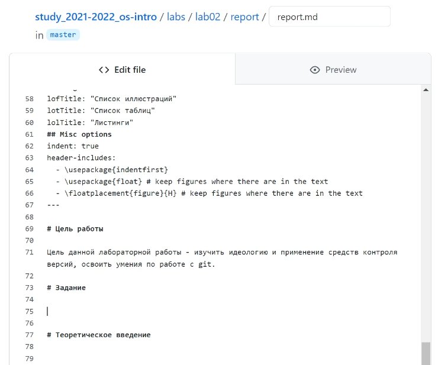
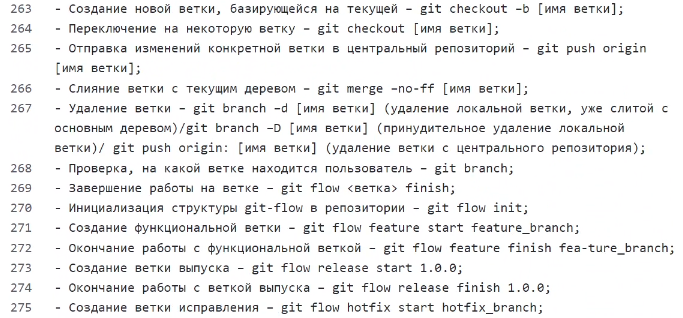
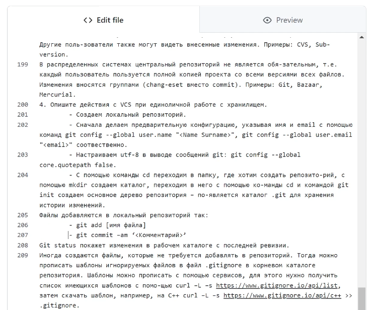
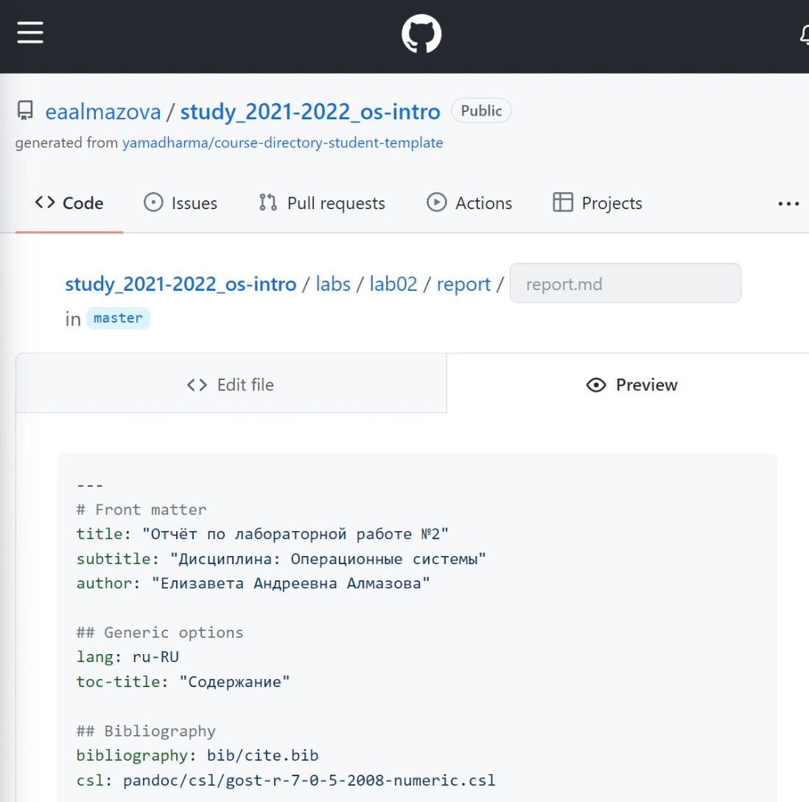

---
## Front matter
lang: ru-RU
title: Отчет по лабораторной работе №3
author: Алмазова Елизавета Андреевна
institute: РУДН, г. Москва, Россия
date: 29.04.2022

## Formatting
toc: false
slide_level: 2
theme: metropolis
header-includes: 
 - \metroset{progressbar=frametitle,sectionpage=progressbar,numbering=fraction}
 - '\makeatletter'
 - '\beamer@ignorenonframefalse'
 - '\makeatother'
aspectratio: 43
section-titles: true
---

# Отчет по лабораторной работе №3

## Цель работы и задание

Цель данной лабораторной работы - научиться оформлять отчёты с помощью легковесного языка разметки Markdown.
Задание - сделать отчёт по предыдущей лабораторной работе в формате Markdown в трех форматах: md, pdf и docx.

## Ход работы. Редактирование шаблона

Я отредактировала шаблон для отчета в соответствии с требованиями лабораторной работы №3 (рис.1).

{ #fig:001 width=70% }

## Ход работы. Заполнение шаблона

Я заполнила шаблон, основываясь на уже выполненном ранее отчете (рис. 2,3).

{ #fig:002 width=70% }

{ #fig:003 width=70% }

## Ход работы. Сохранение файлов

Я сделала коммит изменений в файле отчета ко второй лабораторной работе, предварительно проверив файл с помощью preview (рис.4), а затем перевела его в форматы docx и pdf (рис.5).

{ #fig:004 width=70% }

{ #fig:005 width=70% }

## Выводы

В ходе выполнения данной лабораторной работы я сделала отчет по предыдущей лабораторной работе в формате Markdown и создала отчет в двух других форматах: docx и pdf.

## {.standout}

Спасибо за внимание!
