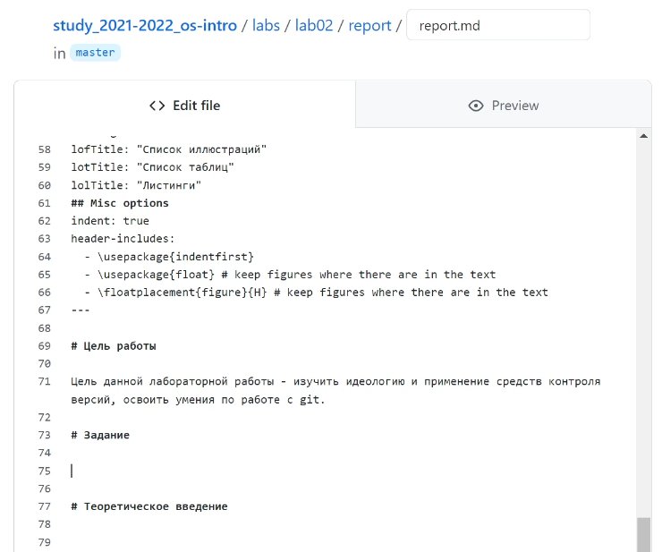
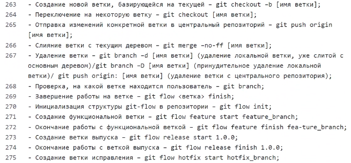
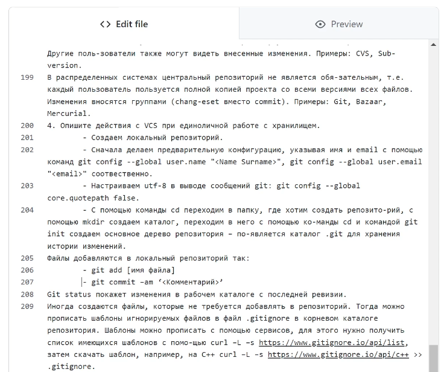
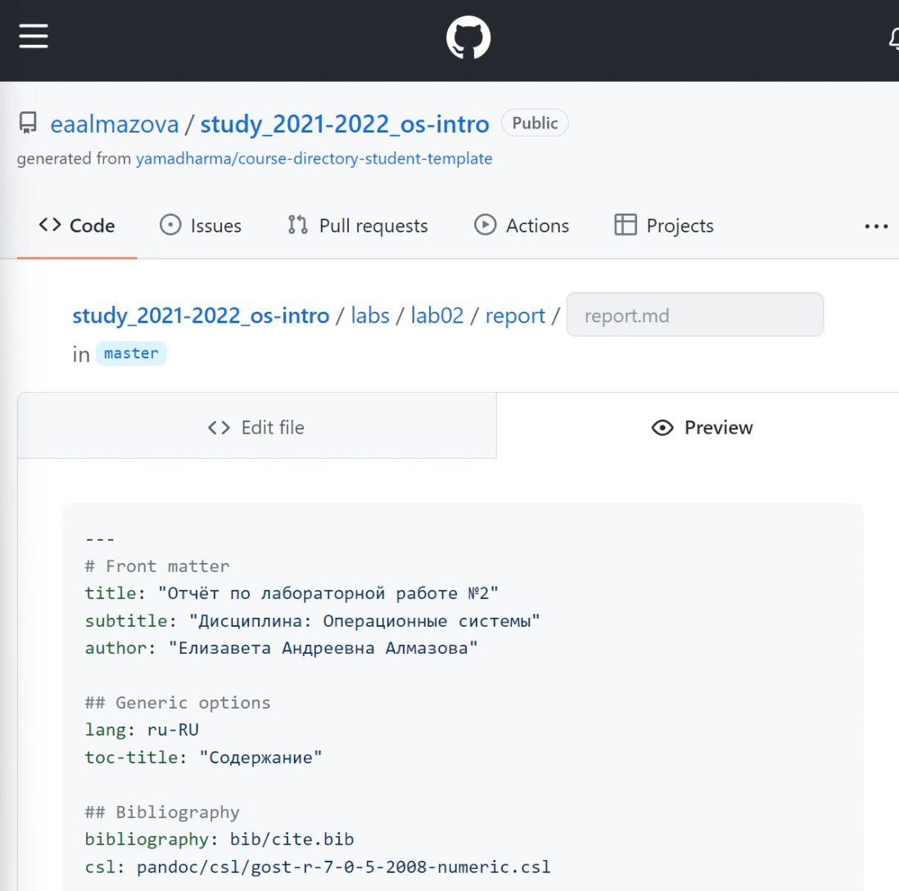
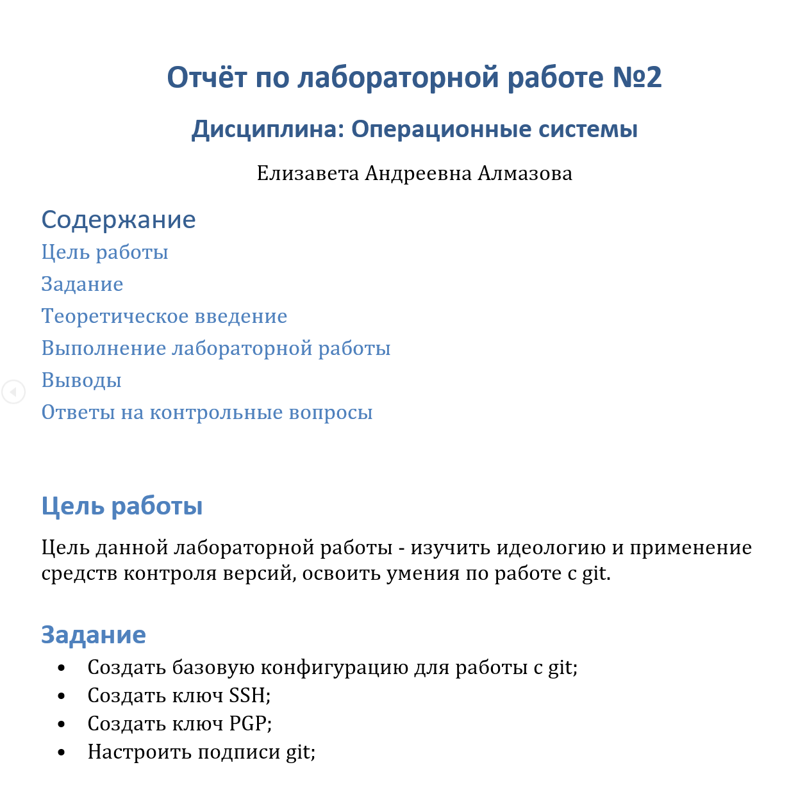

---
# Front matter
title: "Отчёт по лабораторной работе №3"
subtitle: "Дисциплина: Операционные системы"
author: "Елизавета Андреевна Алмазова"

## Generic options
lang: ru-RU
toc-title: "Содержание"

## Bibliography
bibliography: bib/cite.bib
csl: pandoc/csl/gost-r-7-0-5-2008-numeric.csl

## Pdf output format
toc: true # Table of contents
toc-depth: 2
lof: true # List of figures
lot: true # List of tables
fontsize: 12pt
linestretch: 1.5
papersize: a4
documentclass: scrreprt
## I18n polyglossia
polyglossia-lang:
  name: russian
  options:
	- spelling=modern
	- babelshorthands=true
polyglossia-otherlangs:
  name: english
## I18n babel
babel-lang: russian
babel-otherlangs: english
## Fonts
mainfont: PT Serif
romanfont: PT Serif
sansfont: PT Sans
monofont: PT Mono
mainfontoptions: Ligatures=TeX
romanfontoptions: Ligatures=TeX
sansfontoptions: Ligatures=TeX,Scale=MatchLowercase
monofontoptions: Scale=MatchLowercase,Scale=0.9
## Biblatex
biblatex: true
biblio-style: "gost-numeric"
biblatexoptions:
  - parentracker=true
  - backend=biber
  - hyperref=auto
  - language=auto
  - autolang=other*
  - citestyle=gost-numeric
## Pandoc-crossref LaTeX customization
figureTitle: "Рис."
tableTitle: "Таблица"
listingTitle: "Листинг"
lofTitle: "Список иллюстраций"
lotTitle: "Список таблиц"
lolTitle: "Листинги"
## Misc options
indent: true
header-includes:
  - \usepackage{indentfirst}
  - \usepackage{float} # keep figures where there are in the text
  - \floatplacement{figure}{H} # keep figures where there are in the text
---

# Цель работы

Цель данной лабораторной работы - научиться оформлять отчёты с помощью легковесного языка разметки Markdown.

# Задание

Сделать отчёт по предыдущей лабораторной работе в формате Markdown в 3 форматах: md, pdf и docx.

# Теоретическое введение

## Базовые сведения о Markdown

- Чтобы создать заголовок, используйте знак #;
- Чтобы задать для текста полужирное начертание, заключите его в двойные звездочки, курсивное - одинарные, полужирное и курсивное - тройные;
- Блоки цитирования создаются с помощью символа >;
- Неупорядоченный список создается с помощью тире или звездочек, а нумерованный - с помощью цифр. Для вложенных списков используются отступы;
- Синтаксис Markdown для встроенной ссылки состоит из части [link text] , представляющей текст гиперссылки, и части (file-name.md) – URL-адреса или имени файла, на который дается ссылка;
- Markdown поддерживает как встраивание фрагментов кода в предложение, так и их размещение между предложениями в виде отдельных огражденных блоков. Огражденные блоки кода — это простой способ выделить синтаксис для фрагментов кода;
- Нижние индексы записываются как H~2~O, верхние как 2^10^, внутритекстовые формулы делаются аналогично формулам LaTeX.

## Структура отчетов

Согласно ГОСТ 7.32-2001, любая научно-исследовательская работа должна обязательно
содержать следующие элементы:

- титульный лист;
- реферат;
- введение;
- основную часть;
- заключение.

Также ГОСТ рекомендует включить в работу и такие элементы:

- список исполнителей;
- содержание;
- нормативные ссылки;
- определения;
- обозначения и сокращения;
- список использованных источников;
- приложения.

## Содержание элементов отчета

- Титульный лист. Первый лист работы оформляется строго по образцу, который обычно приводится в методических пособиях по вашему предмету. В нем не просто требуется указать такие элементы, как название образовательного учреждения, вид работы
и сведения об исполнителе, но и расположить их в строгом соответствии со стандартами.
- Реферат. Реферат фактически является кратким представлением всего вашего отчета и содержит ряд статистических сведений. В нем нужно указать количество частей, страниц работы, иллюстраций, приложений, таблиц, использованных литературных источников и приложений. Здесь же приводится перечень ключевых слов работы
и собственно текст реферата. Последний подразумевает основные элементы работы от поставленных целей до результатов и рекомендаций по их внедрению.
- Введение. Во введении типовой лабораторной работы обычно прописывают цели проводимого исследования и задачи, выполнение которых поможет достичь поставленных целей. В некоторых случаях пишется развернутое введение с доказательством актуальности и новизны изучаемой темы. Тогда во введении понадобится привести оценку современного состояния рассматриваемой проблемы и обосновать необходимость ее решения.
- Основная часть. Важно, чтобы в этом разделе работы была отражена ее суть, описана методика и результаты проделанной работы. В основной части прописывают следующие элементы:
	- цели проводимого исследования;
	- задачи, выполнение которых поможет достичь поставленных целей;
	- ход работы, в котором описываются выполненные действия;
	- прочие разделы, предусмотренные методическими материалами по изучаемой дисциплине.
- Заключение. В этой части работы  потребуется сделать выводы по полученным в ходе лабораторной работы результатам. Для этого оцените, насколько полно выполнены поставленные задачи. В сложных работах могут присутствовать и другие элементы,
например, рекомендации для дальнейшего применения результатов проведённой работы.

# Выполнение лабораторной работы

1. Я отредактировала шаблон для отчета в соответствии с требованиями лабораторной работы №3 (рис.1).

{ #fig:001 width=70% }

2. Я заполнила шаблон, основываясь на уже выполненном ранее отчете (рис. 2,3).

{ #fig:002 width=70% }
{ #fig:003 width=70% }

3. Я сделала коммит изменений в файле отчета ко второй лабораторной работе, предварительно проверив файл с помощью preview (рис.4), а затем перевела его в форматы docx и pdf (рис.5).

{ #fig:004 width=70% }
{ #fig:005 width=70% }

# Выводы

В ходе выполнения данной лабораторной работы я сделала отчет по предыдущей лабораторной работе в формате Markdown и создала отчет в двух других форматах: docx и pdf.
