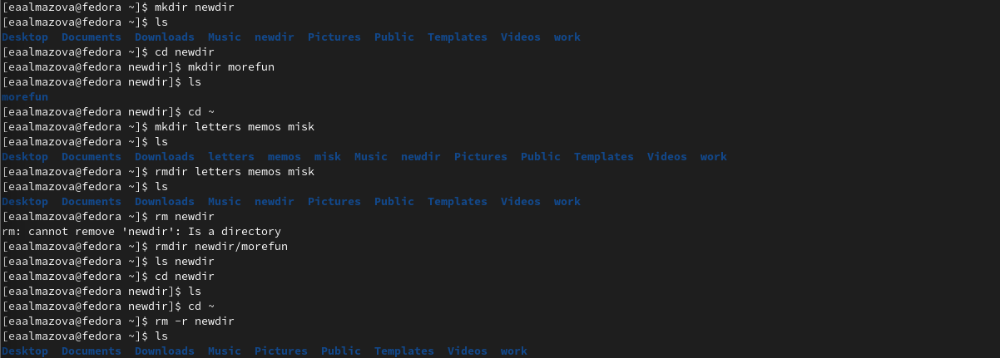

---
## Front matter
lang: ru-RU
title: Отчет по лабораторной работе №4
author: Алмазова Елизавета Андреевна
institute: РУДН, г. Москва, Россия
date: 30.04.2022

## Formatting
toc: false
slide_level: 2
theme: metropolis
header-includes: 
 - \metroset{progressbar=frametitle,sectionpage=progressbar,numbering=fraction}
 - '\makeatletter'
 - '\beamer@ignorenonframefalse'
 - '\makeatother'
aspectratio: 43
section-titles: true
---

# Отчет по лабораторной работе №4

## Цель работы и задание

Цель данной лабораторной работы -  приобретение практических навыков взаимодействия пользователя с системой посредством командной строки.
Задание:
1. Определите полное имя вашего домашнего каталога. Далее относительно этого каталога будут выполняться последующие упражнения.
2. Выполните следующие действия:
	1. Перейдите в каталог /tmp.
	2. Выведите на экран содержимое каталога /tmp. Для этого используйте команду ls с различными опциями. Поясните разницу в выводимой на экран информации.
	3. Определите, есть ли в каталоге /var/spool подкаталог с именем cron?
	4. Перейдите в Ваш домашний каталог и выведите на экран его содержимое. Определите, кто является владельцем файлов и подкаталогов?
3. Выполните следующие действия:
	1. В домашнем каталоге создайте новый каталог с именем newdir.
	2. В каталоге ~/newdir создайте новый каталог с именем morefun.
	3. В домашнем каталоге создайте одной командой три новых каталога с именами letters, memos, misk. Затем удалите эти каталоги одной командой.
	4. Попробуйте удалить ранее созданный каталог ~/newdir командой rm. Проверьте, был ли каталог удалён.
	5. Удалите каталог ~/newdir/morefun из домашнего каталога. Проверьте, был ли каталог удалён.
4. С помощью команды man определите, какую опцию команды ls нужно использовать для просмотра содержимое не только указанного каталога, но и подкаталогов, входящих в него.
5. С помощью команды man определите набор опций команды ls, позволяющий отсортировать по времени  последнего изменения выводимый список содержимого каталога с развёрнутым описанием файлов.
6. Используйте команду man для просмотра описания следующих команд: cd, pwd, mkdir, rmdir, rm. Поясните основные опции этих команд.
7. Используя информацию, полученную при помощи команды history, выполните модификацию и исполнение нескольких команд из буфера команд.

## Ход работы

### Определение имени домашнего каталога и переход в /tmp

{ #fig:001 width=70% }

### Вывод содержимого каталога /tmp
Команда ls вывела список имен видимых файлов и подкаталогов, ls -a вывела имена видимых и скрытых файлов и подкаталогов, ls -aL вывела список имен видимых и скрытых файлов и каталогов, а для символических ссылок отобразило информацию о файле, на который они ссылаются, ls -al вывела список видимых и скрытых файлов и каталогов, а также подробную информацию о них (подробнее см. в теоретическом введении), ls -alF вывела список видимых и скрытых файлов и каталогов с подробной информацией и типом файлов (рис.2,3)

{ #fig:002 width=70% }

{ #fig:003 width=70% }

### Поиск подкаталога cron и определение владельца файлов домашнего каталога

{ #fig:004 width=70% }

### Создание и удаление каталогов
Я создала с помощью команды mkdir каталог newdir и его подкаталог morefun, а также создала (mkdir) и удалила 3 каталога: (rmdir) letters, memos, misk.

{ #fig:005 width=70% }

### Получение справки по команде ls
Man ls показало: опция R покажет содержимое подкаталогов, набор опция -clt отсортирует файлы по времени последнего изменения и выведет подробное описание.

{ #fig:006 width=70% }

{ #fig:007 width=70% }

{ #fig:008 width=70% }

{ #fig:009 width=70% }

### Получение справки по основным командам
С помощью команды man я просмотрела описание следующих команд: cd (рис.10), pwd (рис.11), mkdir (рис.12), rmdir (рис.13), rm (рис.14) (рис.15).

{ #fig:010 width=70% }

{ #fig:011 width=70% }

{ #fig:012 width=70% }

{ #fig:013 width=70% }

{ #fig:014 width=70% }

{ #fig:015 width=70% }

### Модификация команд
Используя команду history 5, я узнала последние 5 выполненных команд. С помощью команд !180:s/a/l и !181:s/F/a я соответственно модифицировала команды ls -a и ls -F к виду ls -l и ls -a (рис.16).

{ #fig:016 width=70% }

## Выводы

В ходе выполнения данной лабораторной работы я приобрела практические навыки взаимодействия пользователя с системой посредством командной строки.

## {.standout}

Спасибо за внимание!
