---
# Front matter
title: "Отчёт по лабораторной работе №4"
subtitle: "Дисциплина: Операционные системы"
author: "Елизавета Андреевна Алмазова"

## Generic options
lang: ru-RU
toc-title: "Содержание"

## Bibliography
bibliography: bib/cite.bib
csl: pandoc/csl/gost-r-7-0-5-2008-numeric.csl

## Pdf output format
toc: true # Table of contents
toc-depth: 2
lof: true # List of figures
lot: true # List of tables
fontsize: 12pt
linestretch: 1.5
papersize: a4
documentclass: scrreprt
## I18n polyglossia
polyglossia-lang:
  name: russian
  options:
	- spelling=modern
	- babelshorthands=true
polyglossia-otherlangs:
  name: english
## I18n babel
babel-lang: russian
babel-otherlangs: english
## Fonts
mainfont: PT Serif
romanfont: PT Serif
sansfont: PT Sans
monofont: PT Mono
mainfontoptions: Ligatures=TeX
romanfontoptions: Ligatures=TeX
sansfontoptions: Ligatures=TeX,Scale=MatchLowercase
monofontoptions: Scale=MatchLowercase,Scale=0.9
## Biblatex
biblatex: true
biblio-style: "gost-numeric"
biblatexoptions:
  - parentracker=true
  - backend=biber
  - hyperref=auto
  - language=auto
  - autolang=other*
  - citestyle=gost-numeric
## Pandoc-crossref LaTeX customization
figureTitle: "Рис."
tableTitle: "Таблица"
listingTitle: "Листинг"
lofTitle: "Список иллюстраций"
lotTitle: "Список таблиц"
lolTitle: "Листинги"
## Misc options
indent: true
header-includes:
  - \usepackage{indentfirst}
  - \usepackage{float} # keep figures where there are in the text
  - \floatplacement{figure}{H} # keep figures where there are in the text
---

# Цель работы

Цель данной лабораторной работы - приобретение практических навыков взаимодействия пользователя с системой посредством командной строки.

# Задание

1. Определите полное имя вашего домашнего каталога. Далее относительно этого каталога будут выполняться последующие упражнения.
2. Выполните следующие действия:
	1. Перейдите в каталог /tmp.
	2. Выведите на экран содержимое каталога /tmp. Для этого используйте команду ls с различными опциями. Поясните разницу в выводимой на экран информации.
	3. Определите, есть ли в каталоге /var/spool подкаталог с именем cron?
	4. Перейдите в Ваш домашний каталог и выведите на экран его содержимое. Определите, кто является владельцем файлов и подкаталогов?
3. Выполните следующие действия:
	1. В домашнем каталоге создайте новый каталог с именем newdir.
	2. В каталоге ~/newdir создайте новый каталог с именем morefun.
	3. В домашнем каталоге создайте одной командой три новых каталога с именами letters, memos, misk. Затем удалите эти каталоги одной командой.
	4. Попробуйте удалить ранее созданный каталог ~/newdir командой rm. Проверьте, был ли каталог удалён.
	5. Удалите каталог ~/newdir/morefun из домашнего каталога. Проверьте, был ли каталог удалён.
4. С помощью команды man определите, какую опцию команды ls нужно использовать для просмотра содержимое не только указанного каталога, но и подкаталогов, входящих в него.
5. С помощью команды man определите набор опций команды ls, позволяющий отсортировать по времени  последнего изменения выводимый список содержимого каталога с развёрнутым описанием файлов.
6. Используйте команду man для просмотра описания следующих команд: cd, pwd, mkdir, rmdir, rm. Поясните основные опции этих команд.
7. Используя информацию, полученную при помощи команды history, выполните модификацию и исполнение нескольких команд из буфера команд.

# Теоретическое введение

## Общие сведения:

В операционной системе типа Linux взаимодействие пользователя с системой обычно осуществляется с помощью командной строки посредством построчного ввода команд. При этом обычно используется командные интерпретаторы языка shell: /bin/sh; /bin/csh; /bin/ksh.
Командой в операционной системе называется записанный по специальным правилам текст (возможно с аргументами), представляющий собой указание на выполнение какой-либо функций (или действий) в операционной системе. Обычно первым словом идёт имя команды, остальной текст — аргументы или опции,
конкретизирующие действие. Можно использовать сокращенную запись пути, согласно которой "~" - домашний каталог, "." - текущий каталог, ".." - родительский каталог. Если требуется выполнить последовательно несколько команд, записанный в одной строке, то для этого используется символ точка с запятой. Специальные символы требуется экранировать.

## Основные команды:

- Команда man используется для просмотра в диалоговом режиме руководства по основным командам операционной системы типа Linux, для управления можно использовать space (перемещение на одну страницу вперед), enter (перемещение на одну строку вперед), q - выход из просмотра описания.
- Команда cd используется для перемещения по файловой системе операционной системы типа Linux. Может использоваться как абсолютный, так и относительный путь в зависимости от взаимного нахождения текущего каталога и каталога, в который собираемся перейти.
- Для определения абсолютного пути к текущему каталогу используется команда pwd.
- Команда ls используется для просмотра содержимого каталога. Для просмотра имен скрытых файлов используется опция a, опция F дает информацию о типах файлов, опция l выводит подробную информацию о файлах и каталогах, включающую в себя тип файла, право жоступа, владельца и т.д.
- Команда mkdir используется для создания каталогов. При задании нескольких аргументов создаётся несколько каталогов, можно использовать группировку. Также можно создать подкаталог в существующем подкаталоге. Если требуется создать подкаталог в каталоге, отличном от текущего, то путь к нему требуется указать в явном виде. Опция m устанавливает атрибуты доступа, p создает каталог вместе с родительскими по отношению к нему.
- Команда rm используется для удаления файлов и/или каталогов. Если требуется, чтобы выдавался запрос подтверждения на удаление файла, то необходимо использовать опцию i. Чтобы удалить каталог, содержащий файлы, нужно использовать опцию r. Без указания этой опции команда не будет выполняться. Если каталог пуст, то можно воспользоваться командой rmdir. Если удаляемый каталог содержит файлы, то команда не будет выполнена, требуется команда rm с опцией r.
- Для вывода на экран списка ранее выполненных команд используется команда history. Выводимые на экран команды в списке нумеруются. К любой команде из выведенного на экран списка можно обратиться по её номеру в списке, воспользовавшись конструкцией !<номер_команды>. Команды из выведенного на экран списка можно модифицировать с помощью конструкции !<номер команды>:s/<что меняем>/<на что меняем>.

# Выполнение лабораторной работы

1. С помощью команды pwd я определила полное имя своего домашнего каталога: /home/eaalmazova. Использовать команду cd не потребовалось, так как по открытии терминала я уже находилась в домашнем каталоге. Затем командами cd / и cd /tmp я перешла в корневой каталог и затем в его подкаталог /tmp соответственно (рис.1).

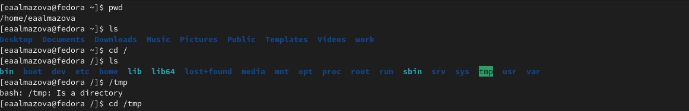{ #fig:001 width=70% }

2. Я вывела на экран содержимое каталога /tmp с помощью команды ls и различных наборов опций. Команда ls вывела список имен видимых файлов и подкаталогов, ls -a вывела имена видимых и скрытых файлов и подкаталогов, ls -aL вывела список имен видимых и скрытых файлов и каталогов, а для символических ссылок отобразило информацию о файле, на который они ссылаются, ls -al вывела список видимых и скрытых файлов и каталогов, а также подробную информацию о них (подробнее см. в теоретическом введении), ls -alF вывела список видимых и скрытых файлов и каталогов с подробной информацией и типом файлов (рис.2,3). 

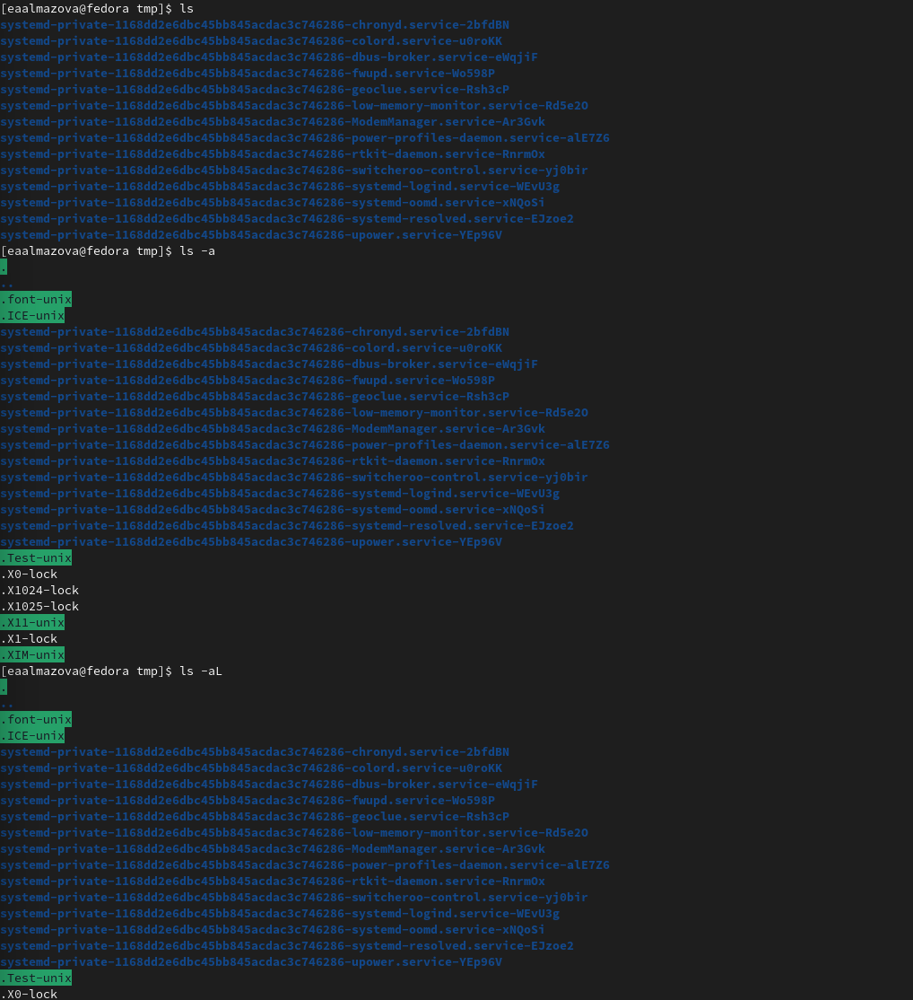{ #fig:002 width=70% }

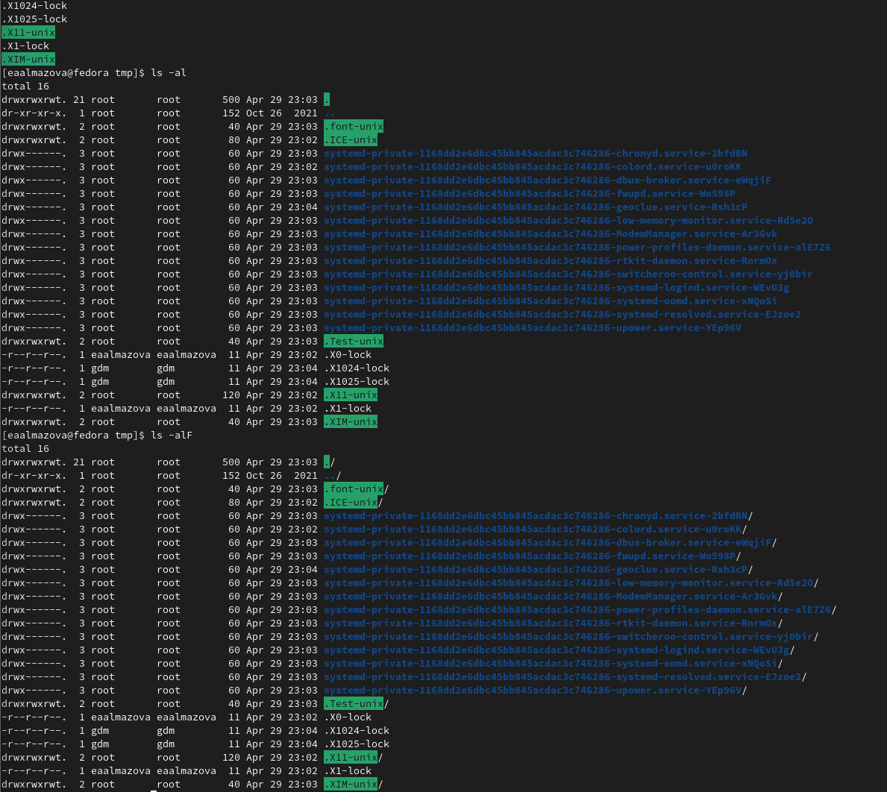{ #fig:003 width=70% }

3. С помощью последовательности команд cd /, ls, cd var/spool, ls -F я перешла в корневой каталог, убедилась, что var является его подкаталогом, перешла в каталог /var/spool и проверила его содержимое путем вывода файлов с их типом: spool не содержит подкаталога cron. Затем я вернулась в домашний каталог (cd ~) и с помощью ls -alF вывела на экран его содержимое с подробной информацией о файлах. Владельцем файлом и подкаталогов являюсь я, пользователь eaalmazova (рис.4).

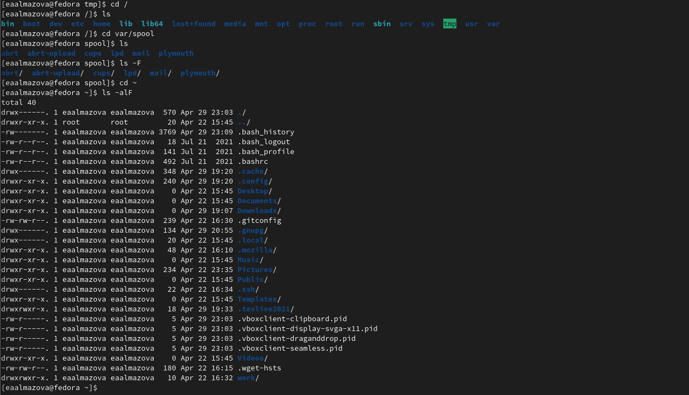{ #fig:004 width=70% }

4. Командой mkdir я создала в домашнем каталоге новый каталог с именем newdir, перешла в него через cd newdir и создала там каталог mkdir morefun, оба действия по созданию проверив с помощью ls. Затем я вернулась в домашний каталог (cd ~), создала командой mkdir letters memos misk и удалила rmdir letters memos misk три каталога: letters, memos, misk. Удаление rm newdir закончилось безрезультатно ошибкой, командами rmdir newdir/morefun и rm -r newdir я удалила созданные недавно каталоги и проверила успешность через ls (рис.5).

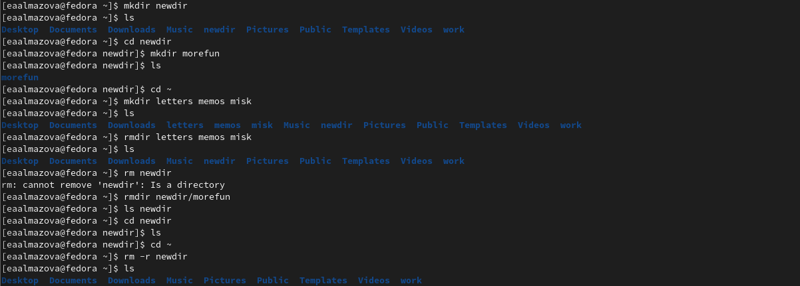{ #fig:005 width=70% }

5. С помощью man ls я выяснила, что для просмотра содержимого не только указанного каталога, но и подкаталогов, входящих в него, нужно использовать опцию R (рис.6), а набор опций -clt позволяет отсортировать по времени последнего изменения выводимый список содержимого каталога с развёрнутым описанием файлов (если добавить опцию a, то будут выведены также скрытые файлы) (рис.7,8,9).

{ #fig:006 width=70% }

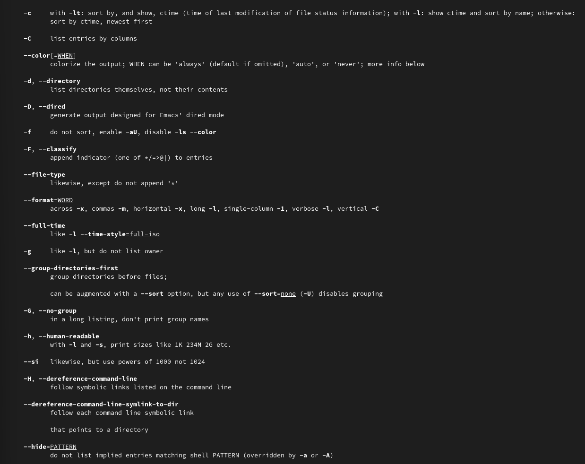{ #fig:007 width=70% }

{ #fig:008 width=70% }

{ #fig:009 width=70% }

6. С помощью команды man я просмотрела описание следующих команд: cd (рис.10), pwd (рис.11), mkdir (рис.12), rmdir (рис.13), rm (рис.14) (рис.15).
	- cd: опция P позволяет перейти по символическим ссылкам до перехода по .., опция L позволяет перейти по символическим ссылкам после перехода по .., и -e возвращает ошибку при переходе в несуществующую папку;
	- pwd: опция L позволяет взять путь из переменной окружения, даже если в нем присутствуют символические ссылки, опция P избегает все символические ссылки, --help показывает справку по утилите, --version показывает версию утилиты;
	- mkdir: опция m устанавливает атрибуты доступа, p создает каталог вместе с родительскими по отношению к нему, v выводит сообщение для каждого созданного каталога, --help показывает справку по утилите, --version показывает версию утилиты;
	- rmdir: опция p удаляет папку и родительские папки, --help показывает справку по утилите, --version показывает версию утилиты;
	- rm: если требуется, чтобы выдавался запрос подтверждения на удаление файла, то необходимо использовать опцию i, чтобы удалить каталог, содержащий или не содержащий файлы, нужно использовать опцию r, -v выводит сообщения о процессе удаления, -d удаляет пустые каталоги, --help показывает справку по утилите, --version показывает версию утилиты.

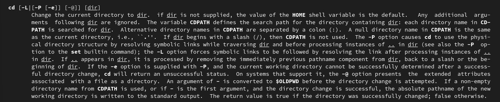{ #fig:010 width=70% }

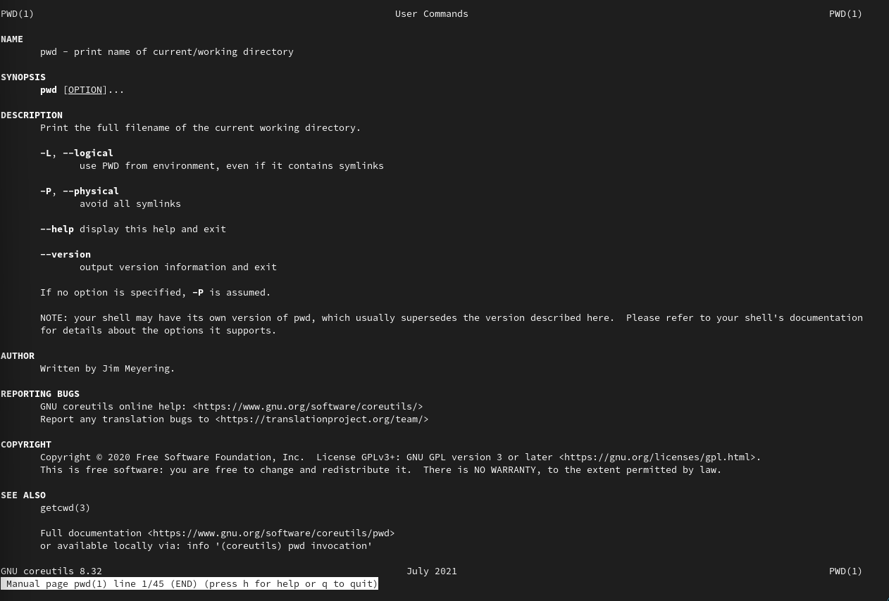{ #fig:011 width=70% }

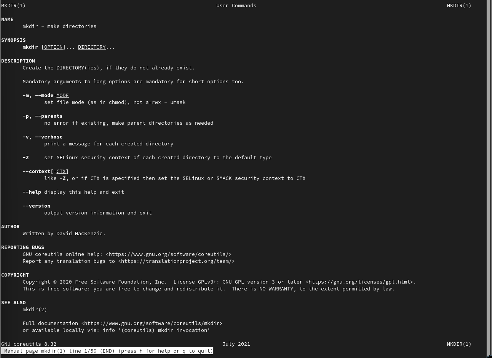{ #fig:012 width=70% }

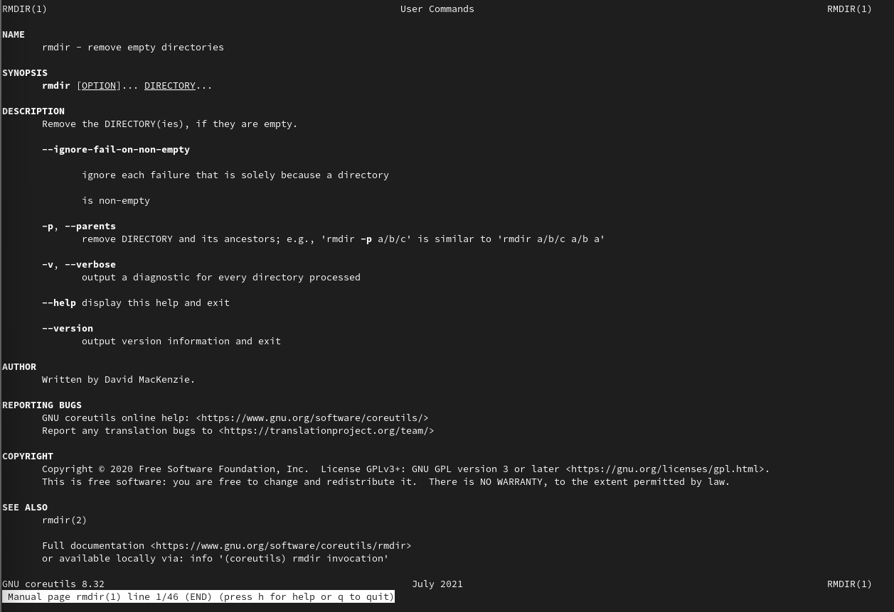{ #fig:013 width=70% }

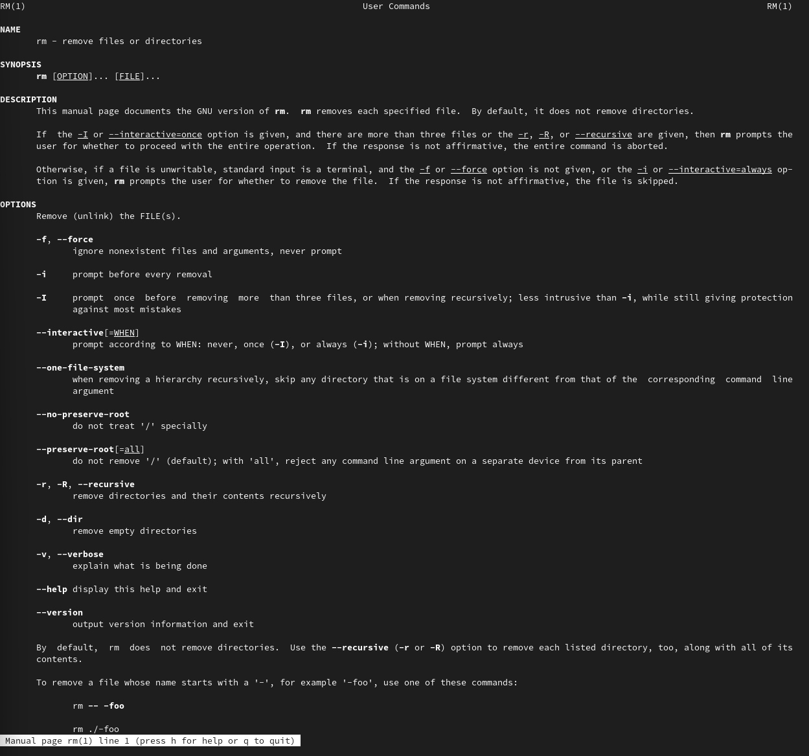{ #fig:014 width=70% }

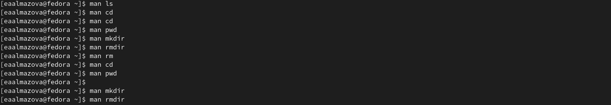{ #fig:015 width=70% }

7. Используя команду history 5, я узнала последние 5 выполненных команд. С помощью команд !180:s/a/l и !181:s/F/a я соответственно модифицировала команды ls -a и ls -F к виду ls -l и ls -a (рис.16).

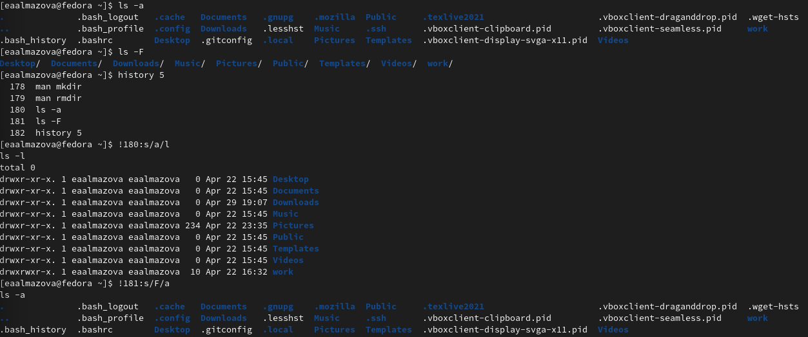{ #fig:016 width=70% }

# Выводы

В ходе выполнения данной лабораторной работы я приобрела практические навыки взаимодействия пользователя с системой посредством командной строки.

# Ответы на контрольные вопросы

1. Что такое командная строка?

Интерфейс командной строки - разновидность текстового интерфейса между человеком и компьютером, в котором инструкции компьютеру даются в основном путём ввода с клавиатуры текстовых строк (команд), в UNIX-системах возможно применение мыши. Командная строка позволяет управлять операционной системой (ОС) путем ввода команд в текстовом виде.

2. При помощи какой команды можно определить абсолютный путь текущего каталога? Приведите пример.

Для определения абсолютного пути к текущему каталогу используется команда pwd. Например, при нахождении в корневом каталоге у меня в ВМ, pwd выведет /home/eaalmazova. 

3. При помощи какой команды и каких опций можно определить только тип файлов и их имена в текущем каталоге? Приведите примеры.

С помощью команды ls –aF, если требуется также отобразить имена скрытых файлов. В противном случае, используется ls –F. Например, ls -F, выполненная в моем домашнем каталоге, показывает наличие только подкаталогов Desktop, Documents и так далее, файлов в каталоге нет. Если же выполнить команду ls -aF, можно увидеть некоторые файлы, например, .bash_logout. Если бы там находились какие-то скрытые ссылки, эта команда тоже бы это показала.

4. Каким образом отобразить информацию о скрытых файлах? Приведите примеры.

Имена скрытых файлов можно вывести с помощью опции –a, а подробную информацию можно вывести с помощью –l команды ls. Например, ls -al выведет имена и подробную информацию о скрытых и видимых файлах текущего каталога.

5. При помощи каких команд можно удалить файл и каталог? Можно ли это сделать одной и той же командой? Приведите примеры.

Для удаления файла используется команда rm с синтаксисом rm [-опции] <имя_файла>. Удаляют пустой каталог с помощью rmdir, удаление пустого и не пустого каталога возможно с помощью rm -r <имя_каталога>. Таким образом, одной и той же командой с одним и тем же набором опций удаление файла и каталога произвести невозможно. Например, rm new удалит файл new, rmdir newdir удалит пустой каталог newdir, а rm -r importantdir удалит каталог importantdir с подкаталогами и файлами. 

6. Каким образом можно вывести информацию о последних выполненных пользователем командах?

Для вывода на экран списка ранее выполненных команд используется команда history.

7. Как воспользоваться историей команд для их модифицированного выполнения? Приведите примеры.

К любой команде из выведенного на экран списка можно обратиться по её номеру в списке, воспользовавшись конструкцией !<номер_команды>. Можно модифицировать команду из выведенного на экран списка при помощи следующей конструкции: !<номер_команды>:s/<что_меняем>/<на_что_меняем>? Например, !3:s/a/F (было) ls -a (результат) ls-F.

8. Приведите примеры запуска нескольких команд в одной строке. 

Если требуется выполнить последовательно несколько команд, записанныхй в одной строке, то для этого используется символ точка с запятой. Пример: cd; ls.

9. Дайте определение и приведите примера символов экранирования.

Экранирование символов — замена в тексте управляющих символов на соответствующие текстовые подстановки. Если в заданном контексте встречаются специальные символы (типа «.», «/» и т.д.), надо перед ними поставить символ экранирования \ (обратный слэш).

10. Охарактеризуйте вывод информации на экран после выполнения команды ls с опцией l.

Чтобы вывести на экран подробную информацию о файлах и каталогах, необходимо использовать опцию l. При этом о каждом файле и каталоге будет выведена следующая информация:
	- тип файла,
	- право доступа,
	- число ссылок,
	- владелец,
	- размер,
	- дата последней ревизии,
	- имя файла или каталога.
	
11. Что такое относительный путь к файлу? Приведите примеры использования относительного и абсолютного пути при выполнении какой-либо команды.

Если присутствуют все три компонента стандартного пути DOS (буква тома или диска, имя каталога и необязательное имя файла), путь является абсолютным. Если буква тома или диска не указана и имя каталога начинается с символа разделителя каталогов, такой путь задан относительно корня текущего диска. В противном случае путь задан относительно текущего каталога.
cd /home/eaalmazova – это абсолютный путь к моему домашнему каталогу. Перейти в него по относительному пути можно предварительно перейдя в каталог home (cd /home), а затем воспользовавшись cd eaalmazova.

12. Как получить информацию об интересующей вас команде?

С помощью команды man, например, man ls.

13. Какая клавиша или комбинация клавиш служит для автоматического дополнения вводимых команд?

Используется клавиша Tab.
