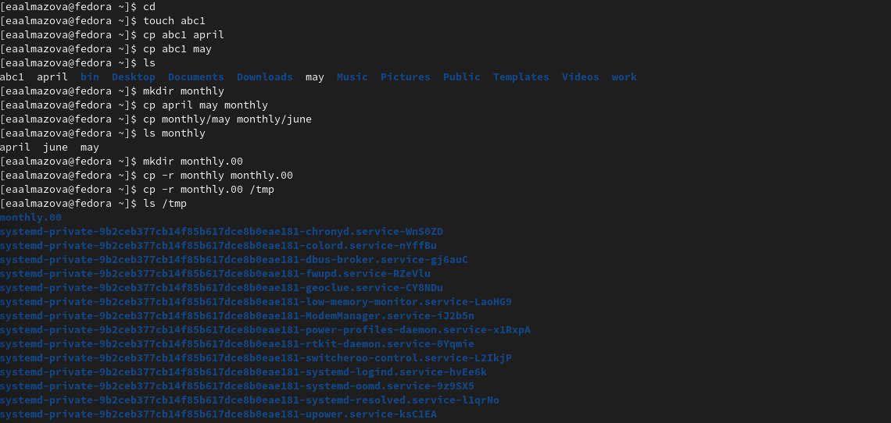
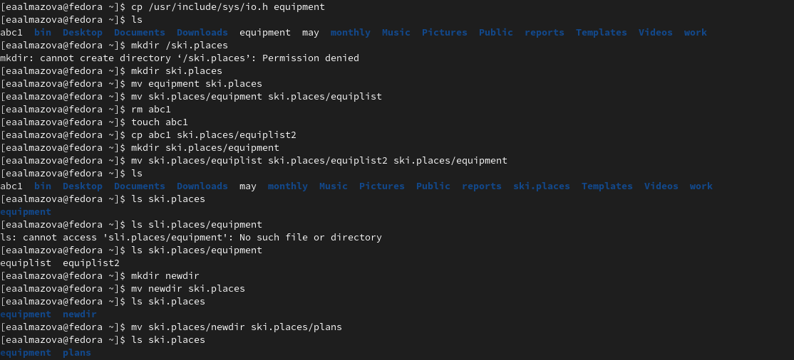
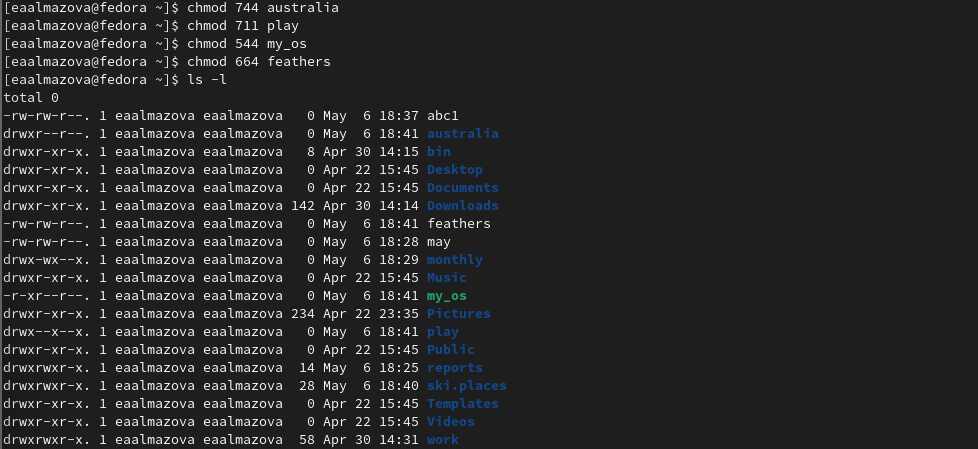
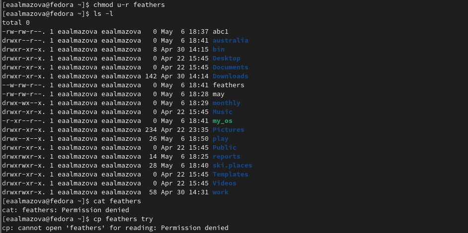
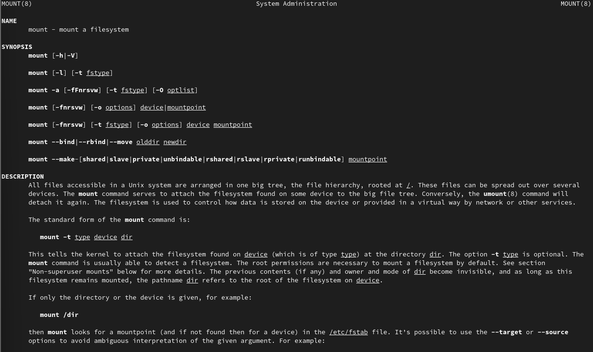
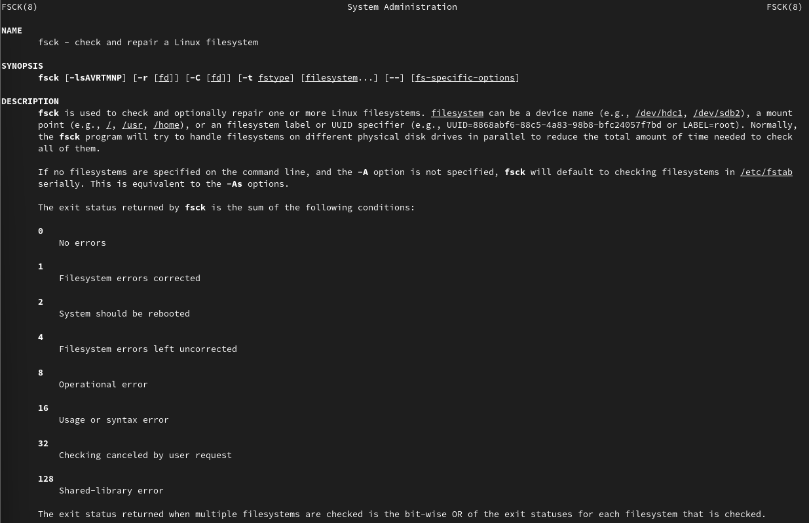
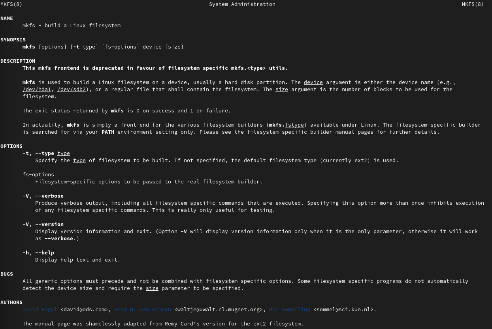
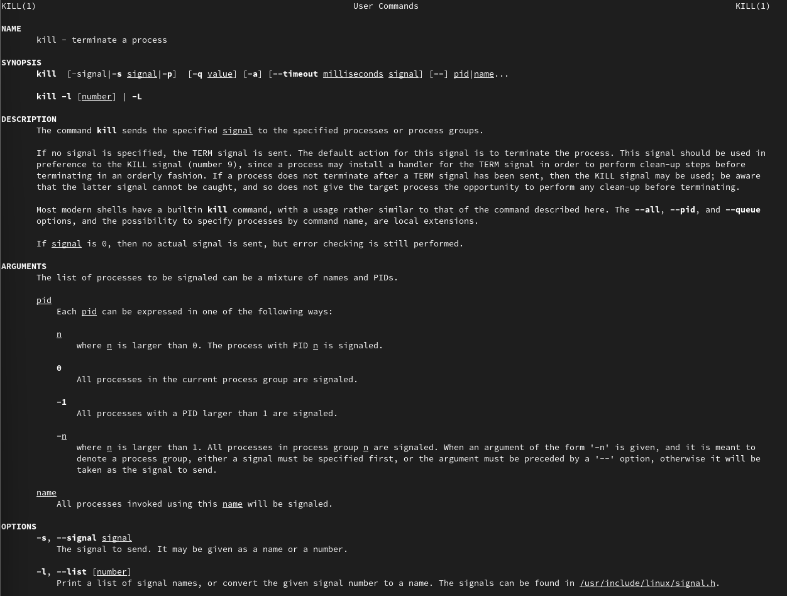

---
## Front matter
lang: ru-RU
title: Отчет по лабораторной работе №5
author: Алмазова Елизавета Андреевна
institute: РУДН, г. Москва, Россия
date: 07.05.2022

## Formatting
toc: false
slide_level: 2
theme: metropolis
header-includes: 
 - \metroset{progressbar=frametitle,sectionpage=progressbar,numbering=fraction}
 - '\makeatletter'
 - '\beamer@ignorenonframefalse'
 - '\makeatother'
aspectratio: 43
section-titles: true
---

# Отчет по лабораторной работе №5

## Цель работы и задание

Цель данной лабораторной работы - ознакомление с файловой системой Linux, её структурой, именами и содержанием каталогов, приобретение практических навыков по применению команд для работы с файлами и каталогами, по управлению процессами (и работами), по проверке использования диска и обслуживанию файловой системы.

Задание:

1. Выполните все примеры, приведённые в первой части описания лабораторной работы.
2. Выполните следующие действия, зафиксировав в отчёте по лабораторной работе
используемые при этом команды и результаты их выполнения:
	1. Скопируйте файл /usr/include/sys/io.h в домашний каталог и назовите его equipment. Если файла io.h нет, то используйте любой другой файл в каталоге /usr/include/sys/ вместо него.
	2. В домашнем каталоге создайте директорию ~/ski.plases.
	3. Переместите файл equipment в каталог ~/ski.plases.
	4. Переименуйте файл ~/ski.plases/equipment в ~/ski.plases/equiplist.
	5. Создайте в домашнем каталоге файл abc1 и скопируйте его в каталог ~/ski.plases, назовите его equiplist2.
	6. Создайте каталог с именем equipment в каталоге ~/ski.plases.
	7. Переместите файлы ~/ski.plases/equiplist и equiplist2 в каталог ~/ski.plases/equipment.
	8. Создайте и переместите каталог ~/newdir в каталог ~/ski.plases и назовите его plans.
3. Определите опции команды chmod, необходимые для того, чтобы присвоить перечисленным ниже файлам выделенные права доступа, считая, что в начале таких прав нет:
	1. drwxr--r-- ... australia
	2. drwx--x--x ... play
	3. -r-xr--r-- ... my_os
	4. -rw-rw-r-- ... feathers
При необходимости создайте нужные файлы.
4. Проделайте приведённые ниже упражнения, записывая в отчёт по лабораторной работе используемые при этом команды:
	1. Просмотрите содержимое файла /etc/password.
	2. Скопируйте файл ~/feathers в файл ~/file.old.
	3. Переместите файл ~/file.old в каталог ~/play.
	4. Скопируйте каталог ~/play в каталог ~/fun.
	5. Переместите каталог ~/fun в каталог ~/play и назовите его games.
	6. Лишите владельца файла ~/feathers права на чтение.
	7. Что произойдёт, если вы попытаетесь просмотреть файл ~/feathers командой cat?
	8. Что произойдёт, если вы попытаетесь скопировать файл ~/feathers?
	9. Дайте владельцу файла ~/feathers право на чтение.
	10. Лишите владельца каталога ~/play права на выполнение.
	11. Перейдите в каталог ~/play. Что произошло?
	12. Дайте владельцу каталога ~/play право на выполнение.
5. Прочитайте man по командам mount, fsck, mkfs, kill и кратко их охарактеризуйте,
приведя примеры.

## Ход работы

### Выполнение примеров

Я выполнила все примеры, приведенные в части описания лабораторной работы, в том числе создавала (touch, mkdir), копировала (cp), перемещала и переименовала (mv) файлы и каталоги may, april, june, monthly, monthly.00, monthly.01, abc1, а также изменяла (chmod) их права доступа (рис. 1).

{ #fig:001 width=70% }

### Работа по созданию, перемещению и переименованию файлов и каталогов

Я скопировала файл /usr/include/sys/io.h в домашний каталог и назвала его equipment. В домашнем каталоге создала директорию ~/ski.places, переместила туда файл equipment и переименовала в equiplist. Создала в домашнем каталоге файл abc1 и скопировала его в каталог, назвав его equiplist2. Создала каталог с именем equipment в каталоге ~/ski.places, переместила туда файлы equiplist и equiplist2 и проверила с помощью ls. Затем я создала и переместила каталог ~/newdir в каталог ~/ski.places и назвала его plans (рис. 2).

{ #fig:002 width=70% }

### Изменение прав доступа

Я создала каталоги australia и play, файлы my_os и feathers, а затем изменила с помощью команды chmod и соответсвующих опций права доступа на требуемые: chmod 744 australia, chmod 711 play, chmod 544 my_os, chmod 664 feathers - и проверила результат с помощью ls -l (рис. 3).

{ #fig:003 width=70% }

### Работа по созданию, перемещению и переименованию файлов и каталогов

Я посмотрела содержимое файла /etc/passwd. Затем я скопировала ~/feathers в файл ~/file.old, переместила файл ~/file.old в каталог ~/play. Скопировала каталог ~/play в каталог ~/fun, переместила каталог ~/fun в каталог ~/play и назвала его games. 

### Работа с файлами и каталогами с измененными правами доступа

Я лишила владельца файла ~/feathers права на чтение, отчего в просмотре файла и копировании мне было отказано (рис. 4). Я дала владельцу файла ~/feathers право на чтение и лишила владельца права на выполнение каталога ~/play. В доступе при переходе в этот каталог мне было отказано. Затем я дала владельцу право на выполнение.

{ #fig:004 width=70% }

### Команды mount, fsck, mkfs, kill

Прочитала с помощью команды man справки по командам mount, fsck, mkfs, kill (рис. 5,6,7,8). mount монтирует файловую систему, fsck  проверяет и восстанавливает файловую систему Linux, mkfs создает файловую систему Linux, а kill передает процессу сигнал завершения.

{ #fig:005 width=70% }

{ #fig:006 width=70% }

{ #fig:007 width=70% }

{ #fig:008 width=70% }

## Выводы

В ходе выполнения данной лабораторной работы я онакомилась с файловой системой Linux, её структурой, именами и содержанием каталогов, приобрела практические навыки по применению команд для работы с файлами и каталогами, по управлению процессами (и работами), по проверке использования диска и обслуживанию файловой системы.

## {.standout}

Спасибо за внимание!
