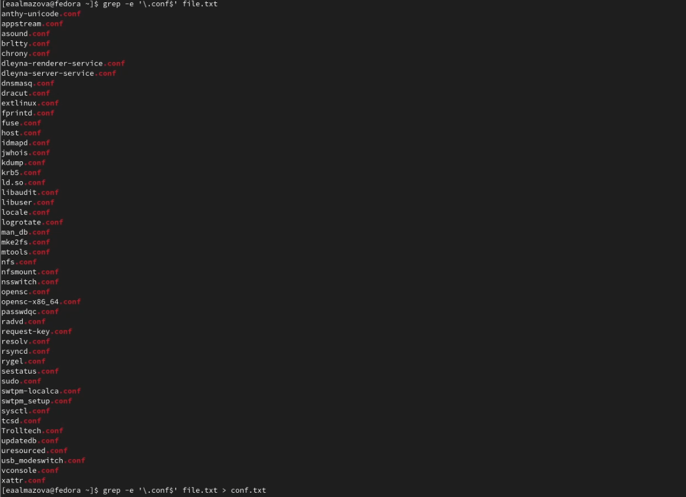
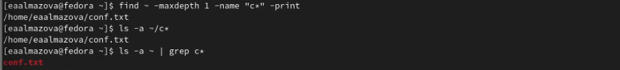
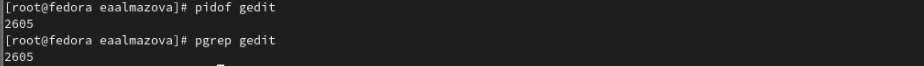
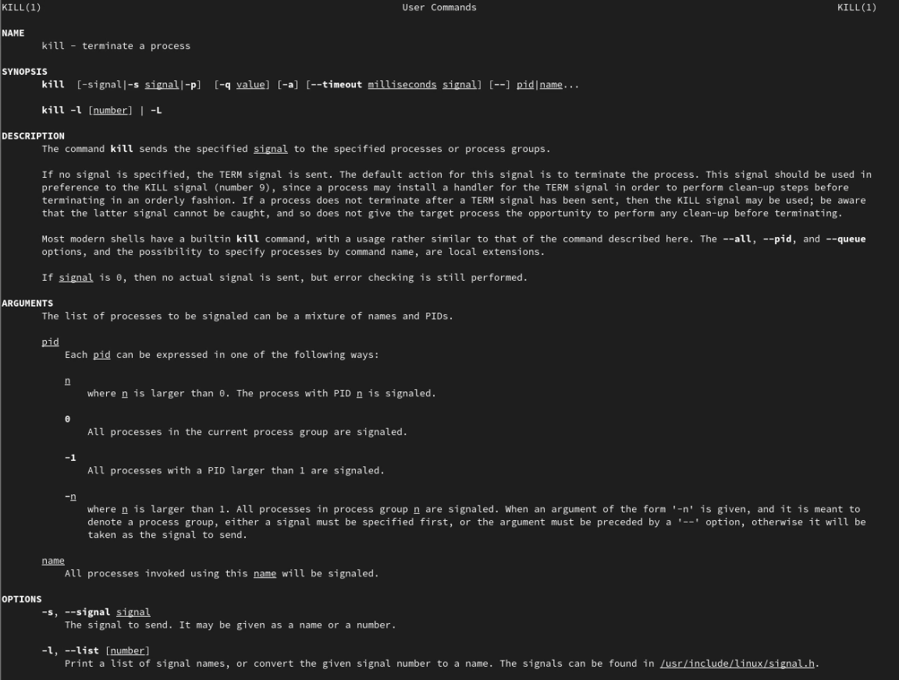
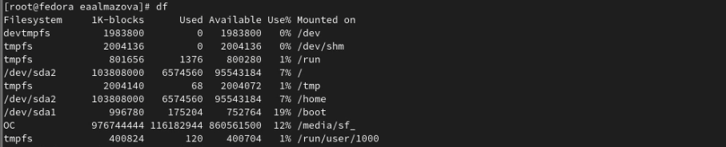
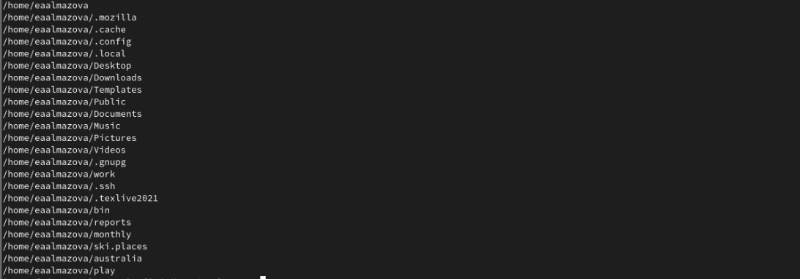

---
## Front matter
lang: ru-RU
title: Отчет по лабораторной работе №6
author: Алмазова Елизавета Андреевна
institute: РУДН, г. Москва, Россия
date: 07.05.2022

## Formatting
toc: false
slide_level: 2
theme: metropolis
header-includes: 
 - \metroset{progressbar=frametitle,sectionpage=progressbar,numbering=fraction}
 - '\makeatletter'
 - '\beamer@ignorenonframefalse'
 - '\makeatother'
aspectratio: 43
section-titles: true
---

# Отчет по лабораторной работе №6

## Цель работы и задание

Цель данной лабораторной работы - ознакомление с инструментами поиска файлов и фильтрации текстовых данных, приобретение практических навыков: по управлению процессами (и заданиями), по проверке использования диска и обслуживанию файловых систем.

Задание:

1. Осуществите вход в систему, используя соответствующее имя пользователя.
2. Запишите в файл file.txt названия файлов, содержащихся в каталоге /etc. Допишите в этот же файл названия файлов, содержащихся в вашем домашнем каталоге.
3. Выведите имена всех файлов из file.txt, имеющих расширение .conf, после чего запишите их в новый текстовой файл conf.txt.
4. Определите, какие файлы в вашем домашнем каталоге имеют имена, начинавшиеся с символа c? Предложите несколько вариантов, как это сделать.
5. Выведите на экран (по странично) имена файлов из каталога /etc, начинающиеся с символа h.
6. Запустите в фоновом режиме процесс, который будет записывать в файл ~/logfile файлы, имена которых начинаются с log.
7. Удалите файл ~/logfile.
8. Запустите из консоли в фоновом режиме редактор gedit.
9. Определите идентификатор процесса gedit, используя команду ps, конвейер и фильтр grep. Как ещё можно определить идентификатор процесса?
10. Прочтите справку (man) команды kill, после чего используйте её для завершения процесса gedit.
11. Выполните команды df и du, предварительно получив более подробную информацию об этих командах, с помощью команды man.
12. Воспользовавшись справкой команды find, выведите имена всех директорий, имеющихся в вашем домашнем каталоге.

## Ход работы

1. Осуществила вход в систему, используя пользователя eaalmazova.
2. Записала в файл file.txt названия файлов, содержащихся в каталоге /etc и дописала в этот же файл названия файлов, содержащихся в моем домашнем каталоге. Командой grep -e '\.conf$' file.txt вывела в консоль имена всех файлов из file.txt, имеющих расширение .conf, после чего записала их в новый текстовой файл conf.txt (рис. 1).

{ #fig:001 width=70% }

3. Определила, какие файлы в моем домашнем каталоге имеют имена, начинающиеся с символа c: conf.txt. Это можно сделать с помощью 3 команд: find ~ -maxdepth 1 - name "C*" -print, ls -a ~/c*, ls -a ~ | grep c* (рис. 2)

{ #fig:002 width=70% }

4. Вывела на экран по странично имена файлов из каталога /etc, начинающиеся с символа h. Запустила в фоновом режиме процесс, который записывает в файл ~/logfile файлы, имена которых начинаются с log. Для этого я зашла через суперпользователя. Удалила файл через rm.
5. Запустила из консоли в фоновом режиме редактор gedit. Определила идентификатор процесса gedit, используя команду ps, конвейер и фильтр grep (рис.3). Также это можно сделать через команды pidof gedit и pgrep gedit (рис.4).

{ #fig:003 width=70% }

{ #fig:004 width=70% }

6. Прочитала справку man команды kill, после чего использовала её для завершения процесса gedit: kill 2605 (рис.5).

{ #fig:005 width=70% }

7. Выполнила команды df и du, предварительно получив более подробную информацию об этих командах, с помощью команды man (рис.6).

{ #fig:006 width=70% }

8. Воспользовавшись справкой команды find, вывела имена всех директорий, имеющихся в моем домашнем каталоге и его подкаталогах, а затем только директорий в домашнем каталоге: find /home/eaalmazova -type d -maxdepth 1 (рис.7).

{ #fig:007 width=70% }

## Выводы

В ходе выполнения данной лабораторной работы я ознакомилась с инструментами поиска файлов и фильтрации текстовых данных, приобрела практических навыков: по управлению процессами (и заданиями), по проверке использования диска и обслуживанию файловых систем.

## {.standout}

Спасибо за внимание!
