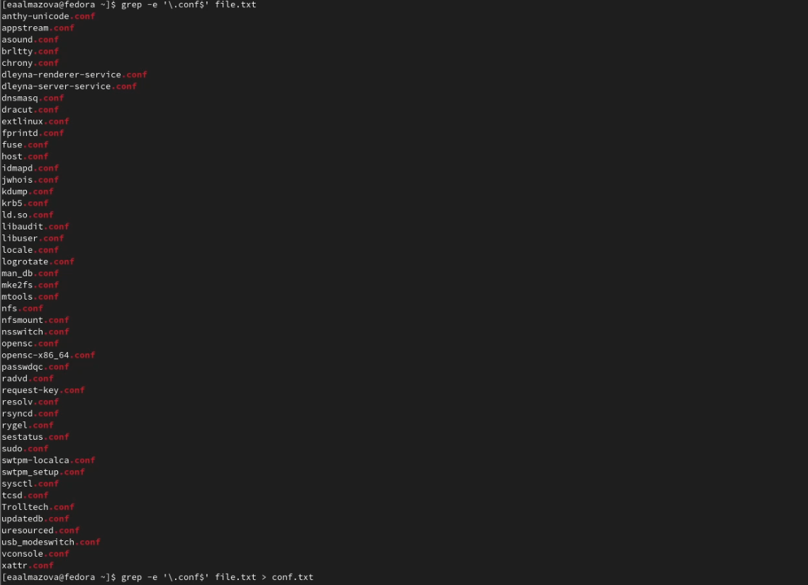
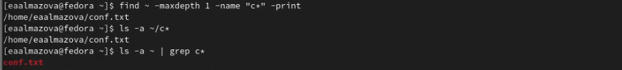
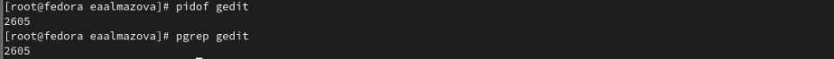
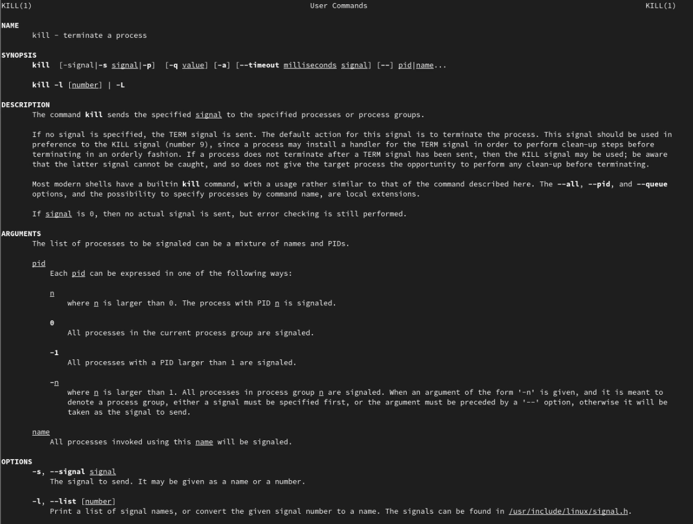
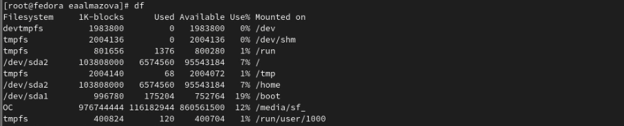
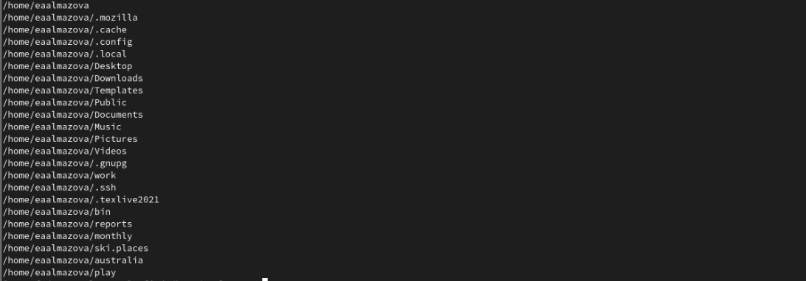

---
# Front matter
title: "Отчёт по лабораторной работе №6"
subtitle: "Дисциплина: Операционные системы"
author: "Елизавета Андреевна Алмазова"

## Generic options
lang: ru-RU
toc-title: "Содержание"

## Bibliography
bibliography: bib/cite.bib
csl: pandoc/csl/gost-r-7-0-5-2008-numeric.csl

## Pdf output format
toc: true # Table of contents
toc-depth: 2
lof: true # List of figures
lot: true # List of tables
fontsize: 12pt
linestretch: 1.5
papersize: a4
documentclass: scrreprt
## I18n polyglossia
polyglossia-lang:
  name: russian
  options:
	- spelling=modern
	- babelshorthands=true
polyglossia-otherlangs:
  name: english
## I18n babel
babel-lang: russian
babel-otherlangs: english
## Fonts
mainfont: PT Serif
romanfont: PT Serif
sansfont: PT Sans
monofont: PT Mono
mainfontoptions: Ligatures=TeX
romanfontoptions: Ligatures=TeX
sansfontoptions: Ligatures=TeX,Scale=MatchLowercase
monofontoptions: Scale=MatchLowercase,Scale=0.9
## Biblatex
biblatex: true
biblio-style: "gost-numeric"
biblatexoptions:
  - parentracker=true
  - backend=biber
  - hyperref=auto
  - language=auto
  - autolang=other*
  - citestyle=gost-numeric
## Pandoc-crossref LaTeX customization
figureTitle: "Рис."
tableTitle: "Таблица"
listingTitle: "Листинг"
lofTitle: "Список иллюстраций"
lotTitle: "Список таблиц"
lolTitle: "Листинги"
## Misc options
indent: true
header-includes:
  - \usepackage{indentfirst}
  - \usepackage{float} # keep figures where there are in the text
  - \floatplacement{figure}{H} # keep figures where there are in the text
---

# Цель работы

Цель данной лабораторной работы - ознакомление с инструментами поиска файлов и фильтрации текстовых данных, приобретение практических навыков: по управлению процессами (и заданиями), по проверке использования диска и обслуживанию файловых систем.

# Задание

1. Осуществите вход в систему, используя соответствующее имя пользователя.
2. Запишите в файл file.txt названия файлов, содержащихся в каталоге /etc. Допишите в этот же файл названия файлов, содержащихся в вашем домашнем каталоге.
3. Выведите имена всех файлов из file.txt, имеющих расширение .conf, после чего запишите их в новый текстовой файл conf.txt.
4. Определите, какие файлы в вашем домашнем каталоге имеют имена, начинавшиеся с символа c? Предложите несколько вариантов, как это сделать.
5. Выведите на экран (по странично) имена файлов из каталога /etc, начинающиеся с символа h.
6. Запустите в фоновом режиме процесс, который будет записывать в файл ~/logfile файлы, имена которых начинаются с log.
7. Удалите файл ~/logfile.
8. Запустите из консоли в фоновом режиме редактор gedit.
9. Определите идентификатор процесса gedit, используя команду ps, конвейер и фильтр grep. Как ещё можно определить идентификатор процесса?
10. Прочтите справку (man) команды kill, после чего используйте её для завершения процесса gedit.
11. Выполните команды df и du, предварительно получив более подробную информацию об этих командах, с помощью команды man.
12. Воспользовавшись справкой команды find, выведите имена всех директорий, имеющихся в вашем домашнем каталоге.

# Теоретическое введение

## Потоки ввода-вывода

В системе по умолчанию открыто три специальных потока:

- stdin — стандартный поток ввода (по умолчанию: клавиатура), файловый дескриптор
0;
- stdout — стандартный поток вывода (по умолчанию: консоль), файловый дескриптор
1;
- stderr — стандартный поток вывод сообщений об ошибках (по умолчанию: консоль),
файловый дескриптор 2.

Большинство используемых в консоли команд и программ записывают результаты своей работы в стандартный поток вывода stdout. Например, команда ls выводит в стандартный поток вывода (консоль) список файлов в текущей директории. Потоки вывода и ввода можно перенаправлять на другие файлы или устройства. Проще всего это делается с помощью символов >, >>, <, <<

## Конвейер

Конвейер (pipe) служит для объединения простых команд или утилит в цепочки, в которых результат работы предыдущей команды передаётся последующей. Синтаксис следующий: команда 1 | команда 2

## Работа с файлами и текстами

Команда find используется для поиска и отображения на экран имён файлов, соответствующих заданной строке символов. Формат команды: find путь [-опции]

Найти в текстовом файле указанную строку символов позволяет команда grep. Формат команды: grep строка имя_файла. Кроме того, команда grep способна обрабатывать стандартный вывод других команд (любой текст). Для этого следует использовать конвейер, связав вывод команды с вводом grep.

## Использование диска

Команда df показывает размер каждого смонтированного раздела диска. Формат команды: df [-опции] [файловая_система], команда du показывает число килобайт, используемое каждым файлом или каталогом. Формат команды: du [-опции] [имя_файла...]. На afs можно посмотреть использованное пространство командой fs quota

## Управление задачами и процессами

Любую выполняющуюся в консоли команду или внешнюю программу можно запустить в фоновом режиме. Для этого следует в конце имени команды указать знак амперсанда &. Запущенные фоном программы называются задачами (jobs). Ими можно управлять с помощью команды jobs, которая выводит список запущенных в данный момент задач. Для завершения задачи необходимо выполнить команду kill %номер задачи.

Любой команде, выполняемой в системе, присваивается идентификатор процесса (process ID). Получить информацию о процессе и управлять им, пользуясь идентификатором процесса, можно из любого окна командного интерпретатора. Команда ps используется для получения информации о процессах. Для получения информации о процессах, управляемых вами и запущенных (работающих или остановленных) на вашем терминале, используйте опцию aux.

# Выполнение лабораторной работы

1. Осуществила вход в систему, используя пользователя eaalmazova.
2. Записала в файл file.txt названия файлов, содержащихся в каталоге /etc (команда ls -a /etc > file.txt). Дописала в этот же файл названия файлов, содержащихся в моем домашнем каталоге (ls -a ~ >> file.txt). Командой grep -e '\ .conf$' file.txt вывела в консоль имена всех файлов из file.txt, имеющих расширение .conf, после чего записала их в новый текстовой файл conf.txt: grep -e '\ .conf$' file.txt > conf.txt (рис. 1).

{ #fig:001 width=70% }

3. Определила, какие файлы в моем домашнем каталоге имеют имена, начинающиеся с символа c: conf.txt. Это можно сделать с помощью 3 команд: find ~ -maxdepth 1 - name "C*" -print, ls -a ~/c*, ls -a ~ | grep c* (рис. 2)

{ #fig:002 width=70% }

4. Вывела на экран по странично имена файлов из каталога /etc, начинающиеся с символа h, с помощью команды ls -a /etc | grep h* | less. Запустила в фоновом режиме процесс, который записывает в файл ~/logfile файлы, имена которых начинаются с log. Для этого я зашла через суперпользователя и воспользовалась командой ls -aR / | grep log* > ~/logfile &. Удалила файл через rm.
5. Запустила из консоли в фоновом режиме редактор gedit: gedit &. Определила идентификатор процесса gedit, используя команду ps, конвейер и фильтр grep (ps aux | grep gedit, рис.3). Также это можно сделать через команды pidof gedit и pgrep gedit (рис.4).

{ #fig:003 width=70% }

{ #fig:004 width=70% }

6. Прочитала справку man команды kill, после чего использовала её для завершения процесса gedit: kill 2605 (рис.5).

{ #fig:005 width=70% }

7. Выполнила команды df и du, предварительно получив более подробную информацию об этих командах, с помощью команды man (рис.6).

{ #fig:006 width=70% }

8. Воспользовавшись справкой команды find, вывела имена всех директорий, имеющихся в моем домашнем каталоге и его подкаталогах (find /home/eaalmazova -type d), а затем только директорий в домашнем каталоге: find /home/eaalmazova -type d -maxdepth 1 (рис.7).

{ #fig:007 width=70% }

# Выводы

В ходе выполнения данной лабораторной работы я ознакомилась с инструментами поиска файлов и фильтрации текстовых данных, приобрела практических навыков: по управлению процессами (и заданиями), по проверке использования диска и обслуживанию файловых систем.

# Ответы на контрольные вопросы

1. Какие потоки ввода вывода вы знаете?

В системе по умолчанию открыто три специальных потока:

- stdin — стандартный поток ввода (по умолчанию: клавиатура), файловый дескриптор 0;
- stdout — стандартный поток вывода (по умолчанию: консоль), файловый дескриптор 1;
- stderr — стандартный поток вывод сообщений об ошибках (по умолчанию: консоль), файловый дескриптор 2.

2. Объясните разницу между операцией > и >>.

Символ ">" перезаписывает информацию из файла, если там уже что-то есть. Для добавления данных в конец используется ">>".

3. Что такое конвейер?

Конвейер (англ. pipeline) в терминологии операционных систем семейства Unix — некоторое множество процессов, для которых выполнено следующее перенаправление ввода-вывода: то, что выводит на поток стандартного вывода предыдущий процесс, попадает в поток стандартного ввода следующего процесса. Конвейер служит для объединения простых команд или утилит в цепочки, в которых результат работы предыдущей команды передаётся последующей. Синтаксис следующий: команда 1 | команда 2. Конвейеры можно группировать в цепочки и выводить с помощью перенаправления в файл, например: 1 ls -la | sort > sortilg_list

4. Что такое процесс? Чем это понятие отличается от программы?

Процесс - это выполнение программы. Он считается активной сущностью и реализует действия, указанные в программе.

Основное различие между программой и процессом заключается в том, что программа представляет собой группу инструкций для выполнения определенной задачи, тогда как процесс представляет собой программу в процессе выполнения. Между процессом и программой существует отношение многие-к-одному, что означает, что одна программа может вызывать несколько процессов или, другими словами, несколько процессов могут быть частью одной и той же программы.

5. Что такое PID и GID?

Любой команде, выполняемой в системе, присваивается идентификатор процесса (process ID, PID). GID — идентификационный номер основной группы пользователя.

6. Что такое задачи и какая команда позволяет ими управлять?

Запущенные фоном программы называются задачами (jobs). Ими можно управлять с помощью команды jobs, которая выводит список запущенных в данный момент задач.

7. Найдите информацию об утилитах top и htop. Каковы их функции?

Команда htop похожа на команду top по выполняемой функции: они обе показывают информацию о процессах в реальном времени, выводят данные о потреблении системных ресурсов и позволяют искать, останавливать и управлять процессами.

У обеих команд есть свои преимущества. Например, в программе htop реализован очень удобный поиск по процессам, а также их фильтрация. В команде top это не так удобно — нужно знать кнопку для вывода функции поиска.

Зато в top можно разделять область окна и выводить информацию о процессах в соответствии с разными настройками. В целом top намного более гибкая в настройке отображения процессов.

8. Назовите и дайте характеристику команде поиска файлов. Приведите примеры использования этой команды.

Команда find используется для поиска и отображения на экран имён файлов, соответствующих заданной строке символов. Формат команды: find путь [-опции]

Путь определяет каталог, начиная с которого по всем подкаталогам будет вестись поиск.

Примеры: find ~ -name "f*" -print выводит на экран имена файлов из домашнего каталога и его подкаталогов, начинающихся на f, find /etc -name "p*" -print выводит на экран имена файлов в каталоге /etc, начинающихся с символа p.

9. Можно ли по контексту (содержанию) найти файл? Если да, то как?

Можно. С помощью команды grep -iRl "фраза" /директория/где/искать

Например, команда может выглядеть вот так: grep -iRl "sun" /home

Команда найдет и выведет все файлы, которые содержат фразу sun в директории /home и во всех директориях, внутри этой папки. Используются следующие ключи:

- i - игнорировать регистра текста (большие или маленькие буквы);
- R - рекурсивно искать файлы в сабдиректориях;
- I - показывать названия файлов, вместо их содержимого;

10. Как определить объем свободной памяти на жёстком диске?

С помощью команды df <устройство>

11. Как определить объем вашего домашнего каталога?

С помощью команды du /home/eaalmazova

12. Как удалить зависший процесс?

Для удаления сначала потребуется определить идентификатор процесса PID. Команда pidof [процесс] выведет требуемый PID. Послать сигнал процессу с помощью команды kill: kill <PID> пошлет сигнал о завершении процесса, однако этот сигнал можно перехватить или заблокировать, а kill -9 <PID> посылает сигнал об уничтожении процесса без возможности перехвата или игнорирования. Есть и другие способы.
