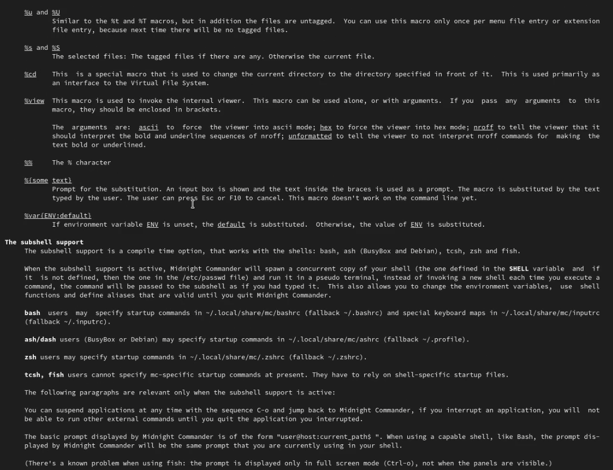
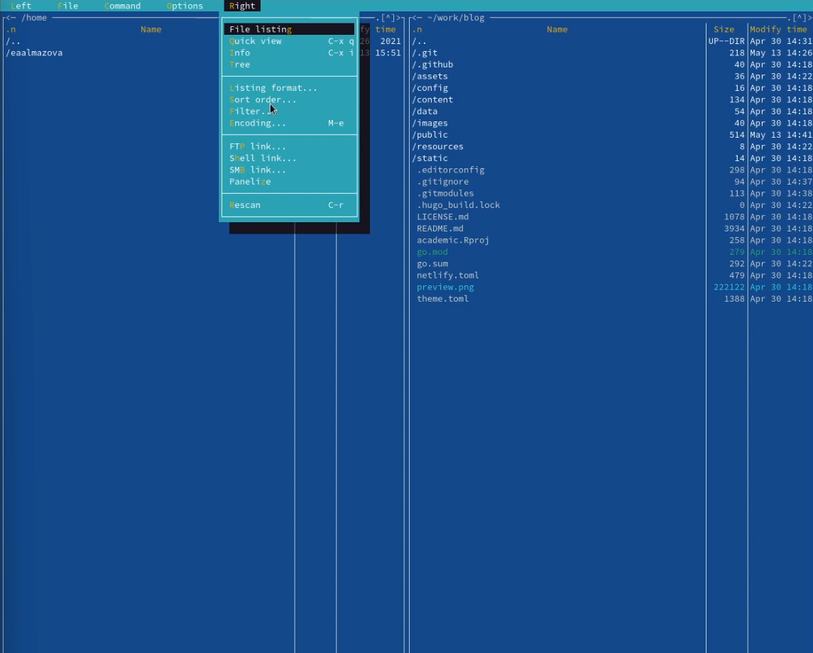
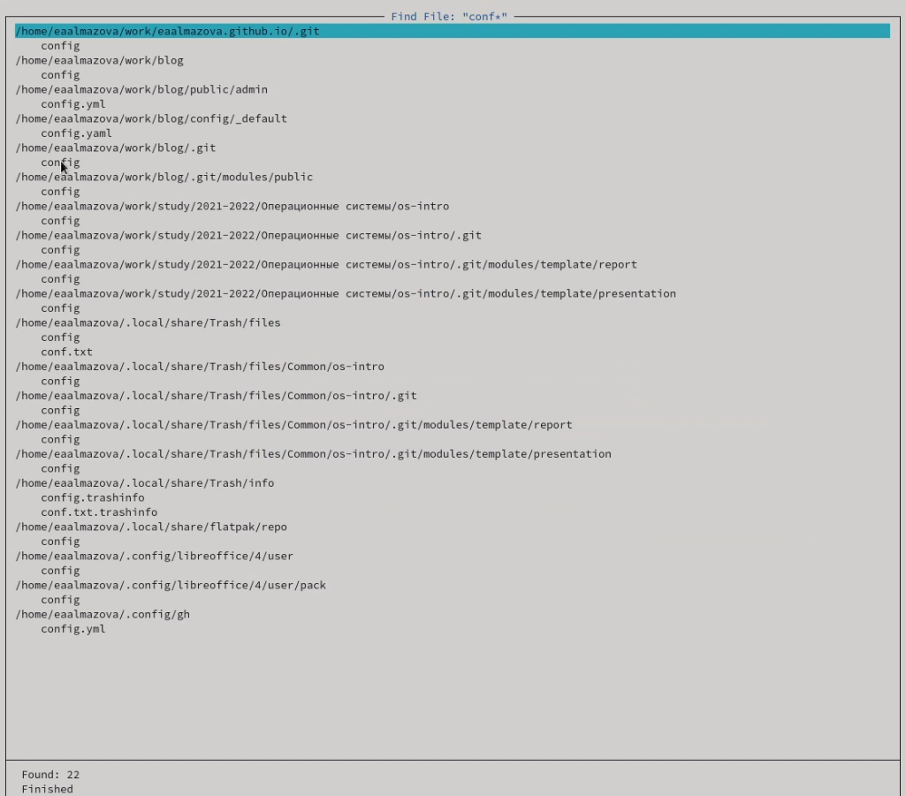
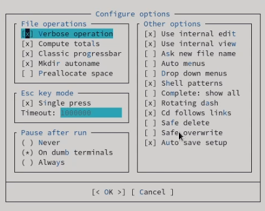
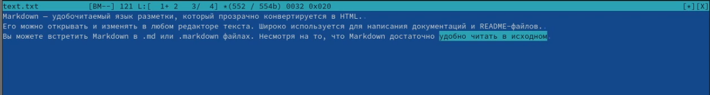

---
## Front matter
lang: ru-RU
title: Отчет по лабораторной работе №7
author: Алмазова Елизавета Андреевна
institute: РУДН, г. Москва, Россия
date: 14.05.2022

## Formatting
toc: false
slide_level: 2
theme: metropolis
header-includes: 
 - \metroset{progressbar=frametitle,sectionpage=progressbar,numbering=fraction}
 - '\makeatletter'
 - '\beamer@ignorenonframefalse'
 - '\makeatother'
aspectratio: 43
section-titles: true
---

# Отчет по лабораторной работе №7

## Цель работы и задание

Цель данной лабораторной работы - освоение основных возможностей командной оболочки Midnight Commander. Приобретение навыков практической работы по просмотру каталогов и файлов; манипуляций с ними.

Задание:

Задание по mc

1. Изучите информацию о mc, вызвав в командной строке man mc.
2. Запустите из командной строки mc, изучите его структуру и меню.
3. Выполните несколько операций в mc, используя управляющие клавиши (операции с панелями; выделение/отмена выделения файлов, копирование/перемещение файлов, получение информации о размере и правах доступа на файлы и/или каталоги и т.п.)
4. Выполните основные команды меню левой (или правой) панели. Оцените степень подробности вывода информации о файлах.
5. Используя возможности подменю Файл , выполните:

	- просмотр содержимого текстового файла;
	- редактирование содержимого текстового файла (без сохранения результатов редактирования);
	- создание каталога;
	- копирование в файлов в созданный каталог.

6. С помощью соответствующих средств подменю Команда осуществите:

	- поиск в файловой системе файла с заданными условиями (например, файла с расширением .c или .cpp, содержащего строку main);
	- выбор и повторение одной из предыдущих команд;
	- переход в домашний каталог;
	- анализ файла меню и файла расширений.

7. Вызовите подменю Настройки . Освойте операции, определяющие структуру экрана mc (Full screen, Double Width, Show Hidden Files и т.д.)

Задание по встроенному редактору mc

1. Создайте текстовой файл text.txt.
2. Откройте этот файл с помощью встроенного в mc редактора.
3. Вставьте в открытый файл небольшой фрагмент текста, скопированный из любого другого файла или Интернета.
4. Проделайте с текстом следующие манипуляции, используя горячие клавиши:

	1. Удалите строку текста.
	2. Выделите фрагмент текста и скопируйте его на новую строку
	3. Выделите фрагмент текста и перенесите его на новую строку.
	4. Сохраните файл.
	5. Отмените последнее действие.
	6. Перейдите в конец файла (нажав комбинацию клавиш) и напишите некоторый текст.
	7. Перейдите в начало файла (нажав комбинацию клавиш) и напишите некоторый текст.
	8. Сохраните и закройте файл.
	
5. Откройте файл с исходным текстом на некотором языке программирования (например C или Java)
6. Используя меню редактора, включите подсветку синтаксиса, если она не включена, или выключите, если она включена.

## Ход работы

1. Изучила информацию о mc, вызвав в командной строке man mc (рис.1).

{ #fig:001 width=70% }

2. Запустила из командной строки mc, изучила его структуру и меню. Выполнила несколько операций в mc, используя управляющие клавиши: открыла файл для просмотра и редактирования. Выполнила основные команды меню правой панели (рис. 2). Степень подробности вывода информации о файлах: "Информация" выводит подробную информацию о файле, "Дерево" - минимум информации, "Формат списка" - "Укороченный" отображает минимальную информацию в виде имени файла, тогда как расширенный формат дает подробную информацию, однако менее полную, чем в пункте "Информация", определенный пользователем формат позволяет самоу определять степень подробности, однако она будет менее подробной, чем в пункте "Информация".

{ #fig:002 width=70% }

3. Используя возможности подменю Файл, выполнила просмотр содержимого текстового файла README.md, редактирование содержимого текстового файла (без сохранения результатов редактирования), создание каталога, копирование в файлов в созданный каталог.
4. С помощью соответствующих средств подменю Команда осуществила поиск в файловой системе файла с заданными условиями, выбор и повторение одной из предыдущих команд cd /work, переход в домашний каталог, анализ файла меню и файла расширений.

{ #fig:003 width=70% }

5. Вызвала подменю Настройки. Освоила операции, определяющие структуру экрана mc (рис.4).

{ #fig:004 width=70% }

6. Создала текстовой файл text.txt, открыла этот файл с помощью встроенного в mc редактора . Вставила в открытый файл небольшой фрагмент текста, скопированный из другого файла. Используя горячие клавиши, редактировала, сохранила и закрыла файл.

{ #fig:005 width=70% }

7. Открыла файл с исходным текстом на языке программирования Java. Используя меню редактора, включила подсветку синтаксиса.

## Выводы

В ходе выполнения данной лабораторной работы я освоила основные возможности командной оболочки Midnight Commander, приобрела навыки практической работы по просмотру каталогов и файлов; манипуляций с ними.

## {.standout}

Спасибо за внимание!
