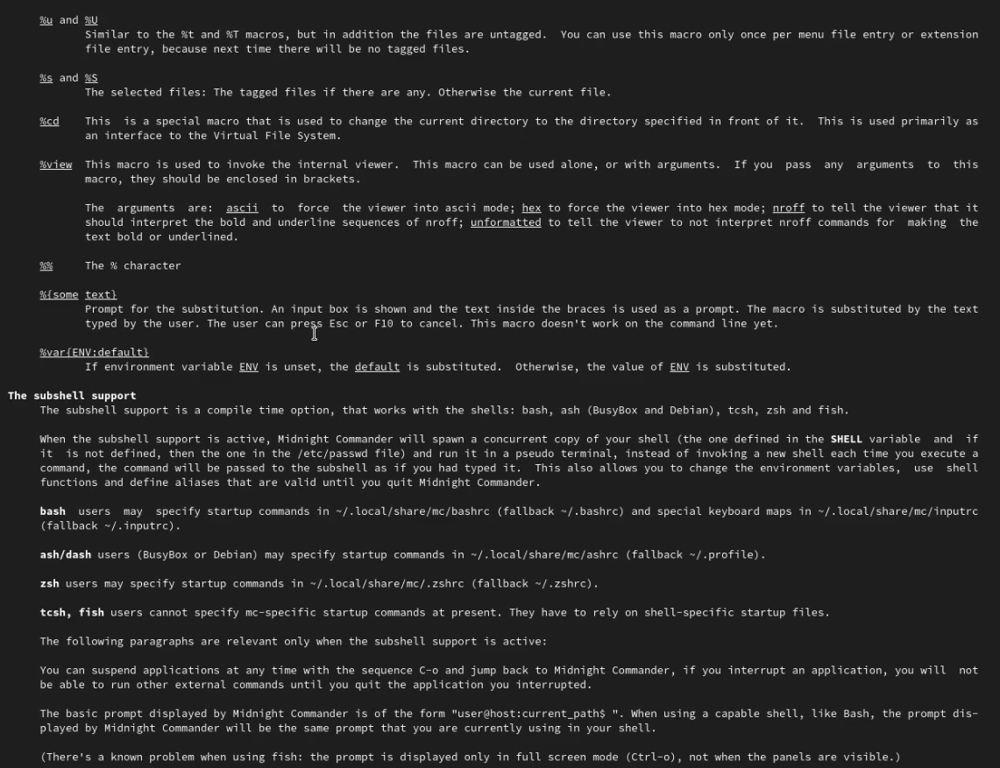

---
# Front matter
title: "Отчёт по лабораторной работе №7"
subtitle: "Дисциплина: Операционные системы"
author: "Елизавета Андреевна Алмазова"

## Generic options
lang: ru-RU
toc-title: "Содержание"

## Bibliography
bibliography: bib/cite.bib
csl: pandoc/csl/gost-r-7-0-5-2008-numeric.csl

## Pdf output format
toc: true # Table of contents
toc-depth: 2
lof: true # List of figures
lot: true # List of tables
fontsize: 12pt
linestretch: 1.5
papersize: a4
documentclass: scrreprt
## I18n polyglossia
polyglossia-lang:
  name: russian
  options:
	- spelling=modern
	- babelshorthands=true
polyglossia-otherlangs:
  name: english
## I18n babel
babel-lang: russian
babel-otherlangs: english
## Fonts
mainfont: PT Serif
romanfont: PT Serif
sansfont: PT Sans
monofont: PT Mono
mainfontoptions: Ligatures=TeX
romanfontoptions: Ligatures=TeX
sansfontoptions: Ligatures=TeX,Scale=MatchLowercase
monofontoptions: Scale=MatchLowercase,Scale=0.9
## Biblatex
biblatex: true
biblio-style: "gost-numeric"
biblatexoptions:
  - parentracker=true
  - backend=biber
  - hyperref=auto
  - language=auto
  - autolang=other*
  - citestyle=gost-numeric
## Pandoc-crossref LaTeX customization
figureTitle: "Рис."
tableTitle: "Таблица"
listingTitle: "Листинг"
lofTitle: "Список иллюстраций"
lotTitle: "Список таблиц"
lolTitle: "Листинги"
## Misc options
indent: true
header-includes:
  - \usepackage{indentfirst}
  - \usepackage{float} # keep figures where there are in the text
  - \floatplacement{figure}{H} # keep figures where there are in the text
---

# Цель работы

Цель данной лабораторной работы - освоение основных возможностей командной оболочки Midnight Commander. Приобретение навыков практической работы по просмотру каталогов и файлов; манипуляций с ними.

# Задание

## Задание по mc

1. Изучите информацию о mc, вызвав в командной строке man mc.
2. Запустите из командной строки mc, изучите его структуру и меню.
3. Выполните несколько операций в mc, используя управляющие клавиши (операции с панелями; выделение/отмена выделения файлов, копирование/перемещение файлов, получение информации о размере и правах доступа на файлы и/или каталоги и т.п.)
4. Выполните основные команды меню левой (или правой) панели. Оцените степень подробности вывода информации о файлах.
5. Используя возможности подменю Файл , выполните:

	- просмотр содержимого текстового файла;
	- редактирование содержимого текстового файла (без сохранения результатов редактирования);
	- создание каталога;
	- копирование в файлов в созданный каталог.

6. С помощью соответствующих средств подменю Команда осуществите:

	- поиск в файловой системе файла с заданными условиями (например, файла с расширением .c или .cpp, содержащего строку main);
	- выбор и повторение одной из предыдущих команд;
	- переход в домашний каталог;
	- анализ файла меню и файла расширений.

7. Вызовите подменю Настройки . Освойте операции, определяющие структуру экрана mc (Full screen, Double Width, Show Hidden Files и т.д.)

## Задание по встроенному редактору mc

1. Создайте текстовой файл text.txt.
2. Откройте этот файл с помощью встроенного в mc редактора.
3. Вставьте в открытый файл небольшой фрагмент текста, скопированный из любого другого файла или Интернета.
4. Проделайте с текстом следующие манипуляции, используя горячие клавиши:

	1. Удалите строку текста.
	2. Выделите фрагмент текста и скопируйте его на новую строку
	3. Выделите фрагмент текста и перенесите его на новую строку.
	4. Сохраните файл.
	5. Отмените последнее действие.
	6. Перейдите в конец файла (нажав комбинацию клавиш) и напишите некоторый текст.
	7. Перейдите в начало файла (нажав комбинацию клавиш) и напишите некоторый текст.
	8. Сохраните и закройте файл.
	
5. Откройте файл с исходным текстом на некотором языке программирования (например C или Java)
6. Используя меню редактора, включите подсветку синтаксиса, если она не включена, или выключите, если она включена.

# Теоретическое введение

## Общие сведения

Командная оболочка — интерфейс взаимодействия пользователя с операционной системой и программным обеспечением посредством команд.

Midnight Commander (или mc) — псевдографическая командная оболочка для UNIX/Linux систем. Для запуска mc необходимо в командной строке набрать mc и нажать Enter. Рабочее пространство mc имеет две панели, отображающие по умолчанию списки файлов двух каталогов.

Над панелями располагается меню, доступ к которому осуществляется с помощью клавиши F9. Под панелями внизу расположены управляющие экранные кнопки, ассоциированные с функциональными клавишами F1 – F10. Над ними располагается командная строка, предназначенная для ввода команд.

## Режимы отображения панелей и управление ими

Панель в mc отображает список файлов текущего каталога. Абсолютный путь к этому каталогу отображается в заголовке панели. У активной панели заголовок и одна из её строк подсвечиваются. Управление панелями осуществляется с помощью определённых комбинаций клавиш или пунктов меню mc.

Панели можно поменять местами. Для этого и используется комбинация клавиш Ctrl-u или команда меню mc Переставить панели . Также можно временно убрать отображение панелей (отключить их) с помощью комбинации клавиш Ctrl-o или команды меню mc Отключить панели . Это может быть полезно, например, если необходимо увидеть вывод какой-то информации на экран после выполнения какой-либо команды shell.

С помощью последовательного применения комбинации клавиш Ctrl-x d есть возможность сравнения каталогов, отображённых на двух панелях. Панели могут дополнительно быть переведены в один из двух режимов: Информация или Дерево . В режиме Информация на панель выводятся сведения о файле и текущей файловой системе, расположенных на активной панели. В режиме Дерево на одной из панелей выводится структура дерева каталогов. Управлять режимами отображения панелей можно через пункты меню mc Правая панель и Левая панель

## Меню панелей

Перейти в строку меню панелей mc можно с помощью функциональной клавиши F9.

В строке меню имеются пять меню: Левая панель , Файл , Команда , Настройки и Правая панель. Подпункт меню Быстрый просмотр позволяет выполнить быстрый просмотр содержимого панели. Подпункт меню Информация позволяет посмотреть информацию о файле или каталоге. В меню каждой (левой или правой) панели можно выбрать Формат списка:

- стандартный — выводит список файлов и каталогов с указанием размера и времени правки;
- ускоренный — позволяет задать число столбцов, на которые разбивается панель при выводе списка имён файлов или каталогов без дополнительной информации;
- расширенный — помимо названия файла или каталога выводит сведения о правах доступа, владельце, группе, размере, времени правки;
- определённый пользователем — позволяет вывести те сведения о файле или каталоге, которые задаст сам пользователь.

Подпункт меню Порядок сортировки позволяет задать критерии сортировки при выводе списка файлов и каталогов: без сортировки, по имени, расширенный, время правки, время доступа, время изменения атрибута, размер, узел.

## Другие функции и возможности MC

В меню Файл содержит перечень команд, которые могут быть применены к одному или нескольким файлам или каталогам. В меню Команда содержатся более общие команды для работы с mc. Меню Настройки содержит ряд дополнительных опций по внешнему виду и функциональности mc.

Встроенный в mc редактор вызывается с помощью функциональной клавиши F4 . В нём удобно использовать различные комбинации клавиш при редактировании содержимого (как правило текстового) файла.

# Выполнение лабораторной работы

1. Изучила информацию о mc, вызвав в командной строке man mc (рис.1).

{ #fig:001 width=70% }

2. Запустила из командной строки mc, изучила его структуру и меню. Выполните несколько операций в mc, используя управляющие клавиш: открыла файл для просмотра (F3) и редактирования (F4). Выполнила основные команды меню правой панели (рис. 2). Степень подробности вывода информации о файлах: "Информация" выводит подробную информацию о файле, "Дерево" - минимум информации, "Формат списка" - "Укороченный" отображает минимальную информацию в виде имени файла, тогда как расширенный формат дает подробную информацию, однако менее полную, чем в пункте "Информация", определенный пользователем формат позволяет самоу определять степень подробности, однако она будет менее подробной, чем в пункте "Информация".

{ #fig:002 width=70% }

3. Используя возможности подменю Файл, выполнила просмотр содержимого текстового файла README.md (F4), редактирование содержимого текстового файла (без сохранения результатов редактирования) (F3), создание каталога (F7), копирование в файлов в созданный каталог (F5).
4. С помощью соответствующих средств подменю Команда осуществила поиск в файловой системе файла с заданными условиями: имя начинается на conf (рис.3), выбор и повторение одной из предыдущих команд cd /work, переход в домашний каталог, анализ файла меню (позволяет отредактировать контекстное меню пользователя, вызываемое по клавише F2) и файла расширений (позволяет задать с помощью определённого синтаксиса действия при запуске файлов с определённым расширением).

{ #fig:003 width=70% }

5. Вызвала подменю Настройки. Освоила операции, определяющие структуру экрана mc (рис.4).

{ #fig:004 width=70% }

6. Создала текстовой файл text.txt (touch text.txt), открыла этот файл с помощью встроенного в mc редактора (mcedit text.txt). Вставила в открытый файл небольшой фрагмент текста, скопированный из другого файла. Проделала с текстом следующие манипуляции, используя горячие клавиши:

	1. Удалила строку текста.
	2. Выделила фрагмент текста и скопировала его на новую строку (рис.5).
	3. Выделила фрагмент текста и перенесла его на новую строку.
	4. Сохранила файл.
	5. Отменила последнее действие.
	6. Перешла в конец файла (нажав комбинацию клавиш) и написала Hello.
	7. Перешла в начало файла (нажав комбинацию клавиш) и написала Hello.
	8. Сохранила и закрыла файл.

{ #fig:005 width=70% }

7. Открыла файл с исходным текстом на языке программирования Java. Используя меню редактора, включила подсветку синтаксиса.

# Выводы

В ходе выполнения данной лабораторной работы я освоила основные возможности командной оболочки Midnight Commander, приобрела навыки практической работы по просмотру каталогов и файлов; манипуляций с ними.

# Ответы на контрольные вопросы

1. Какие режимы работы есть в mc. Охарактеризуйте их.

Панели могут дополнительно быть переведены в один из двух режимов: Информация или Дерево. В режиме Информация на панель выводятся сведения о файле и текущей файловой системе, расположенных на активной панели. В режиме Дерево на одной из панелей выводится структура дерева каталогов.

2. Какие операции с файлами можно выполнить как с помощью команд shell, так и с помощью меню (комбинаций клавиш) mc? Приведите несколько примеров.

- перемещение/переименование F6 (mv имя_файла имя_каталога)
- создание каталога F7 (mkdir имя_каталога)
- удаление F8 (rm имя_файла)

3. Опишите структуру меню левой (или правой) панели mc, дайте характеристику командам.

Подпункт меню Быстрый просмотр позволяет выполнить быстрый просмотр содержимого панели.

Подпункт меню Порядок сортировки позволяет задать критерии сортировки при выводе списка файлов и каталогов: без сортировки, по имени, расширенный, время правки, время доступа, время изменения атрибута, размер, узел.

Подпункт меню Информация позволяет посмотреть информацию о файле или каталоге.

Подпункт меню Формат списка:

- стандартный – выводит список файлов и каталогов с указанием размера и времени правки;
- ускоренный – позволяет задать число столбцов, на которые разбивается панель при выводе списка имён файлов или каталогов без дополнительной информации;
- расширенный – помимо названия файла или каталога выводит сведения о правах доступа, владельце, группе, размере, времени правки;
- определённый пользователем – позволяет вывести те сведения о файле или каталоге, которые задаст сам пользователь.

4. Опишите структура меню Файл mc, дайте характеристику командам.

В меню Файл содержит перечень команд, которые могут быть применены к одному или нескольким файлам или каталогам. Команды меню Файл:

- Просмотр (F3) – позволяет посмотреть содержимое текущего (или выделенного) файла без возможности редактирования.
- Просмотр вывода команды (М + !) – функция запроса команды с параметрами (аргумент к текущему выбранному файлу).
- Правка (F4) – открывает текущий (или выделенный) файл для его редактирования.
- Копирование (F5) – осуществляет копирование одного или нескольких файлов или каталогов в указанное пользователем во всплывающем окне место.
- Права доступа (Ctrl-x c) – позволяет указать (изменить) права доступа к одному или нескольким файлам или каталогам.
- Жёсткая ссылка (Ctrl-x l) – позволяет создать жёсткую ссылку к текущему (или выделенному) файлу.
- Символическая ссылка (Ctrl-x s) – позволяет создать символическую ссылку к текущему (или выделенному) файлу2.
- Владелец/группа (Ctrl-x o) – позволяет задать (изменить) владельца и имя группы для одного или нескольких файлов или каталогов.
- Права (расширенные) – позволяет изменить права доступа и владения для одного или нескольких файлов или каталогов.
- Переименование (F6) – позволяет переименовать (или переместить) один или несколько файлов или каталогов.
- Создание каталога (F7) – позволяет создать каталог.
- Удалить (F8) – позволяет удалить один или несколько файлов или каталогов.
– Выход (F10) – завершает работу mc. 

5. Опишите структура меню Команда mc, дайте характеристику командам.

В меню Команда содержатся более общие команды для работы с mc. Команды меню Команда:

- Дерево каталогов – отображает структуру каталогов системы.
- Поиск файла – выполняет поиск файлов по заданным параметрам.
- Переставить панели – меняет местами левую и правую панели.
- Сравнить каталоги (Ctrl-x d) – сравнивает содержимое двух каталогов.
- Размеры каталогов – отображает размер и время изменения каталога (по умолчанию в mc размер каталога корректно не отображается).
- История командной строки – выводит на экран список ранее выполненных в оболочке команд.
- Каталоги быстрого доступа (Ctrl-\) – пр вызове выполняется быстрая смена текущего каталога на один из заданного списка.
- Восстановление файлов – позволяет восстановить файлы на файловых системах ext2 и ext3.
- Редактировать файл расширений – позволяет задать с помощью определённого синтаксиса действия при запуске файлов с определённым расширением (например, какое программного обеспечение запускать для открытия или редактирования файлов с расширением doc или docx).
- Редактировать файл меню – позволяет отредактировать контекстное меню пользователя, вызываемое по клавише F2.
- Редактировать файл расцветки имён – позволяет подобрать оптимальную для пользователя расцветку имён файлов в зависимости от их типа.

6. Опишите структура меню Настройки mc, дайте характеристику командам.

Меню Настройки содержит ряд дополнительных опций по внешнему виду и функциональности mc. Меню Настройки содержит:

- Конфигурация – позволяет скорректировать настройки работы с панелями.
- Внешний вид и Настройки панелей – определяет элементы (строка меню, командная строка, подсказки и прочее), отображаемые при вызове mc, а также геометрию расположения панелей и цветовыделение.
- Биты символов – задаёт формат обработки информации локальным терминалом.
- Подтверждение – позволяет установить или убрать вывод окна с запросом подтверждения действий при операциях удаления и перезаписи файлов, а также при выходе из программы.
- Распознание клавиш – диалоговое окно используется для тестирования функциональных клавиш, клавиш управления курсором и прочее.
- Виртуальные ФС – настройки виртуальной файловой системы: тайм-аут, пароль и прочее.

7. Назовите и дайте характеристику встроенным командам mc.

- F1 Вызов контекстно-зависимой подсказки
- F2 Вызов пользовательского меню с возможностью создания и/или дополнения дополнительных функций
- F3 Просмотр содержимого файла, на который указывает подсветка в активной панели (без возможности редактирования)
- F4 Вызов встроенного в mc редактора для изменения содержания файла, на который указывает подсветка в активной панели
- F5 Копирование одного или нескольких файлов, отмеченных в первой (активной) панели, в каталог, отображаемый на второй панели
- F6 Перенос одного или нескольких файлов, отмеченных в первой (активной) панели, в каталог, отображаемый на второй панели
- F7 Создание подкаталога в каталоге, отображаемом в активной панели
- F8 Удаление одного или нескольких файлов (каталогов), отмеченных в первой (активной) панели файлов
- F9 Вызов меню mc
- F10 Выход из mc

8.	Назовите и дайте характеристику командам встроенного редактора mc.

- Ctrl-y удалить строку
- Ctrl-u отмена последней операции
- Ins вставка/замена
- F7 поиск (можно использовать регулярные выражения)
- "-F7" повтор последней операции поиска
- F4 замена
- F3 первое нажатие – начало выделения, второе – окончание выделения
- F5 копировать выделенный фрагмент
- F6 переместить выделенный фрагмент
- F8 удалить выделенный фрагмент
- F2 записать изменения в файл
- F10 выйти из редактора

9. Дайте характеристику средствам mc, которые позволяют создавать меню, определяемые пользователем.

Для редактирования меню пользователя, которое вызывается клавишей F2, необходимо перейти в пункт Редактировать файл меню, затем Команда и изменить настройки файла.

10.	Дайте характеристику средствам mc, которые позволяют выполнять действия, определяемые пользователем, над текущим файлом.

Часть команд Меню пользователя, а также меню Файл позволяют выполнять действия, определяемые пользователем, над текущим файлом. Например, копирование каталога или файла, переименование, перемещение, архивирование.
