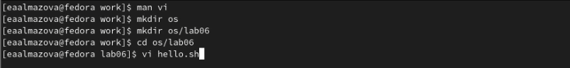
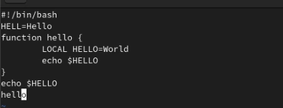
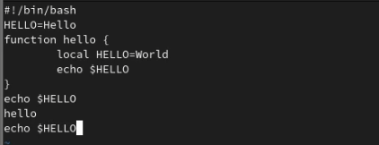

---
## Front matter
lang: ru-RU
title: Отчет по лабораторной работе №8
author: Алмазова Елизавета Андреевна
institute: РУДН, г. Москва, Россия
date: 14.05.2022

## Formatting
toc: false
slide_level: 2
theme: metropolis
header-includes: 
 - \metroset{progressbar=frametitle,sectionpage=progressbar,numbering=fraction}
 - '\makeatletter'
 - '\beamer@ignorenonframefalse'
 - '\makeatother'
aspectratio: 43
section-titles: true
---

# Отчет по лабораторной работе №8

## Цель работы и задание

Цель данной лабораторной работы - познакомиться с операционной системой Linux, получить практические навыки работы с редактором vi, установленным по умолчанию практически во всех дистрибутивах.

Задание:

Создание нового файла с использованием vi

1. Создайте каталог с именем ~/work/os/lab06.
2. Перейдите во вновь созданный каталог.
3. Вызовите vi и создайте файл hello.sh
4. Нажмите клавишу i и введите следующий текст: 

#!/bin/bash

HELL=Hello

function hello {

LOCAL HELLO=World

echo $HELLO

}

echo $HELLO

hello

5. Нажмите клавишу Esc для перехода в командный режим после завершения ввода текста.
6. Нажмите : для перехода в режим последней строки и внизу вашего экрана появится приглашение в виде двоеточия.
7. Нажмите w (записать) и q (выйти), а затем нажмите клавишу Enter для сохранения вашего текста и завершения работы.
8. Сделайте файл исполняемым.

Редактирование существующего файла

1. Вызовите vi на редактирование файла hello.sh.
2. Установите курсор в конец слова HELL второй строки.
3. Перейдите в режим вставки и замените на HELLO. Нажмите Esc для возврата в командный режим.
4. Установите курсор на четвертую строку и сотрите слово LOCAL.
5. Перейдите в режим вставки и наберите следующий текст: local, нажмите Esc для
возврата в командный режим.
6. Установите курсор на последней строке файла. Вставьте после неё строку, содержащую
следующий текст: echo $HELLO.
7. Нажмите Esc для перехода в командный режим.
8. Удалите последнюю строку.
9. Введите команду отмены изменений u для отмены последней команды.
10. Введите символ : для перехода в режим последней строки. Запишите произведённые
изменения и выйдите из vi.

## Ход работы

1. Создала каталог с именем ~/work/os/lab06. Перешла во вновь созданный каталог с помощью команды cd. Вызвала vi и создала файл hello.sh (рис.1).

{ #fig:001 width=70% }

2. Нажала клавишу i и ввела требующийся текст (рис.2). Нажала клавишу Esc для перехода в командный режим после завершения ввода текста. Нажала : для перехода в режим последней строки и внизу моего экрана появилось приглашение в виде двоеточия. Нажала w, q и клавишу Enter для сохранения текста и завершения работы.

{ #fig:002 width=70% }

3. Сделала файл исполняемым с помощью команды chmod +x hello.sh.
4. Вызвала vi на редактирование файла hello.sh (vi hello.sh). Заменила HELL на HELLO, стерла слово LOCAL, в режиме вставки набрала local, нажала Esc для возврата в командный режим. Установила курсор на последней строке файла. Вставила после неё строку, содержащую следующий текст: echo $HELLO (рис.3).

{ #fig:003 width=70% }

5. Нажала Esc для перехода в командный режим. Удалила последнюю строку. Ввела команду отмены изменений u для отмены последней команды. Ввела символ : для перехода в режим последней строки. Записала произведённые изменения и вышла из vi с помощью нажатия w+q+Enter.

## Выводы

В ходе выполнения данной лабораторной работы я познакомилась с операционной системой Linux, получила практические навыки работы с редактором vi, установленным по умолчанию практически во всех дистрибутивах.

## {.standout}

Спасибо за внимание!
