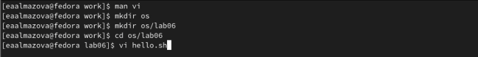
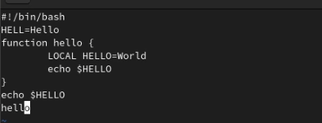
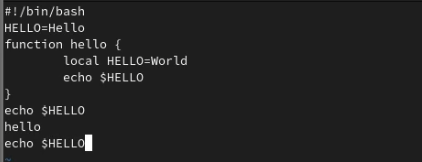
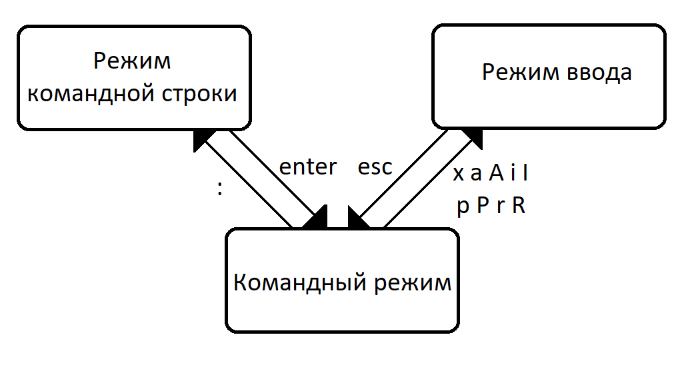

---
# Front matter
title: "Отчёт по лабораторной работе №8"
subtitle: "Дисциплина: Операционные системы"
author: "Елизавета Андреевна Алмазова"

## Generic options
lang: ru-RU
toc-title: "Содержание"

## Bibliography
bibliography: bib/cite.bib
csl: pandoc/csl/gost-r-7-0-5-2008-numeric.csl

## Pdf output format
toc: true # Table of contents
toc-depth: 2
lof: true # List of figures
lot: true # List of tables
fontsize: 12pt
linestretch: 1.5
papersize: a4
documentclass: scrreprt
## I18n polyglossia
polyglossia-lang:
  name: russian
  options:
	- spelling=modern
	- babelshorthands=true
polyglossia-otherlangs:
  name: english
## I18n babel
babel-lang: russian
babel-otherlangs: english
## Fonts
mainfont: PT Serif
romanfont: PT Serif
sansfont: PT Sans
monofont: PT Mono
mainfontoptions: Ligatures=TeX
romanfontoptions: Ligatures=TeX
sansfontoptions: Ligatures=TeX,Scale=MatchLowercase
monofontoptions: Scale=MatchLowercase,Scale=0.9
## Biblatex
biblatex: true
biblio-style: "gost-numeric"
biblatexoptions:
  - parentracker=true
  - backend=biber
  - hyperref=auto
  - language=auto
  - autolang=other*
  - citestyle=gost-numeric
## Pandoc-crossref LaTeX customization
figureTitle: "Рис."
tableTitle: "Таблица"
listingTitle: "Листинг"
lofTitle: "Список иллюстраций"
lotTitle: "Список таблиц"
lolTitle: "Листинги"
## Misc options
indent: true
header-includes:
  - \usepackage{indentfirst}
  - \usepackage{float} # keep figures where there are in the text
  - \floatplacement{figure}{H} # keep figures where there are in the text
---

# Цель работы

Цель данной лабораторной работы - познакомиться с операционной системой Linux, получить практические навыки работы с редактором vi, установленным по умолчанию практически во всех дистрибутивах.

# Задание

## Создание нового файла с использованием vi

1. Создайте каталог с именем ~/work/os/lab06.
2. Перейдите во вновь созданный каталог.
3. Вызовите vi и создайте файл hello.sh
4. Нажмите клавишу i и введите следующий текст: 

#!/bin/bash

HELL=Hello

function hello {

LOCAL HELLO=World

echo $HELLO

}

echo $HELLO

hello

5. Нажмите клавишу Esc для перехода в командный режим после завершения ввода текста.
6. Нажмите : для перехода в режим последней строки и внизу вашего экрана появится приглашение в виде двоеточия.
7. Нажмите w (записать) и q (выйти), а затем нажмите клавишу Enter для сохранения вашего текста и завершения работы.
8. Сделайте файл исполняемым.

## Редактирование существующего файла

1. Вызовите vi на редактирование файла hello.sh.
2. Установите курсор в конец слова HELL второй строки.
3. Перейдите в режим вставки и замените на HELLO. Нажмите Esc для возврата в командный режим.
4. Установите курсор на четвертую строку и сотрите слово LOCAL.
5. Перейдите в режим вставки и наберите следующий текст: local, нажмите Esc для
возврата в командный режим.
6. Установите курсор на последней строке файла. Вставьте после неё строку, содержащую
следующий текст: echo $HELLO.
7. Нажмите Esc для перехода в командный режим.
8. Удалите последнюю строку.
9. Введите команду отмены изменений u для отмены последней команды.
10. Введите символ : для перехода в режим последней строки. Запишите произведённые
изменения и выйдите из vi.

# Теоретическое введение

В большинстве дистрибутивов Linux в качестве текстового редактора по умолчанию устанавливается интерактивный экранный редактор vi (Visual display editor). Редактор vi имеет три режима работы:

- командный режим — предназначен для ввода команд редактирования и навигации по редактируемому файлу;
- режим вставки — предназначен для ввода содержания редактируемого файла;
- режим последней (или командной) строки — используется для записи изменений в файл и выхода из редактора.

Для вызова редактора vi необходимо указать команду vi и имя редактируемого файла: vi <имя_файла>. При этом в случае отсутствия файла с указанным именем будет создан такой файл.

Переход в командный режим осуществляется нажатием клавиши Esc. Для выхода из редактора vi необходимо перейти в режим последней строки: находясь в командном режиме, нажать Shift-; (по сути символ : — двоеточие), затем: 

- набрать символы wq, если перед выходом из редактора требуется записать изменения
в файл;
- набрать символ q (или q!), если требуется выйти из редактора без сохранения.

Опции редактора vi позволяют настроить рабочую среду. Для задания опций используется команда set. Если вы хотите отказаться от использования опции, то в команде set перед именем опции надо поставить no.

# Выполнение лабораторной работы

1. Создала каталог с именем ~/work/os/lab06 (mkdir os, mkdir os/lab06). Перешла во вновь созданный каталог с помощью команды cd. Вызвала vi и создала файл hello.sh: vi hello.sh (рис.1).

{ #fig:001 width=70% }

2. Нажала клавишу i и ввела требующийся текст (рис.2). Нажала клавишу Esc для перехода в командный режим после завершения ввода текста. Нажала : для перехода в режим последней строки и внизу моего экрана появилось приглашение в виде двоеточия. Нажала w, q и клавишу Enter для сохранения текста и завершения работы.

{ #fig:002 width=70% }

3. Сделала файл исполняемым с помощью команды chmod +x hello.sh.
4. Вызвала vi на редактирование файла hello.sh (vi hello.sh). Установила курсор в конец слова HELL второй строки. Перейдите в режим вставки (клавиша i) и заменила на HELLO. Нажала Esc для возврата в командный режим. Установила курсор на четвертую строку и стерла слово LOCAL, в режиме вставки набрала local, нажала Esc для возврата в командный режим. Установила курсор на последней строке файла. Вставила после неё строку, содержащую следующий текст: echo $HELLO (рис.3).

{ #fig:003 width=70% }

5. Нажала Esc для перехода в командный режим. Удалила последнюю строку. Ввела команду отмены изменений u для отмены последней команды. Ввела символ : для перехода в режим последней строки. Записала произведённые изменения и вышла из vi с помощью нажатия w+q+Enter.

# Выводы

В ходе выполнения данной лабораторной работы я познакомилась с операционной системой Linux, получила практические навыки работы с редактором vi, установленным по умолчанию практически во всех дистрибутивах.

# Ответы на контрольные вопросы

1. Дайте краткую характеристику режимам работы редактора vi.

Редактор vi имеет три режима работы:

- командный режим – предназначен для ввода команд редактирования и навигации по редактируемому файлу;
- режим вставки – предназначен для ввода содержания редактируемого файла;
- режим последней (или командной) строки – используется для записи изменений в файл и выхода из редактора.

2. Как выйти из редактора, не сохраняя произведённые изменения?

Необходимо перейти в режим последней строки: находясь в командном режиме, нажать Shift-; (по сути символ : – двоеточие), затем набрать символ q (или q!).

3. Назовите и дайте краткую характеристику командам позиционирования.

- 0 (ноль) – переход в начало строки;
- $ – переход в конец строки;
- G – переход в конец файла;
- n G – переход на строку с номером n.

4. Что для редактора vi является словом?

При использовании прописных W и B под разделителями понимаются только пробел, табуляция и возврат каретки. При использовании строчных w и b под разделителями понимаются также любые знаки пунктуации.

5. Каким образом из любого места редактируемого файла перейти в начало (конец) файла?

Чтобы из любого места редактируемого файла перейти в начало (конец) файла, нужно в режиме командной строки нажать клавиши 1 G (G).

6. Назовите и дайте краткую характеристику основным группам команд редактирования.

- Вставка текста
	- а – вставить текст после курсора;
	- А – вставить текст в конец строки;
	- i – вставить текст перед курсором;
	- n i – вставить текст n раз;
	- I – вставить текст в начало строки.
- Вставка строки
	- о – вставить строку под курсором;
	- О – вставить строку над курсором.
- Удаление текста
	- x – удалить один символ в буфер;
	- d w – удалить одно слово в буфер;
	- d $ – удалить в буфер текст от курсора до конца строки;
	- d 0 – удалить в буфер текст от начала строки до позиции курсора;
	- d d – удалить в буфер одну строку;
	- n d d – удалить в буфер n строк.
- Отмена и повтор произведённых изменений
	- u – отменить последнее изменение;
	- . – повторить последнее изменение.
- Копирование текста в буфер
	- Y – скопировать строку в буфер;
	- n Y – скопировать n строк в буфер;
	- y w – скопировать слово в буфер.
- Вставка текста из буфера
	- p – вставить текст из буфера после курсора;
	- P – вставить текст из буфера перед курсором.
- Замена текста
	- c w – заменить слово;
	- n c w – заменить n слов;
	- c $ – заменить текст от курсора до конца строки;
	- r – заменить слово;
	- R – заменить текст.
- Поиск текста
	- / текст – произвести поиск вперёд по тексту указанной строки символов текст;
	- ? текст – произвести поиск назад по тексту указанной строки символов текст.

7. Необходимо заполнить строку символами $. Каковы ваши действия?

Чтобы заполнить строку символами $, необходимо для начала перейти на эту строку, нажав клавиши n G, где n – номер строки, далее нажать 0 для перехода в начало строки. Теперь необходимо нажать c $, чтобы заменить текст от курсора до конца строки, и ввести символы $.

8. Как отменить некорректное действие, связанное с процессом редактирования?

Чтобы отменить по одному предыдущему действию последовательно, необходимо нажать u. Чтобы отменить все изменения, произведённые со времени последней записи, нужно нажать : e !

9. Назовите и дайте характеристику основным группам команд режима последней строки.

- Копирование и перемещение текста
	- : 𝑛,𝑚 d – удалить строки с 𝑛 по 𝑚;
	- : 𝑖,𝑗 m 𝑘 – переместить строки с 𝑖 по 𝑗, начиная со строки 𝑘;
	- : 𝑖,𝑗 t 𝑘 – копировать строки с 𝑖 по 𝑗 в строку 𝑘;
	- : 𝑖,𝑗 w имя-файла – записать строки с 𝑖 по 𝑗 в файл с именем имя-файла.
- Запись в файл и выход из редактора
	- : w – записать изменённый текст в файл, не выходя из vi;
	- : w имя-файла – записать изменённый текст в новый файл с именем имя-файла;
	- : w ! имя-файла – записать изменённый текст в файл с именем имя-файла;
	- : w q – записать изменения в файл и выйти из vi;
	- : q – выйти из редактора vi;
	- : q ! – выйти из редактора без записи;
	- : e ! – вернуться в командный режим, отменив все изменения, произведённые со времени последней записи.
	
10. Как определить, не перемещая курсора, позицию, в которой заканчивается строка?

Чтобы определить, не перемещая курсора, позицию, в которой заканчивается строка, нужно в командном режиме находясь на нужной строке нажать «$» и посмотреть на число после запятой в правом нижнем углу экрана.

11. Выполните анализ опций редактора vi (сколько их, как узнать их назначение и т.д.).

Опции редактора vi позволяют настроить рабочую среду. Для задания опций используется команда set (в режиме последней строки). Если вы хотите отказаться от использования опции, то в команде set перед именем опции надо поставить no. Чтобы просмотреть опции редактора vi, необходимо нажать «:» set all. Нажав «:» help “название_опции”, можно узнать назначение конкретной опции.

12. Как определить режим работы редактора vi?

В режиме командной строки внизу редактора присутствует «:», в режиме ввода – «-- ВСТАВКА --», в командном режиме внизу ничего нет.

13. Постройте граф взаимосвязи режимов работы редактора vi.

См. рисунок 4.

{ #fig:004 width=70% }
