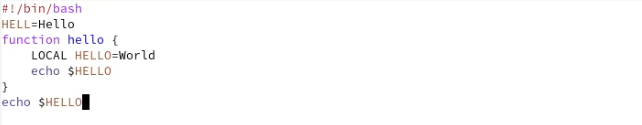
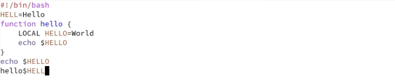
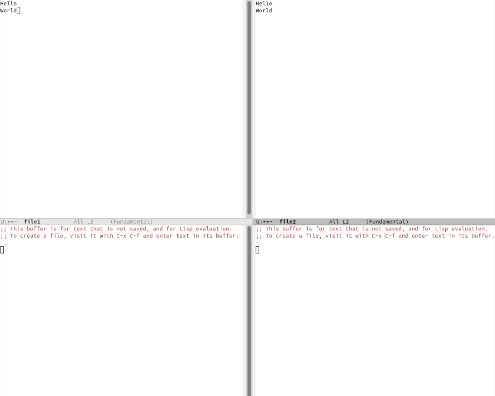
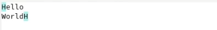

---
## Front matter
lang: ru-RU
title: Отчет по лабораторной работе №9
author: Алмазова Елизавета Андреевна
institute: РУДН, г. Москва, Россия
date: 21.05.2022

## Formatting
toc: false
slide_level: 2
theme: metropolis
header-includes: 
 - \metroset{progressbar=frametitle,sectionpage=progressbar,numbering=fraction}
 - '\makeatletter'
 - '\beamer@ignorenonframefalse'
 - '\makeatother'
aspectratio: 43
section-titles: true
---

# Отчет по лабораторной работе №9

## Цель работы и задание

Цель данной лабораторной работы - познакомиться с операционной системой Linux, получить практические навыки работы с редактором Emacs.

Задание:

1. Открыть emacs.
2. Создать файл lab07.sh с помощью комбинации Ctrl-x Ctrl-f (C-x C-f).
3. Наберите текст:
	- #!/bin/bash
	- HELL=Hello
	- function hello {
	- LOCAL HELLO=World
	- echo $HELLO
	- }
	- echo $HELLO
	- hello
4. Сохранить файл с помощью комбинации Ctrl-x Ctrl-s (C-x C-s).
5. Проделать с текстом стандартные процедуры редактирования, каждое действие должно осуществляться комбинацией клавиш.
	1. Вырезать одной командой целую строку (С-k).
	2. Вставить эту строку в конец файла (C-y).
	3. Выделить область текста (C-space).
	4. Скопировать область в буфер обмена (M-w).
	5. Вставить область в конец файла.
	6. Вновь выделить эту область и на этот раз вырезать её (C-w).
	7. Отмените последнее действие (C-/).
6. Научитесь использовать команды по перемещению курсора.
	1. Переместите курсор в начало строки (C-a).
	2. Переместите курсор в конец строки (C-e).
	3. Переместите курсор в начало буфера (M-<).
	4. Переместите курсор в конец буфера (M->).
7. Управление буферами.
	1. Вывести список активных буферов на экран (C-x C-b).
	2. Переместитесь во вновь открытое окно (C-x) o со списком открытых буферов и переключитесь на другой буфер.
	3. Закройте это окно (C-x 0).
	4. Теперь вновь переключайтесь между буферами, но уже без вывода их списка на экран (C-x b).
8. Управление окнами.
	1. Поделите фрейм на 4 части: разделите фрейм на два окна по вертикали (C-x 3), а затем каждое из этих окон на две части по горизонтали (C-x 2) (см. рис. 9.1).
	2. В каждом из четырёх созданных окон откройте новый буфер (файл) и введите несколько строк текста.
9. Режим поиска
	1. Переключитесь в режим поиска (C-s) и найдите несколько слов, присутствующих в тексте.
	2. Переключайтесь между результатами поиска, нажимая C-s.
	3. Выйдите из режима поиска, нажав C-g.
	4. Перейдите в режим поиска и замены (M-%), введите текст, который следует найти и заменить, нажмите Enter , затем введите текст для замены. После того как будут подсвечены результаты поиска, нажмите ! для подтверждения замены.
	5. Испробуйте другой режим поиска, нажав M-s o. Объясните, чем он отличается от обычного режима?

## Ход работы

1. Открыла emacs, создала файл lab07.sh с помощью комбинации C-x C-f. Набрала текст из задания (рис.1). Сохранила файл с помощью комбинации.

{ #fig:001 width=70% }

2. Проделала с текстом стандартные процедуры редактирования, каждое действие осуществлялось комбинацией клавиш (рис.2), в том числе выделяла, вырезала, копировала и вставляла строки, отменяла действия.

{ #fig:002 width=70% }

3. Научилась использовать команды по перемещению курсора.
4. Управляла буферами, в том числе выводила их список и переключалась между ними.
5. Управляла окнами (рис.3), делила их по вертикали и горизонтали, а также работала с открытыми в них буферами.

{ #fig:003 width=70% }

6. Использовала два режима поиска: C-s и M-%. С помощью первого я находила слова и переключалась между результатами поиска, заменяла текст. Я узнала, что второй вид поиска отличается от обычного в том плане, что в нем считывается строка поиска в качестве регулярного выражения, точное совпадение не ищется. (рис.4,5).

{ #fig:004 width=70% }

{ #fig:005 width=70% }

## Выводы

В ходе выполнения данной лабораторной работы я познакомилась с операционной системой Linux, получила практические навыки работы с редактором Emacs.

## {.standout}

Спасибо за внимание!
