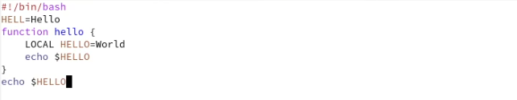

---
# Front matter
title: "Отчёт по лабораторной работе №9"
subtitle: "Дисциплина: Операционные системы"
author: "Елизавета Андреевна Алмазова"

## Generic options
lang: ru-RU
toc-title: "Содержание"

## Bibliography
bibliography: bib/cite.bib
csl: pandoc/csl/gost-r-7-0-5-2008-numeric.csl

## Pdf output format
toc: true # Table of contents
toc-depth: 2
lof: true # List of figures
lot: true # List of tables
fontsize: 12pt
linestretch: 1.5
papersize: a4
documentclass: scrreprt
## I18n polyglossia
polyglossia-lang:
  name: russian
  options:
	- spelling=modern
	- babelshorthands=true
polyglossia-otherlangs:
  name: english
## I18n babel
babel-lang: russian
babel-otherlangs: english
## Fonts
mainfont: PT Serif
romanfont: PT Serif
sansfont: PT Sans
monofont: PT Mono
mainfontoptions: Ligatures=TeX
romanfontoptions: Ligatures=TeX
sansfontoptions: Ligatures=TeX,Scale=MatchLowercase
monofontoptions: Scale=MatchLowercase,Scale=0.9
## Biblatex
biblatex: true
biblio-style: "gost-numeric"
biblatexoptions:
  - parentracker=true
  - backend=biber
  - hyperref=auto
  - language=auto
  - autolang=other*
  - citestyle=gost-numeric
## Pandoc-crossref LaTeX customization
figureTitle: "Рис."
tableTitle: "Таблица"
listingTitle: "Листинг"
lofTitle: "Список иллюстраций"
lotTitle: "Список таблиц"
lolTitle: "Листинги"
## Misc options
indent: true
header-includes:
  - \usepackage{indentfirst}
  - \usepackage{float} # keep figures where there are in the text
  - \floatplacement{figure}{H} # keep figures where there are in the text
---

# Цель работы

Цель данной лабораторной работы - познакомиться с операционной системой Linux, получить практические навыки работы с редактором Emacs.

# Задание

1. Открыть emacs.
2. Создать файл lab07.sh с помощью комбинации Ctrl-x Ctrl-f (C-x C-f).
3. Наберите текст:
	- #!/bin/bash
	- HELL=Hello
	- function hello {
	- LOCAL HELLO=World
	- echo $HELLO
	- }
	- echo $HELLO
	- hello
4. Сохранить файл с помощью комбинации Ctrl-x Ctrl-s (C-x C-s).
5. Проделать с текстом стандартные процедуры редактирования, каждое действие должно осуществляться комбинацией клавиш.
	1. Вырезать одной командой целую строку (С-k).
	2. Вставить эту строку в конец файла (C-y).
	3. Выделить область текста (C-space).
	4. Скопировать область в буфер обмена (M-w).
	5. Вставить область в конец файла.
	6. Вновь выделить эту область и на этот раз вырезать её (C-w).
	7. Отмените последнее действие (C-/).
6. Научитесь использовать команды по перемещению курсора.
	1. Переместите курсор в начало строки (C-a).
	2. Переместите курсор в конец строки (C-e).
	3. Переместите курсор в начало буфера (M-<).
	4. Переместите курсор в конец буфера (M->).
7. Управление буферами.
	1. Вывести список активных буферов на экран (C-x C-b).
	2. Переместитесь во вновь открытое окно (C-x) o со списком открытых буферов и переключитесь на другой буфер.
	3. Закройте это окно (C-x 0).
	4. Теперь вновь переключайтесь между буферами, но уже без вывода их списка на экран (C-x b).
8. Управление окнами.
	1. Поделите фрейм на 4 части: разделите фрейм на два окна по вертикали (C-x 3), а затем каждое из этих окон на две части по горизонтали (C-x 2) (см. рис. 9.1).
	2. В каждом из четырёх созданных окон откройте новый буфер (файл) и введите несколько строк текста.
9. Режим поиска
	1. Переключитесь в режим поиска (C-s) и найдите несколько слов, присутствующих в тексте.
	2. Переключайтесь между результатами поиска, нажимая C-s.
	3. Выйдите из режима поиска, нажав C-g.
	4. Перейдите в режим поиска и замены (M-%), введите текст, который следует найти и заменить, нажмите Enter , затем введите текст для замены. После того как будут подсвечены результаты поиска, нажмите ! для подтверждения замены.
	5. Испробуйте другой режим поиска, нажав M-s o. Объясните, чем он отличается от обычного режима?

# Теоретическое введение

## Краткая информация

Emacs представляет собой мощный экранный редактор текста, написанный на языке высокого уровня Elisp. Emacs имеет встроенный язык программирования, который может использоваться для настройки, расширения и изменения поведения редактора. Многие рутинные операции в Emacs удобнее производить с помощью клавиатуры, а не графического меню. Может вызывать трудности изучение большого количества сочетаний клавиш и команд, для начала скорее всего придется часто обращаться к справочным материалам.

## Основные термины

1. Буфер — объект, представляющий какой-либо текст. Буфер может содержать что угодно, например, результаты компиляции программы или встроенные подсказки. Практически всё взаимодействие с пользователем, в том числе интерактивное, происходит посредством буферов.
2. Фрейм соответствует окну в обычном понимании этого слова. Каждый фрейм содержит область вывода и одно или несколько окон Emacs. 
3. Окно — прямоугольная область фрейма, отображающая один из буферов. Каждое окно имеет свою строку состояния, в которой выводится следующая информация: название буфера, его основной режим, изменялся ли текст буфера и как далеко вниз по буферу расположен курсор. Каждый буфер находится только в одном из возможных основных режимов. Существующие основные режимы включают режим Fundamental (наименее специализированный), режим Text, режим Lisp, режим С, режим Texinfo и другие. Под второстепенными режимами понимается список режимов, которые включены в данный момент в буфере выбранного окна.
4. Область вывода — одна или несколько строк внизу фрейма, в которой Emacs выводит различные сообщения, а также запрашивает подтверждения и дополнительную информацию от пользователя.
5. Минибуфер используется для ввода дополнительной информации и всегда отображается в области вывода.
6. Точка вставки — место вставки (удаления) данных в буфере.
7. Режим — пакет расширений, изменяющий поведение буфера Emacs при редактировании и просмотре текста (например, для редактирования исходного текста программ на языках С или Perl).

## Основы работы

Для запуска Emacs необходимо в командной строке набрать emacs (или emacs & для работы в фоновом режиме относительно консоли). Для работы с Emacs можно использовать как элементы меню, так и различные сочетания клавиш. Например, для выхода из Emacs можно воспользоваться меню File и выбрать пункт Quit , а можно нажать последовательно Ctrl-x Ctrl-c (в обозначениях Emacs: C-x C-c).

Многие рутинные операции в Emacs удобнее производить с помощью клавиатуры, а не графического меню. Наиболее часто в командах Emacs используются сочетания c клавишами Ctrl и Meta (в обозначениях Emacs: C- и M-; клавиша Shift в Emasc обозначается как S-). Так как на клавиатуре для IBM PC совместимых ПК клавиши Meta нет, то вместо неё можно использовать Alt или Esc . Для доступа к системе меню используйте клавишу F10 . Клавиши Ctrl , Meta и Shift принято называть префиксными. Например, запись M-x означает, что надо удерживая клавишу Meta (или Alt ), нажать на клавишу x. Для открытия файла следует использовать команду C-x C-f (надо, удерживая клавишу Ctrl , нажать на клавишу x , затем отпустить обе клавиши и снова, удерживая клавишу Ctrl , нажать на клавишу f ).

По назначению префиксные сочетания клавиш различаются следующим образом:

- C-x — префикс ввода основных команд редактора (например, открытия, закрытии, сохранения файла и т.д.);
- C-c — префикс вызова функций, зависящих от используемого режима.

При работе с командами Emacs можно использовать регулярные выражения. Основные отличия от PCRE (Perl Compatible Regular Expressions — библиотека регулярных выражений в стиле Perl):

- \s не задаёт пробел;
- \t не задаёт табуляцию;
- операция «или» и скобки группировки экранируются.

# Выполнение лабораторной работы

1. Открыла emacs с помощью команды emacs. Создала файл lab07.sh с помощью комбинации Ctrl-x Ctrl-f (C-x C-f). Набрала текст из задания (рис.1). Сохранила файл с помощью комбинации Ctrl-x Ctrl-s (C-x C-s).

{ #fig:001 width=70% }

2. Проделала с текстом стандартные процедуры редактирования, каждое действие осуществлялось комбинацией клавиш (рис.2).
	1. Вырезала одной командой целую строку (С-k).
	2. Вставила эту строку в конец файла (C-y).
	3. Выделила область текста (C-space).
	4. Скопировала область в буфер обмена (M-w).
	5. Вставила область в конец файла.
	6. Вновь выделила эту область и на этот раз вырезать её (C-space C-w).
	7. Отменила последнее действие (C-/).

{ #fig:002 width=70% }

3. Научилась использовать команды по перемещению курсора.
	1. Переместила курсор в начало строки (C-a).
	2. Переместила курсор в конец строки (C-e).
	3. Переместила курсор в начало буфера (M-<).
	4. Переместила курсор в конец буфера (M->).
4. Управление буферами.
	1. Вывела список активных буферов на экран (C-x C-b).
	2. Переместилась во вновь открытое окно (C-x) о со списком открытых буферов и переключилась на другой буфер.
	3. Закрыла это окно (C-x 0).
	4. Вновь переключилась между буферами, но уже без вывода их списка на экран (C-x b).
5. Управление окнами (рис.3).
	1. Поделила фрейм на 4 части: разделила фрейм на два окна по вертикали (C-x 3), а затем каждое из этих окон на две части по горизонтали (C-x 2).
	2. В каждом из четырёх созданных окон создала и открыла новый буфер (C-x C-f) и ввела несколько строк текста.

{ #fig:003 width=70% }

6. Режим поиска (рис.4,5).
	1. Переключилась в режим поиска (C-s) и нашла несколько слов, присутствующих в тексте (Hello).
	2. Переключилась между результатами поиска, нажимая C-s.
	3. Вышла из режима поиска, нажав C-g.
	4. Перешла в режим поиска и замены (M-%), ввела текст, который следует найти и заменить, нажала Enter, затем ввела текст для замены. После того, как будут подсвечены результаты поиска, нажала ! для подтверждения замены.
	5. Испробовала другой режим поиска, нажав M-s o. Данный вид поиска отличается от обычного в том плане, что в нем считывается строка поиска в качестве регулярного выражения, точное совпадение не ищется.

{ #fig:004 width=70% }

{ #fig:005 width=70% }

# Выводы

В ходе выполнения данной лабораторной работы я познакомилась с операционной системой Linux, получила практические навыки работы с редактором Emacs.

# Ответы на контрольные вопросы

1. Кратко охарактеризуйте редактор emacs.

Emacs представляет собой мощный экранный редактор текста, написанный на языке высокого уровня Elisp. Emacs имеет встроенный язык программирования, который может использоваться для настройки, расширения и изменения поведения редактора.

2. Какие особенности данного редактора могут сделать его сложным для освоения новичком?

Многие рутинные операции в Emacs удобнее производить с помощью клавиатуры, а не графического меню. Может вызывать трудности изучение большого количества сочетаний клавиш и команд, для начала скорее всего придется часто обращаться к справочным материалам.

3. Своими словами опишите, что такое буфер и окно в терминологии emacs’а.

Буфер – это некоторый объект, в котором находится текст. Окно – это область экрана, в которой отображается буфер.

4. Можно ли открыть больше 10 буферов в одном окне?

Нет. Одно окно имеет один буфер, но фрейм может иметь несколько окон.

5. Какие буферы создаются по умолчанию при запуске emacs?

Scratch, Messages, GNU Emacs.

6. Какие клавиши вы нажмёте, чтобы ввести следующую комбинацию C-c | и C-c C-|?

C-c | - сначала, удерживая ctrl, нажимаю c, потом отпускаю обе клавиши и нажимаю |.
C-c C-| - сначала, удерживая ctrl, нажимаю c, потом отпускаю обе клавиши и, удерживая ctrl, нажимаю |.

7. Как поделить текущее окно на две части?

Можно нажать C-x 2, это разделит окно по горизонтали, или C-x 3, это разделит окно по вертикали.

8. В каком файле хранятся настройки редактора emacs?

В файле .emacs.

9. Какую функцию выполняет клавиша и можно ли её переназначить?

Кроме отдельных префиксных клавиш, в Emacs используются сочетания клавиш, которые рассматриваются как префиксные. В отличии от префиксных клавиш Control, Shift и других, такие сочетания клавиш не надо удерживать когда нажимается следующая клавиша. Клавиши можно переназначить с помощью изменения файла .emacs.

10. Какой редактор вам показался удобнее в работе vi или emacs? Поясните почему.

Vi показался мне более удобным редактором, так как в нем есть несколько различных режимов, между которыми можно переключаться, а также меньше сочетаний клавиш, большое количество которых, особенно на начальном этапе, может быть неудобным.
