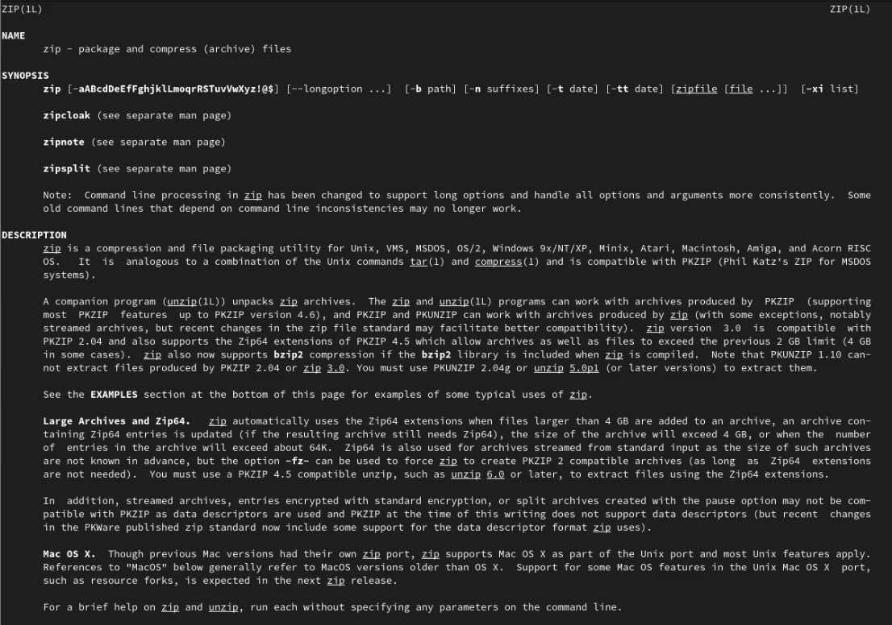
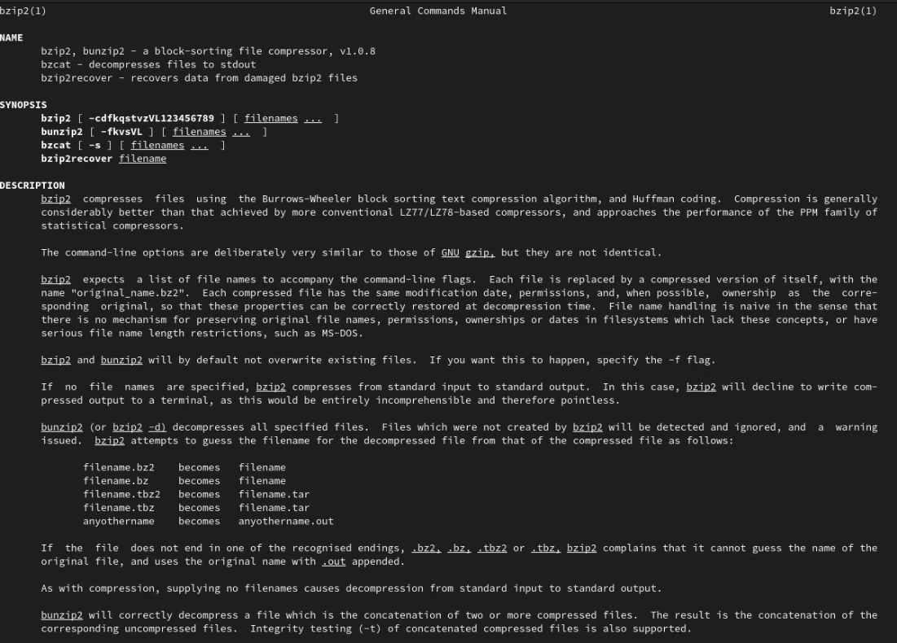
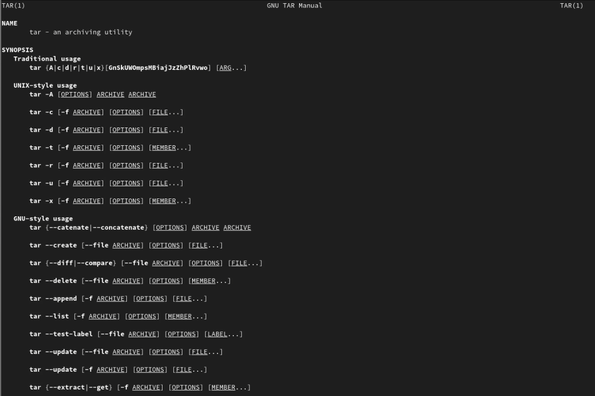
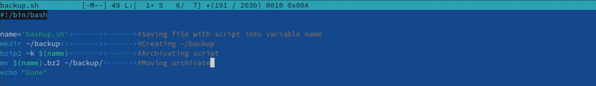
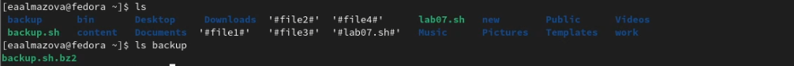
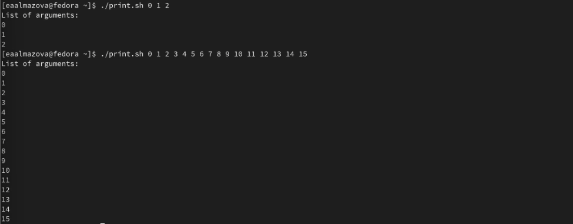
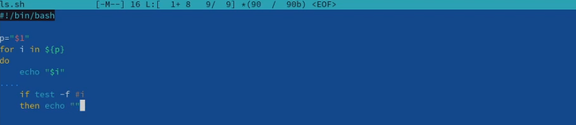
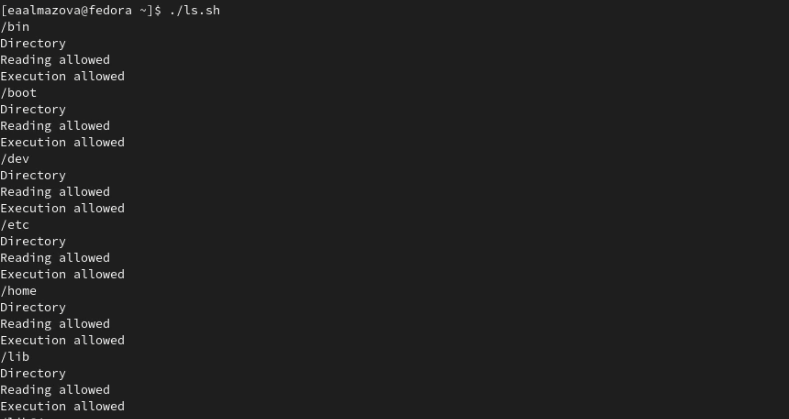

---
## Front matter
lang: ru-RU
title: Отчет по лабораторной работе №10
author: Алмазова Елизавета Андреевна
institute: РУДН, г. Москва, Россия
date: 21.05.2022

## Formatting
toc: false
slide_level: 2
theme: metropolis
header-includes: 
 - \metroset{progressbar=frametitle,sectionpage=progressbar,numbering=fraction}
 - '\makeatletter'
 - '\beamer@ignorenonframefalse'
 - '\makeatother'
aspectratio: 43
section-titles: true
---

# Отчет по лабораторной работе №10

## Цель работы и задание

Цель данной лабораторной работы - изучить основы программирования в оболочке ОС UNIX/Linux, научиться писать небольшие командные файлы.

Задание:

1. Написать скрипт, который при запуске будет делать резервную копию самого себя (то есть файла, в котором содержится его исходный код) в другую директорию backup в вашем домашнем каталоге. При этом файл должен архивироваться одним из архиваторов на выбор zip, bzip2 или tar. Способ использования команд архивации необходимо узнать, изучив справку.
2. Написать пример командного файла, обрабатывающего любое произвольное число аргументов командной строки, в том числе превышающее десять. Например, скрипт может последовательно распечатывать значения всех переданных аргументов.
3. Написать командный файл — аналог команды ls (без использования самой этой команды и команды dir). Требуется, чтобы он выдавал информацию о нужном каталоге и выводил информацию о возможностях доступа к файлам этого каталога.
4. Написать командный файл, который получает в качестве аргумента командной строки формат файла (.txt, .doc, .jpg, .pdf и т.д.) и вычисляет количество таких файлов в указанной директории. Путь к директории также передаётся в виде аргумента командной строки.

## Ход работы

1. С помощью команды man изучала справку по командам архивации: man zip, man bzip2, man tar (рис.1,2,3).

{ #fig:001 width=70% }

{ #fig:002 width=70% }

{ #fig:003 width=70% }

2. Написала скрипт, который при запуске будет делать резервную копию самого себя (то есть файла, в котором содержится его исходный код) в другую директорию backup в вашем домашнем каталоге, при этом файл архивируется bzip2. Cделала файл исполняемым и проверила работу скрипта(рис.4,5).

{ #fig:004 width=70% }

{ #fig:005 width=70% }

3. Написала пример командного файла, обрабатывающего любое произвольное число аргументов командной строки, в том числе превышающее десять: скрипт может последовательно распечатывать значения всех переданных аргументов. Cделала файл исполняемым и проверила работу скрипта(рис.6).

{ #fig:006 width=70% }

4. Написала командный файл — аналог команды ls (без использования самой этой команды и команды dir), чтобы он выдавал информацию о нужном каталоге и выводил информацию о возможностях доступа к файлам этого каталога. Cделала файл исполняемым и проверила работу скрипта (рис.7,8).

{ #fig:007 width=70% }

{ #fig:008 width=70% }

5. Написала командный файл, который получает в качестве аргумента командной строки формат файла (.txt, .doc, .jpg, .pdf и т.д.) и вычисляет количество таких файлов в указанной директории. Путь к директории также передаётся в виде аргумента командной строки. Cделала файл исполняемым и проверила работу скрипта(рис.9).

{ #fig:003 width=70% }

## Выводы

В ходе выполнения данной лабораторной работы я изучила основы программирования в оболочке ОС UNIX/Linux, научилась писать небольшие командные файлы.

## {.standout}

Спасибо за внимание!
