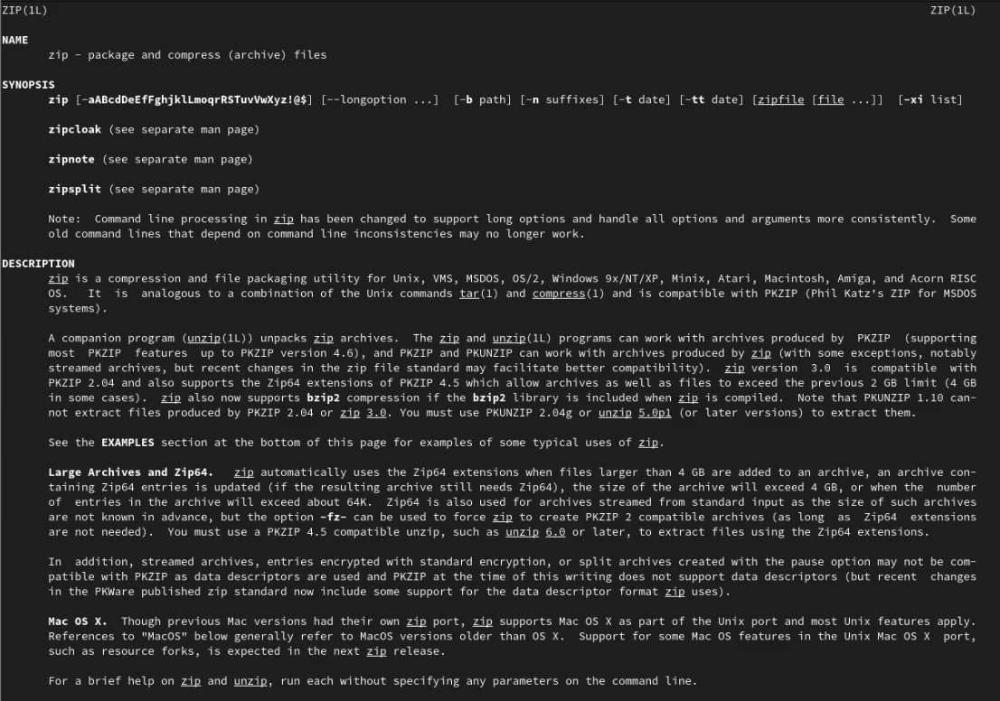
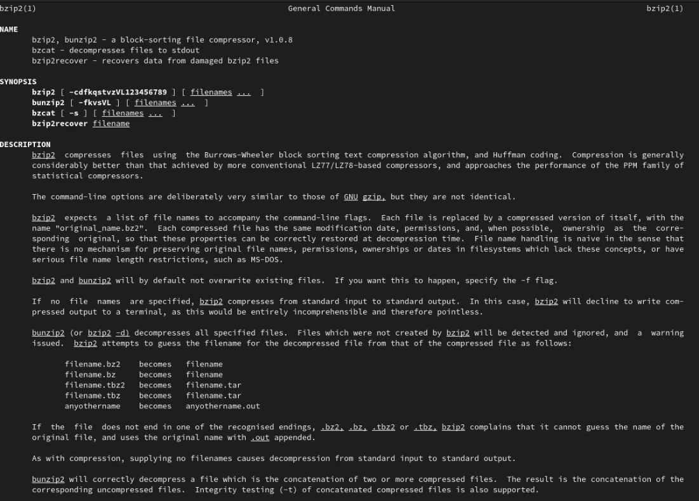
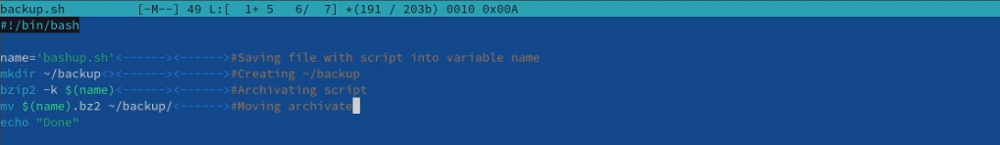
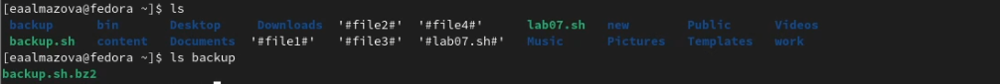
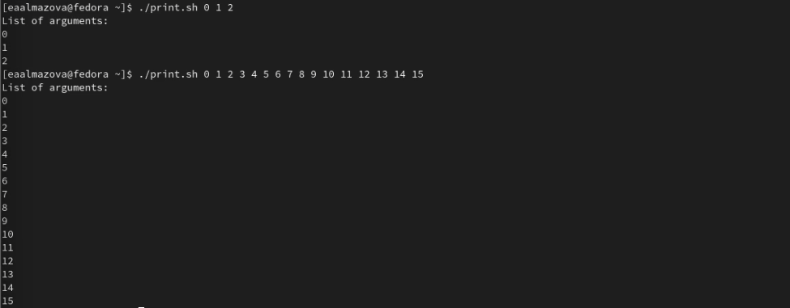
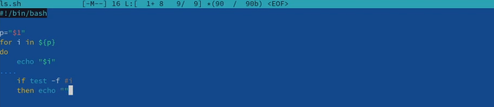
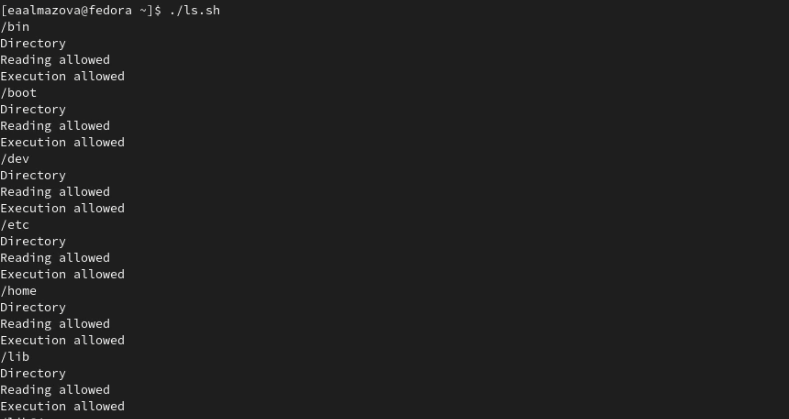

---
# Front matter
title: "Отчёт по лабораторной работе №10"
subtitle: "Дисциплина: Операционные системы"
author: "Елизавета Андреевна Алмазова"

## Generic options
lang: ru-RU
toc-title: "Содержание"

## Bibliography
bibliography: bib/cite.bib
csl: pandoc/csl/gost-r-7-0-5-2008-numeric.csl

## Pdf output format
toc: true # Table of contents
toc-depth: 2
lof: true # List of figures
lot: true # List of tables
fontsize: 12pt
linestretch: 1.5
papersize: a4
documentclass: scrreprt
## I18n polyglossia
polyglossia-lang:
  name: russian
  options:
	- spelling=modern
	- babelshorthands=true
polyglossia-otherlangs:
  name: english
## I18n babel
babel-lang: russian
babel-otherlangs: english
## Fonts
mainfont: PT Serif
romanfont: PT Serif
sansfont: PT Sans
monofont: PT Mono
mainfontoptions: Ligatures=TeX
romanfontoptions: Ligatures=TeX
sansfontoptions: Ligatures=TeX,Scale=MatchLowercase
monofontoptions: Scale=MatchLowercase,Scale=0.9
## Biblatex
biblatex: true
biblio-style: "gost-numeric"
biblatexoptions:
  - parentracker=true
  - backend=biber
  - hyperref=auto
  - language=auto
  - autolang=other*
  - citestyle=gost-numeric
## Pandoc-crossref LaTeX customization
figureTitle: "Рис."
tableTitle: "Таблица"
listingTitle: "Листинг"
lofTitle: "Список иллюстраций"
lotTitle: "Список таблиц"
lolTitle: "Листинги"
## Misc options
indent: true
header-includes:
  - \usepackage{indentfirst}
  - \usepackage{float} # keep figures where there are in the text
  - \floatplacement{figure}{H} # keep figures where there are in the text
---

# Цель работы

Цель данной лабораторной работы - изучить основы программирования в оболочке ОС UNIX/Linux, научиться писать небольшие командные файлы.

# Задание

1. Написать скрипт, который при запуске будет делать резервную копию самого себя (то есть файла, в котором содержится его исходный код) в другую директорию backup в вашем домашнем каталоге. При этом файл должен архивироваться одним из архиваторов на выбор zip, bzip2 или tar. Способ использования команд архивации необходимо узнать, изучив справку.
2. Написать пример командного файла, обрабатывающего любое произвольное число аргументов командной строки, в том числе превышающее десять. Например, скрипт может последовательно распечатывать значения всех переданных аргументов.
3. Написать командный файл — аналог команды ls (без использования самой этой команды и команды dir). Требуется, чтобы он выдавал информацию о нужном каталоге и выводил информацию о возможностях доступа к файлам этого каталога.
4. Написать командный файл, который получает в качестве аргумента командной строки формат файла (.txt, .doc, .jpg, .pdf и т.д.) и вычисляет количество таких файлов в указанной директории. Путь к директории также передаётся в виде аргумента командной строки.

# Теоретическое введение

## Командные оболочки

Командная оболочка - это программа, позволяющая пользователю взаимодействовать с операционной системой компьютера. В операционных системах типа UNIX/Linux наиболее часто используются следующие реализации командных оболочек:

- оболочка Борна (Bourne shell или sh) — стандартная командная оболочка UNIX/Linux, содержащая базовый, но при этом полный набор функций;
- С-оболочка (или csh) — надстройка на оболочкой Борна, использующая С-подобный синтаксис команд с возможностью сохранения истории выполнения команд;
- оболочка Корна (или ksh) — напоминает оболочку С, но операторы управления программой совместимы с операторами оболочки Борна;
- BASH — сокращение от Bourne Again Shell (опять оболочка Борна), в основе своей совмещает свойства оболочек С и Корна (разработка компании Free Software Foundation).

POSIX (Portable Operating System Interface for Computer Environments) — набор стандартов описания интерфейсов взаимодействия операционной системы и прикладных программ. Стандарты POSIX разработаны комитетом IEEE (Institute of Electrical and Electronics Engineers) для обеспечения совместимости различных UNIX/Linux-подобных операционных систем и переносимости прикладных программ на уровне исходного кода. POSIX-совместимые оболочки разработаны на базе оболочки Корна.

## Переменные и массивы в языке программирования bash

Имена переменных могут быть выбраны пользователем. Пользователь имеет возможность присвоить переменной значение некоторой строки символов. Например, команда mark=/usr/andy/bin присваивает значение строки символов /usr/andy/bin переменной mark типа строка символов. Оболочка bash позволяет работать с массивами. Для создания массива используется команда set с флагом -A. За флагом следует имя переменной, а затем список значений, разделённых пробелами. Например, 1 set -A states Delaware Michigan "New Jersey". Далее можно сделать добавление в массив, например,states[49]=Alaska. Индексация массивов начинается с нулевого элемента.

## Арифметические вычисления

Оболочка bash поддерживает встроенные арифметические функции. Команда let является показателем того, что последующие аргументы представляют собой выражение, подлежащее вычислению. Простейшее выражение — это единичный терм (term), обычно целочисленный.

Целые числа можно записывать как последовательность цифр или в любом базовом формате типа radix\#number, где radix (основание системы счисления) — любое число не более 26. Для большинства команд используются следующие основания систем исчисления: 2 (двоичная), 8 (восьмеричная) и 16 (шестнадцатеричная). Простейшими математическими выражениями являются сложение (+), вычитание (-), умножение (\*), целочисленное деление (/) и целочисленный остаток от деления (%).

Команда let берет два операнда и присваивает их переменной. Положительным моментом команды let можно считать то, что для идентификации переменной ей не нужен знак доллара; вы можете писать команды типа let sum=x+7, и let будет искать переменную x и добавлять к ней 7. Команда let также расширяет другие выражения let, если они заключены в двойные круглые скобки. Таким способом вы можете создавать довольно сложные выражения.
Команда let не ограничена простыми арифметическими выражениями.

Подобно С оболочка bash может присваивать переменной любое значение, а произвольное выражение само имеет значение, которое может использоваться. При этом «ноль» воспринимается как «ложь», а любое другое значение выражения — как «истина». Для сказанного является выполнение некоторого действия, одновременно декрементируя
некоторое значение.

Наиболее распространённым является сокращение, избавляющееся от слова let в программах оболочек. Если объявить переменные целыми значениями, то любое присвоение автоматически будет трактоваться как арифметическое действие. Если использовать typeset -i для объявления и присвоения переменной, то при последующем её применении она станет целой. Также можно использовать ключевое слово integer (псевдоним для typeset -i) и объявлять таким образом переменные целыми. Выражения типа х=y+z будет восприниматься в это случае как арифметические.

Команда read позволяет читать значения переменных со стандартного ввода

## Стандартные переменные

Переменные PS1 и PS2 предназначены для отображения промптера командного процессора. PS1 — это промптер командного процессора, по умолчанию его значение равно символу $ или #. Если какая-то интерактивная программа, запущенная командным процессором, требует ввода, то используется промптер PS2. Он по умолчанию имеет значение символа >. Другие стандартные переменные:

- HOME — имя домашнего каталога пользователя. Если команда cd вводится без аргументов, то происходит переход в каталог, указанный в этой переменной.
- IFS — последовательность символов, являющихся разделителями в командной строке, например, пробел, табуляция и перевод строки (new line).
- MAIL — командный процессор каждый раз перед выводом на экран промптера проверяет содержимое файла, имя которого указано в этой переменной, и если содержимое этого файла изменилось с момента последнего ввода из него, то перед тем как вывести на терминал промптер, командный процессор выводит на терминал сообщение You have mail (у Вас есть почта).
- TERM — тип используемого терминала.
- LOGNAME — содержит регистрационное имя пользователя, которое устанавливается автоматически при входе в систему.

В командном процессоре Си имеется ещё несколько стандартных переменных. Значение всех переменных можно просмотреть с помощью команды set.

## Метасимволы и экранирование

Такие символы, как ' < > * ? | \ " &, являются метасимволами и имеют для командного процессора специальный смысл. Экранирование может быть осуществлено с помощью предшествующего метасимволу символа \, который, в свою очередь, является метасимволом.

## Командные файлы и их параметры

Последовательность команд может быть помещена в текстовый файл. Такой файл называется командным. Далее этот файл можно выполнить по команде bash командный_файл [аргументы]. Чтобы не вводить каждый раз последовательности символов bash, необходимо изменить код защиты этого командного файла, обеспечив доступ к этому файлу по выполнению. Это может быть сделано с помощью команды chmod +x имя_файла. Теперь можно вызывать свой командный файл на выполнение, просто вводя его имя с терминала так, как-будто он является выполняемой программой. Командный процессор распознает, что в Вашем файле на самом деле хранится не выполняемая программа, а программа, написанная на языке программирования оболочки, и осуществит её интерпретацию.

При вызове командного файла на выполнение параметры ему могут быть переданы точно таким же образом, как и выполняемой программе. С точки зрения командного файла эти параметры являются позиционными. Символ $ является метасимволом командного процессора. Он используется, в частности, для ссылки на параметры, точнее, для получения их значений в командном файле. В командный файл можно передать до девяти параметров. При использовании где-либо в командном файле комбинации символов $i, где 0 < 𝑖 < 10, вместо неё будет осуществлена подстановка значения параметра с порядковым номером i, т.е. аргумента командного файла с порядковым номером i. Использование комбинации символов $0 приводит к подстановке вместо неё имени данного командного файла.

## Getopts и флаги

Весьма необходимой при программировании является команда getopts, которая осуществляет синтаксический анализ командной строки, выделяя флаги, и используется для объявления переменных. Флаги — это опции командной строки, обычно помеченные знаком минус; Например, для команды ls флагом может являться -F. Иногда флаги имеют аргументы, связанные с ними. Программы интерпретируют флаги, соответствующим образом изменяя своё поведение. Строка опций option-string — это список возможных букв и чисел соответствующего флага. Если ожидается, что некоторый флаг будет сопровождаться некоторым аргументом, то за символом, обозначающим этот флаг, должно следовать двоеточие. Соответствующей переменной присваивается буква данной опции. Если команда getopts может распознать аргумент, то она возвращает истину. Принято включать getopts в цикл while и анализировать введённые данные с помощью оператора case.

## Управление последовательностью действий

Часто бывает необходимо обеспечить проведение каких-либо действий циклически и управление дальнейшими действиями в зависимости от результатов проверки некоторого условия. Для решения подобных задач язык программирования bash предоставляет возможность использовать такие управляющие конструкции, как for, case, if и while.

При каждом следующем выполнении оператора цикла for переменная имя принимает следующее значение из списка значений, задаваемых списком список -значений. Вообще говоря, список-значений является необязательным. При его отсутствии оператор цикла for выполняется для всех позиционных параметров или, иначе говоря, аргументов.

Оператор выбора case реализует возможность ветвления на произвольное число ветвей.

Выполнение условного оператора if сводится к тому, что сначала выполняется последовательность команд (операторов), которую задаёт список-команд в строке, содержащей служебное слово if. Затем, если последняя выполненная команда из этой последовательности команд возвращает нулевой код завершения (истина), то будет выполнена последовательность команд (операторов), которую задаёт список-команд в строке, содержащей служебное слово then. Фраза elif проверяется в том случае, когда предыдущая проверка была ложной. Строка, содержащая служебное слово else, является необязательной. Если она присутствует, то последовательность команд (операторов), которую задаёт список-команд в строке, содержащей служебное слово else, будет выполнена только при условии, что последняя выполненная команда из последовательности команд (операторов), которую задаёт список-команд в строке, содержащей служебное слово if или elif, возвращает ненулевой код завершения (ложь).

# Выполнение лабораторной работы

1. С помощью команды man изучала справку по командам архивации: man zip, man bzip2, man tar (рис.1,2,3).

{ #fig:001 width=70% }

{ #fig:002 width=70% }

{ #fig:003 width=70% }

2. Написала скрипт, который при запуске будет делать резервную копию самого себя (то есть файла, в котором содержится его исходный код) в другую директорию backup в вашем домашнем каталоге, при этом файл архивируется bzip2 (mcedit backup.sh). С помощью команды chmod +x \*.sh сделала файл исполняемым и проверила работу скрипта с помощью ./backup.sh (рис.4,5).

{ #fig:004 width=70% }

{ #fig:005 width=70% }

3. Написала пример командного файла, обрабатывающего любое произвольное число аргументов командной строки, в том числе превышающее десять: скрипт может последовательно распечатывать значения всех переданных аргументов (mcedit print.sh). С помощью команды chmod +x \*.sh сделала файл исполняемым и проверила работу скрипта с помощью ./print.sh (рис.6).

{ #fig:006 width=70% }

4. Написала командный файл — аналог команды ls (без использования самой этой команды и команды dir), чтобы он выдавал информацию о нужном каталоге и выводил информацию о возможностях доступа к файлам этого каталога (mcedit ls.sh). С помощью команды chmod +x \*.sh сделала файл исполняемым и проверила работу скрипта с помощью ./ls.sh (рис.7,8).

{ #fig:007 width=70% }

{ #fig:008 width=70% }

5. Написала командный файл, который получает в качестве аргумента командной строки формат файла (.txt, .doc, .jpg, .pdf и т.д.) и вычисляет количество таких файлов в указанной директории (mcedit format.sh). Путь к директории также передаётся в виде аргумента командной строки. С помощью команды chmod +x \*.sh сделала файл исполняемым и проверила работу скрипта с помощью ./format.sh (рис.9).

{ #fig:003 width=70% }

# Выводы

В ходе выполнения данной лабораторной работы я изучила основы программирования в оболочке ОС UNIX/Linux, научилась писать небольшие командные файлы.

# Ответы на контрольные вопросы

1. Объясните понятие командной оболочки. Приведите примеры командных оболочек. Чем они отличаются?

Командная оболочка - это программа, позволяющая пользователю взаимодействовать с операционной системой компьютера. В операционных системах типа UNIX/Linux наиболее часто используются следующие реализации командных оболочек:

- оболочка Борна (Bourne shell или sh) — стандартная командная оболочка UNIX/Linux, содержащая базовый, но при этом полный набор функций;
- С-оболочка (или csh) — надстройка на оболочкой Борна, использующая С-подобный синтаксис команд с возможностью сохранения истории выполнения команд;
- оболочка Корна (или ksh) — напоминает оболочку С, но операторы управления программой совместимы с операторами оболочки Борна;
- BASH — сокращение от Bourne Again Shell (опять оболочка Борна), в основе своей совмещает свойства оболочек С и Корна (разработка компании Free Software Foundation).

2. Что такое POSIX?

POSIX (Portable Operating System Interface for Computer Environments) — набор стандартов описания интерфейсов взаимодействия операционной системы и прикладных программ. Стандарты POSIX разработаны комитетом IEEE (Institute of Electrical and Electronics Engineers) для обеспечения совместимости различных UNIX/Linux-подобных операционных систем и переносимости прикладных программ на уровне исходного кода. POSIX-совместимые оболочки разработаны на базе оболочки Корна.

3. Как определяются переменные и массивы в языке программирования bash?

Имена переменных могут быть выбраны пользователем. Пользователь имеет возможность присвоить переменной значение некоторой строки символов. Например, команда mark=/usr/andy/bin присваивает значение строки символов /usr/andy/bin переменной mark типа строка символов. Оболочка bash позволяет работать с массивами. Для создания массива используется команда set с флагом -A. За флагом следует имя переменной, а затем список значений, разделённых пробелами. Например, 1 set -A states Delaware Michigan "New Jersey". Далее можно сделать добавление в массив, например,states[49]=Alaska. Индексация массивов начинается с нулевого элемента.

4. Каково назначение операторов let и read?

Команда let берет два операнда и присваивает их переменной. Команда read позволяет читать значения переменных со стандартного ввода.

5. Какие арифметические операции можно применять в языке программирования bash?

Сложение, вычитание, умножение, деление, сдвиг влево и право на некоторое количество бит, сравнение и другие.

6. Что означает операция (( ))?

Для облегчения программирования можно записывать условия оболочки bash в двойные скобки.

7. Какие стандартные имена переменных Вам известны?

PS1, PS2, HOME, IFS, MAIL, TERM, LOGNAME.

8. Что такое метасимволы?

Такие символы, как ' < > * ? | \ " &, являются метасимволами и имеют для командного процессора специальный смысл.

9. Как экранировать метасимволы?

Экранирование может быть осуществлено с помощью предшествующего метасимволу символа \, который, в свою очередь, является метасимволом.

10. Как создавать и запускать командные файлы?

Последовательность команд может быть помещена в текстовый файл. Такой файл называется командным. Далее этот файл можно выполнить по команде bash командный_файл [аргументы]. Чтобы не вводить каждый раз последовательности символов bash, необходимо изменить код защиты этого командного файла, обеспечив доступ к этому файлу по выполнению. Это может быть сделано с помощью команды chmod +x имя_файла. Теперь можно вызывать свой командный файл на выполнение, просто вводя его имя с терминала так, как-будто он является выполняемой программой. Командный процессор распознает, что в Вашем файле на самом деле хранится не выполняемая программа, а программа, написанная на языке программирования оболочки, и осуществит её интерпретацию.

11. Как определяются функции в языке программирования bash?

Функция – это объединение группы команд. Для этого существует ключевое слово – function, после которого следует имя функции и список команд, заключённых в фигурные скобки.

12. Каким образом можно выяснить, является файл каталогом или обычным файлом?

С помощью команд test –d и test –f соответственно.

13. Каково назначение команд set, typeset и unset?

Set используется для вывода списка переменных окружения, typeset для наложения ограничений на переменные, unset для удаления переменной из окружения командной оболочки.

14. Как передаются параметры в командные файлы?

При вызове командного файла на выполнение параметры ему могут быть переданы точно таким же образом, как и выполняемой программе. С точки зрения командного файла эти параметры являются позиционными. Символ $ является метасимволом командного процессора. Он используется, в частности, для ссылки на параметры, точнее, для получения их значений в командном файле. В командный файл можно передать до девяти параметров. При использовании где-либо в командном файле комбинации символов $i, где 0 < 𝑖 < 10, вместо неё будет осуществлена подстановка значения параметра с порядковым номером i, т.е. аргумента командного файла с порядковым номером i. Использование комбинации символов $0 приводит к подстановке вместо неё имени данного командного файла.

15. Назовите специальные переменные языка bash и их назначение

- $* — отображается вся командная строка или параметры оболочки;
- $? — код завершения последней выполненной команды;
- $$ — уникальный идентификатор процесса, в рамках которого выполняется командный процессор;
- $! — номер процесса, в рамках которого выполняется последняя вызванная на выполнение в командном режиме команда;
- $- — значение флагов командного процессора;
- ${#\*} — возвращает целое число — количество слов, которые были результатом $\*;
- ${#name} — возвращает целое значение длины строки в переменной name;
- ${name[n]} — обращение к n-му элементу массива;
- ${name[\*]} — перечисляет все элементы массива, разделённые пробелом;
- ${name[@]} — то же самое, но позволяет учитывать символы пробелы в самих переменных;
- ${name:-value} — если значение переменной name не определено, то оно будет заменено на указанное value;
- ${name:value} — проверяется факт существования переменной;
- ${name=value} — если name не определено, то ему присваивается значение value;
- ${name?value} — останавливает выполнение, если имя переменной не определено, и выводит value как сообщение об ошибке;
- ${name+value} — это выражение работает противоположно ${name-value}. Если переменная определена, то подставляется value;
- ${name#pattern} — представляет значение переменной name с удалённым самым коротким левым образцом (pattern);
- ${#name[\*]} и ${#name[@]} — эти выражения возвращают количество элементов в массиве name.
