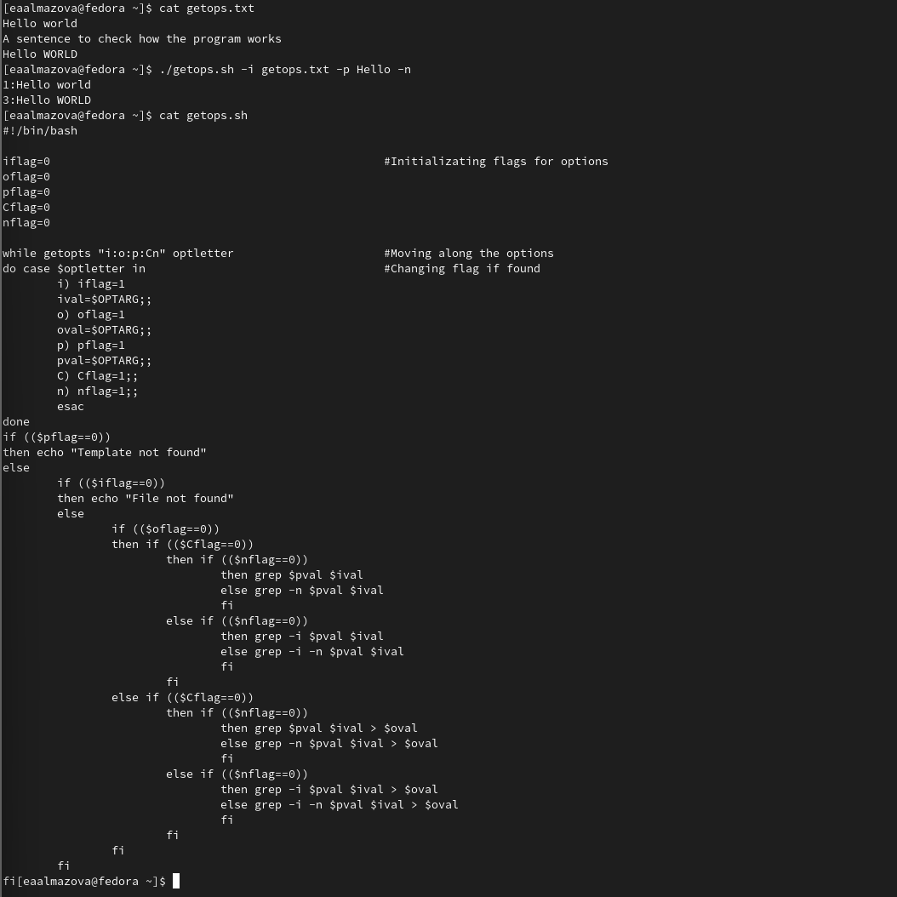
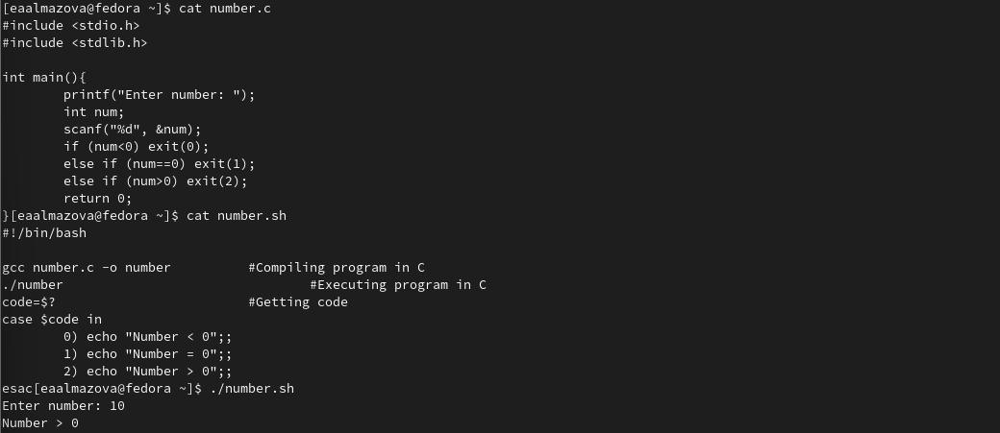
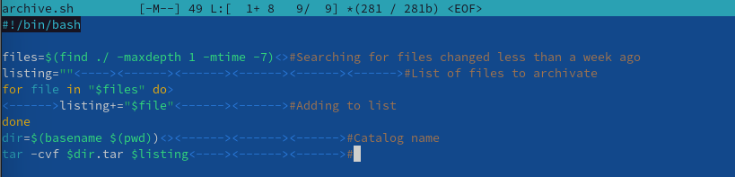
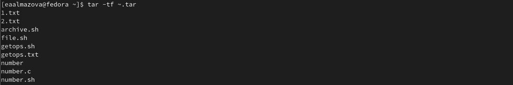

---
## Front matter
lang: ru-RU
title: Отчет по лабораторной работе №11
author: Алмазова Елизавета Андреевна
institute: РУДН, г. Москва, Россия
date: 28.05.2022

## Formatting
toc: false
slide_level: 2
theme: metropolis
header-includes: 
 - \metroset{progressbar=frametitle,sectionpage=progressbar,numbering=fraction}
 - '\makeatletter'
 - '\beamer@ignorenonframefalse'
 - '\makeatother'
aspectratio: 43
section-titles: true
---

# Отчет по лабораторной работе №11

## Цель работы и задание

Цель данной лабораторной работы - изучить основы программирования в оболочке ОС UNIX. Научиться писать более сложные командные файлы с использованием логических управляющих конструкций и циклов.

Задание:

1. Используя команды getopts grep, написать командный файл, который анализирует командную строку с ключами:

- iinputfile — прочитать данные из указанного файла;
- ooutputfile — вывести данные в указанный файл;
- pшаблон — указать шаблон для поиска;
- C — различать большие и малые буквы;
- n — выдавать номера строк.

а затем ищет в указанном файле нужные строки, определяемые ключом -p.

2. Написать на языке Си программу, которая вводит число и определяет, является ли оно больше нуля, меньше нуля или равно нулю. Затем программа завершается с помощью функции exit(n), передавая информацию в о коде завершения в оболочку. Командный файл должен вызывать эту программу и, проанализировав с помощью команды $?, выдать сообщение о том, какое число было введено.

3. Написать командный файл, создающий указанное число файлов, пронумерованных последовательно от 1 до 𝑁 (например 1.tmp, 2.tmp, 3.tmp,4.tmp и т.д.). Число файлов, которые необходимо создать, передаётся в аргументы командной строки. Этот же командный файл должен уметь удалять все созданные им файлы (если они существуют).

4. Написать командный файл, который с помощью команды tar запаковывает в архив все файлы в указанной директории. Модифицировать его так, чтобы запаковывались только те файлы, которые были изменены менее недели тому назад (использовать команду find).

## Ход работы

1. Используя команды getopts grep, написала командный файл getops.sh, который анализирует командную строку с ключами inputfile — прочитать данные из указанного файла; outputfile — вывести данные в указанный файл; p - шаблон — указать шаблон для поиска; C — различать большие и малые буквы; n — выдавать номера строк, а затем ищет в указанном файле нужные строки, определяемые ключом -p. Проверила его работу на файле getops.txt (рис.1).

{ #fig:001 width=70% }

2. Написала на языке Си программу number.c, которая вводит число и определяет, является ли оно больше нуля, меньше нуля или равно нулю. Затем программа завершается с помощью функции exit(n), передавая информацию о коде завершения в оболочку. Командный файл number.sh вызывает эту программу и, проанализировав с помощью команды $?, выдает сообщение о том, какое число было введено. Проверила его работу (рис.2).

{ #fig:002 width=70% }

3. Написала командный файл file.sh, создающий указанное число файлов, пронумерованных последовательно от 1 до 𝑁 (например 1.tmp, 2.tmp, 3.tmp, 4.tmp и т.д.). Число файлов, которые необходимо создать, передаётся в аргументы командной строки. Этот же командный файл умеет удалять все созданные им файлы. Создание или удаление файлов регулируется с помощью опций -c и -r (рис.3). Проверила его работу (рис.4)

{ #fig:003 width=70% }

{ #fig:004 width=70% }

4. Написала командный файл archive.sh, который с помощью команды tar запаковывает в архив все файлы в указанной директории и модифицировала его так, чтобы запаковывались только те файлы, которые были изменены менее недели тому назад с помощью команды find (рис.5). Проверила его работу (рис.6).

{ #fig:005 width=70% }

{ #fig:006 width=70% }

## Выводы

В ходе выполнения данной лабораторной работы я изучила основы программирования в оболочке ОС UNIX, научилась писать более сложные командные файлы с использованием логических управляющих конструкций и циклов.

## {.standout}

Спасибо за внимание!
