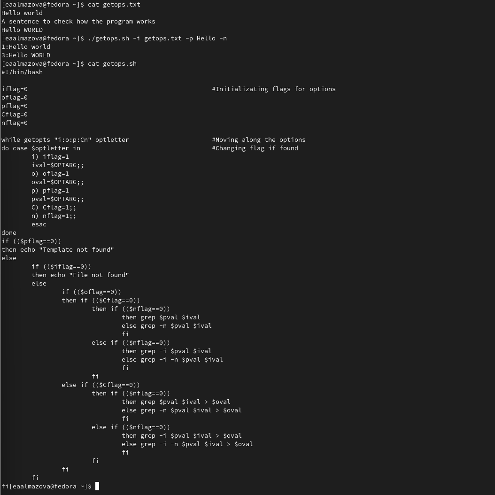
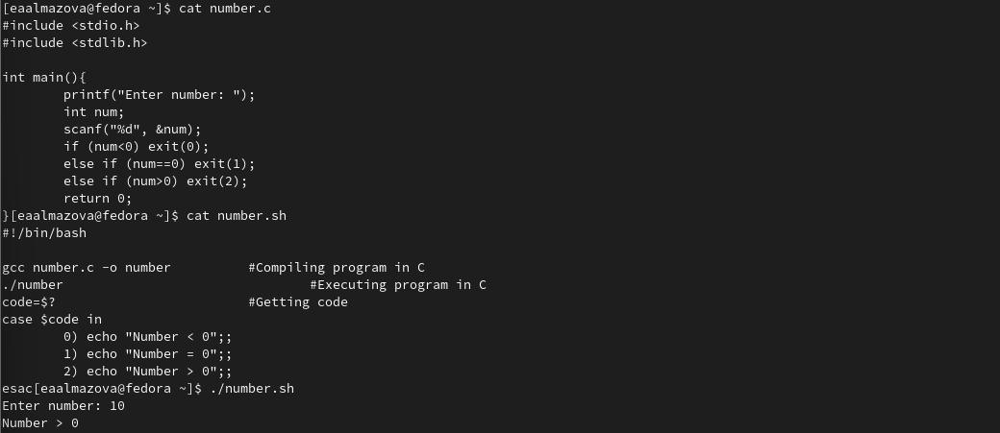
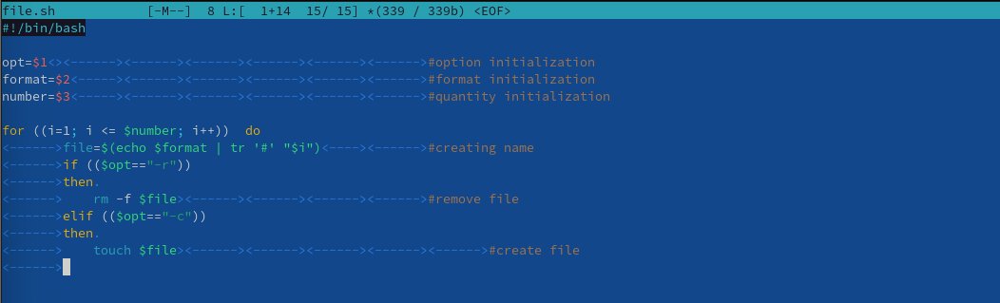
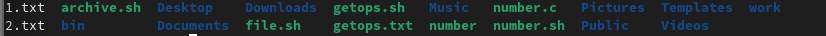
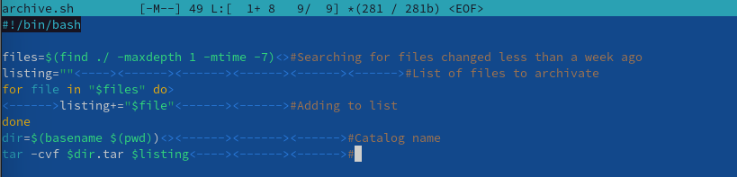
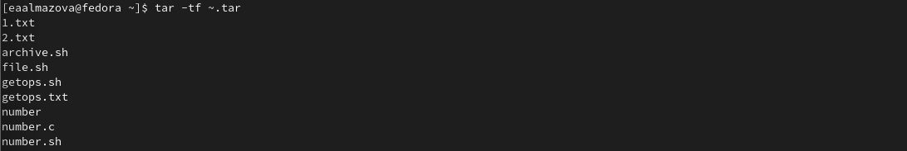

---
# Front matter
title: "Отчёт по лабораторной работе №11"
subtitle: "Дисциплина: Операционные системы"
author: "Елизавета Андреевна Алмазова"

## Generic options
lang: ru-RU
toc-title: "Содержание"

## Bibliography
bibliography: bib/cite.bib
csl: pandoc/csl/gost-r-7-0-5-2008-numeric.csl

## Pdf output format
toc: true # Table of contents
toc-depth: 2
lof: true # List of figures
lot: true # List of tables
fontsize: 12pt
linestretch: 1.5
papersize: a4
documentclass: scrreprt
## I18n polyglossia
polyglossia-lang:
  name: russian
  options:
	- spelling=modern
	- babelshorthands=true
polyglossia-otherlangs:
  name: english
## I18n babel
babel-lang: russian
babel-otherlangs: english
## Fonts
mainfont: PT Serif
romanfont: PT Serif
sansfont: PT Sans
monofont: PT Mono
mainfontoptions: Ligatures=TeX
romanfontoptions: Ligatures=TeX
sansfontoptions: Ligatures=TeX,Scale=MatchLowercase
monofontoptions: Scale=MatchLowercase,Scale=0.9
## Biblatex
biblatex: true
biblio-style: "gost-numeric"
biblatexoptions:
  - parentracker=true
  - backend=biber
  - hyperref=auto
  - language=auto
  - autolang=other*
  - citestyle=gost-numeric
## Pandoc-crossref LaTeX customization
figureTitle: "Рис."
tableTitle: "Таблица"
listingTitle: "Листинг"
lofTitle: "Список иллюстраций"
lotTitle: "Список таблиц"
lolTitle: "Листинги"
## Misc options
indent: true
header-includes:
  - \usepackage{indentfirst}
  - \usepackage{float} # keep figures where there are in the text
  - \floatplacement{figure}{H} # keep figures where there are in the text
---

# Цель работы

Цель данной лабораторной работы - изучить основы программирования в оболочке ОС UNIX. Научиться писать более сложные командные файлы с использованием логических управляющих конструкций и циклов.

# Задание

1. Используя команды getopts grep, написать командный файл, который анализирует командную строку с ключами:

- iinputfile — прочитать данные из указанного файла;
- ooutputfile — вывести данные в указанный файл;
- pшаблон — указать шаблон для поиска;
- C — различать большие и малые буквы;
- n — выдавать номера строк.

а затем ищет в указанном файле нужные строки, определяемые ключом -p.

2. Написать на языке Си программу, которая вводит число и определяет, является ли оно больше нуля, меньше нуля или равно нулю. Затем программа завершается с помощью функции exit(n), передавая информацию в о коде завершения в оболочку. Командный файл должен вызывать эту программу и, проанализировав с помощью команды $?, выдать сообщение о том, какое число было введено.

3. Написать командный файл, создающий указанное число файлов, пронумерованных последовательно от 1 до 𝑁 (например 1.tmp, 2.tmp, 3.tmp,4.tmp и т.д.). Число файлов, которые необходимо создать, передаётся в аргументы командной строки. Этот же командный файл должен уметь удалять все созданные им файлы (если они существуют).

4. Написать командный файл, который с помощью команды tar запаковывает в архив все файлы в указанной директории. Модифицировать его так, чтобы запаковывались только те файлы, которые были изменены менее недели тому назад (использовать команду find).

# Теоретическое введение

## Командные оболочки

Командная оболочка - это программа, позволяющая пользователю взаимодействовать с операционной системой компьютера. В операционных системах типа UNIX/Linux наиболее часто используются следующие реализации командных оболочек:

- оболочка Борна (Bourne shell или sh) — стандартная командная оболочка UNIX/Linux, содержащая базовый, но при этом полный набор функций;
- С-оболочка (или csh) — надстройка на оболочкой Борна, использующая С-подобный синтаксис команд с возможностью сохранения истории выполнения команд;
- оболочка Корна (или ksh) — напоминает оболочку С, но операторы управления программой совместимы с операторами оболочки Борна;
- BASH — сокращение от Bourne Again Shell (опять оболочка Борна), в основе своей совмещает свойства оболочек С и Корна (разработка компании Free Software Foundation).

POSIX (Portable Operating System Interface for Computer Environments) — набор стандартов описания интерфейсов взаимодействия операционной системы и прикладных программ. Стандарты POSIX разработаны комитетом IEEE (Institute of Electrical and Electronics Engineers) для обеспечения совместимости различных UNIX/Linux-подобных операционных систем и переносимости прикладных программ на уровне исходного кода. POSIX-совместимые оболочки разработаны на базе оболочки Корна.

## Переменные и массивы в языке программирования bash

Имена переменных могут быть выбраны пользователем. Пользователь имеет возможность присвоить переменной значение некоторой строки символов. Например, команда mark=/usr/andy/bin присваивает значение строки символов /usr/andy/bin переменной mark типа строка символов. Оболочка bash позволяет работать с массивами. Для создания массива используется команда set с флагом -A. За флагом следует имя переменной, а затем список значений, разделённых пробелами. Например, 1 set -A states Delaware Michigan "New Jersey". Далее можно сделать добавление в массив, например,states[49]=Alaska. Индексация массивов начинается с нулевого элемента.

## Арифметические вычисления

Оболочка bash поддерживает встроенные арифметические функции. Команда let является показателем того, что последующие аргументы представляют собой выражение, подлежащее вычислению. Простейшее выражение — это единичный терм (term), обычно целочисленный.

Целые числа можно записывать как последовательность цифр или в любом базовом формате типа radix\#number, где radix (основание системы счисления) — любое число не более 26. Для большинства команд используются следующие основания систем исчисления: 2 (двоичная), 8 (восьмеричная) и 16 (шестнадцатеричная). Простейшими математическими выражениями являются сложение (+), вычитание (-), умножение (\*), целочисленное деление (/) и целочисленный остаток от деления (%).

Команда let берет два операнда и присваивает их переменной. Положительным моментом команды let можно считать то, что для идентификации переменной ей не нужен знак доллара; вы можете писать команды типа let sum=x+7, и let будет искать переменную x и добавлять к ней 7. Команда let также расширяет другие выражения let, если они заключены в двойные круглые скобки. Таким способом вы можете создавать довольно сложные выражения.
Команда let не ограничена простыми арифметическими выражениями.

Подобно С оболочка bash может присваивать переменной любое значение, а произвольное выражение само имеет значение, которое может использоваться. При этом «ноль» воспринимается как «ложь», а любое другое значение выражения — как «истина». Для сказанного является выполнение некоторого действия, одновременно декрементируя
некоторое значение.

Наиболее распространённым является сокращение, избавляющееся от слова let в программах оболочек. Если объявить переменные целыми значениями, то любое присвоение автоматически будет трактоваться как арифметическое действие. Если использовать typeset -i для объявления и присвоения переменной, то при последующем её применении она станет целой. Также можно использовать ключевое слово integer (псевдоним для typeset -i) и объявлять таким образом переменные целыми. Выражения типа х=y+z будет восприниматься в это случае как арифметические.

Команда read позволяет читать значения переменных со стандартного ввода

## Стандартные переменные

Переменные PS1 и PS2 предназначены для отображения промптера командного процессора. PS1 — это промптер командного процессора, по умолчанию его значение равно символу $ или #. Если какая-то интерактивная программа, запущенная командным процессором, требует ввода, то используется промптер PS2. Он по умолчанию имеет значение символа >. Другие стандартные переменные:

- HOME — имя домашнего каталога пользователя. Если команда cd вводится без аргументов, то происходит переход в каталог, указанный в этой переменной.
- IFS — последовательность символов, являющихся разделителями в командной строке, например, пробел, табуляция и перевод строки (new line).
- MAIL — командный процессор каждый раз перед выводом на экран промптера проверяет содержимое файла, имя которого указано в этой переменной, и если содержимое этого файла изменилось с момента последнего ввода из него, то перед тем как вывести на терминал промптер, командный процессор выводит на терминал сообщение You have mail (у Вас есть почта).
- TERM — тип используемого терминала.
- LOGNAME — содержит регистрационное имя пользователя, которое устанавливается автоматически при входе в систему.

В командном процессоре Си имеется ещё несколько стандартных переменных. Значение всех переменных можно просмотреть с помощью команды set.

## Метасимволы и экранирование

Такие символы, как ' < > * ? | \ " &, являются метасимволами и имеют для командного процессора специальный смысл. Экранирование может быть осуществлено с помощью предшествующего метасимволу символа \, который, в свою очередь, является метасимволом.

## Командные файлы и их параметры

Последовательность команд может быть помещена в текстовый файл. Такой файл называется командным. Далее этот файл можно выполнить по команде bash командный_файл [аргументы]. Чтобы не вводить каждый раз последовательности символов bash, необходимо изменить код защиты этого командного файла, обеспечив доступ к этому файлу по выполнению. Это может быть сделано с помощью команды chmod +x имя_файла. Теперь можно вызывать свой командный файл на выполнение, просто вводя его имя с терминала так, как-будто он является выполняемой программой. Командный процессор распознает, что в Вашем файле на самом деле хранится не выполняемая программа, а программа, написанная на языке программирования оболочки, и осуществит её интерпретацию.

При вызове командного файла на выполнение параметры ему могут быть переданы точно таким же образом, как и выполняемой программе. С точки зрения командного файла эти параметры являются позиционными. Символ $ является метасимволом командного процессора. Он используется, в частности, для ссылки на параметры, точнее, для получения их значений в командном файле. В командный файл можно передать до девяти параметров. При использовании где-либо в командном файле комбинации символов $i, где 0 < 𝑖 < 10, вместо неё будет осуществлена подстановка значения параметра с порядковым номером i, т.е. аргумента командного файла с порядковым номером i. Использование комбинации символов $0 приводит к подстановке вместо неё имени данного командного файла.

## Getopts и флаги

Весьма необходимой при программировании является команда getopts, которая осуществляет синтаксический анализ командной строки, выделяя флаги, и используется для объявления переменных. Флаги — это опции командной строки, обычно помеченные знаком минус; Например, для команды ls флагом может являться -F. Иногда флаги имеют аргументы, связанные с ними. Программы интерпретируют флаги, соответствующим образом изменяя своё поведение. Строка опций option-string — это список возможных букв и чисел соответствующего флага. Если ожидается, что некоторый флаг будет сопровождаться некоторым аргументом, то за символом, обозначающим этот флаг, должно следовать двоеточие. Соответствующей переменной присваивается буква данной опции. Если команда getopts может распознать аргумент, то она возвращает истину. Принято включать getopts в цикл while и анализировать введённые данные с помощью оператора case.

## Управление последовательностью действий

Часто бывает необходимо обеспечить проведение каких-либо действий циклически и управление дальнейшими действиями в зависимости от результатов проверки некоторого условия. Для решения подобных задач язык программирования bash предоставляет возможность использовать такие управляющие конструкции, как for, case, if и while.

При каждом следующем выполнении оператора цикла for переменная имя принимает следующее значение из списка значений, задаваемых списком список -значений. Вообще говоря, список-значений является необязательным. При его отсутствии оператор цикла for выполняется для всех позиционных параметров или, иначе говоря, аргументов.

Оператор выбора case реализует возможность ветвления на произвольное число ветвей.

Выполнение условного оператора if сводится к тому, что сначала выполняется последовательность команд (операторов), которую задаёт список-команд в строке, содержащей служебное слово if. Затем, если последняя выполненная команда из этой последовательности команд возвращает нулевой код завершения (истина), то будет выполнена последовательность команд (операторов), которую задаёт список-команд в строке, содержащей служебное слово then. Фраза elif проверяется в том случае, когда предыдущая проверка была ложной. Строка, содержащая служебное слово else, является необязательной. Если она присутствует, то последовательность команд (операторов), которую задаёт список-команд в строке, содержащей служебное слово else, будет выполнена только при условии, что последняя выполненная команда из последовательности команд (операторов), которую задаёт список-команд в строке, содержащей служебное слово if или elif, возвращает ненулевой код завершения (ложь).

# Выполнение лабораторной работы

1. Используя команды getopts grep, написала командный файл getops.sh, который анализирует командную строку с ключами inputfile — прочитать данные из указанного файла; outputfile — вывести данные в указанный файл; p - шаблон — указать шаблон для поиска; C — различать большие и малые буквы; n — выдавать номера строк, а затем ищет в указанном файле нужные строки, определяемые ключом -p. Проверила его работу на файле getops.txt (рис.1).

{ #fig:001 width=70% }

2. Написала на языке Си программу number.c, которая вводит число и определяет, является ли оно больше нуля, меньше нуля или равно нулю. Затем программа завершается с помощью функции exit(n), передавая информацию о коде завершения в оболочку. Командный файл number.sh вызывает эту программу и, проанализировав с помощью команды $?, выдает сообщение о том, какое число было введено. Проверила его работу (рис.2).

{ #fig:002 width=70% }

3. Написала командный файл file.sh, создающий указанное число файлов, пронумерованных последовательно от 1 до 𝑁 (например 1.tmp, 2.tmp, 3.tmp, 4.tmp и т.д.). Число файлов, которые необходимо создать, передаётся в аргументы командной строки. Этот же командный файл умеет удалять все созданные им файлы. Создание или удаление файлов регулируется с помощью опций -c и -r (рис.3). Проверила его работу (рис.4)

{ #fig:003 width=70% }

{ #fig:004 width=70% }

4. Написала командный файл archive.sh, который с помощью команды tar запаковывает в архив все файлы в указанной директории и модифицировала его так, чтобы запаковывались только те файлы, которые были изменены менее недели тому назад с помощью команды find (рис.5). Проверила его работу (рис.6).

{ #fig:005 width=70% }

{ #fig:006 width=70% }

# Выводы

В ходе выполнения данной лабораторной работы я изучила основы программирования в оболочке ОС UNIX, научилась писать более сложные командные файлы с использованием логических управляющих конструкций и циклов.

# Ответы на контрольные вопросы

1. Каково предназначение команды getopts?

Весьма необходимой при программировании является команда getopts, которая осуществляет синтаксический анализ командной строки, выделяя флаги, и используется для объявления переменных. 

2. Какое отношение метасимволы имеют к генерации имён файлов?

Каждый из метасимволов может представлять самого себя, если перед ним стоит \. Все символы, заключенные между кавычками ' и ', представляют самих себя. Между двойными кавычками (") выполняются подстановки команд и параметров, а символы \, `," и $ могут экранироваться предшествующим символом \.

После всех подстановок в каждом слове команды ищутся символы *,?, и [. Если находится хотя бы один из них, то это слово рассматривается как шаблон имен файлов и заменяется именами файлов, удовлетворяющих данному шаблону (в алфавитном порядке). Если ни одно имя файла не удовлетворяет шаблону, то он остается неизменным.

3. Какие операторы управления действиями вы знаете?

If, case, while, for, until позволяют управлять последовательностью действий. Операторы управления - ;, &, $?, &&, ||, #, \.

4. Какие операторы используются для прерывания цикла?

break <N>, continue <N>

5. Для чего нужны команды false и true?
	
False - ложь, true - истина. Чаще всего используются в логических операциях, условных операторах и операторах цикла if, case, while, for. Например, выполнение условного оператора if сводится к тому, что сначала выполняется последовательность команд (операторов), которую задаёт список-команд в строке, содержащей служебное слово if. Затем, если последняя выполненная команда из этой последовательности команд возвращает нулевой код завершения (истина), то будет выполнена последовательность команд (операторов), которую задаёт список-команд в строке, содержащей служебное слово then. Фраза elif проверяется в том случае, когда предыдущая проверка была ложной. Строка, содержащая служебное слово else, является необязательной. Если она присутствует, то последовательность команд (операторов), которую задаёт список-команд в строке, содержащей служебное слово else, будет выполнена только при условии, что последняя выполненная команда из последовательности команд (операторов), которую задаёт список-команд в строке, содержащей служебное слово if или elif, возвращает ненулевой код завершения (ложь).
	
6. Что означает строка if test -f man$s/$i.$s, встреченная в командном файле?

Строка возвращает значение "Истина", если существует файл man$s/$i.$s и является ли он обычным файлом, где $s и $i - значения переменных s и i соответственно.
	
7. Объясните различия между конструкциями while и until.
	
Суть цикла While в том, что он будет повторяться до тех пор, пока будет выполняться условие, указанное в объявлении цикла. Цикл until очень похож на while и отличается от него только работой условия. Если в первом нужно чтобы условие всегда было истинным, то здесь все наоборот. Цикл будет выполняться пока условие неверно.
