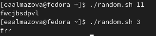

---
## Front matter
lang: ru-RU
title: Отчет по лабораторной работе №12
author: Алмазова Елизавета Андреевна
institute: РУДН, г. Москва, Россия
date: 28.05.2022

## Formatting
toc: false
slide_level: 2
theme: metropolis
header-includes: 
 - \metroset{progressbar=frametitle,sectionpage=progressbar,numbering=fraction}
 - '\makeatletter'
 - '\beamer@ignorenonframefalse'
 - '\makeatother'
aspectratio: 43
section-titles: true
---

# Отчет по лабораторной работе №12

## Цель работы и задание

Цель данной лабораторной работы - изучить основы программирования в оболочке ОС UNIX. Научиться писать более сложные командные файлы с использованием логических управляющих конструкций и циклов.

Задание:

1. Написать командный файл, реализующий упрощённый механизм семафоров. Командный файл должен в течение некоторого времени t1 дожидаться освобождения ресурса, выдавая об этом сообщение, а дождавшись его освобождения, использовать его в течение некоторого времени t2<>t1, также выдавая информацию о том, что ресурс используется соответствующим командным файлом (процессом). Запустить командный файл в одном виртуальном терминале в фоновом режиме, перенаправив его вывод в другой (> /dev/tty#, где # — номер терминала куда перенаправляется вывод), в котором также запущен этот файл, но не фоновом, а в привилегированном режиме. Доработать программу так, чтобы имелась возможность взаимодействия трёх и более процессов.
2. Реализовать команду man с помощью командного файла. Изучите содержимое каталога /usr/share/man/man1. В нем находятся архивы текстовых файлов, содержащих справку по большинству установленных в системе программ и команд. Каждый архив можно открыть командой less сразу же просмотрев содержимое справки. Командный файл должен получать в виде аргумента командной строки название команды и в виде результата выдавать справку об этой команде или сообщение об отсутствии справки, если соответствующего файла нет в каталоге man1.
3. Используя встроенную переменную $RANDOM, напишите командный файл, генерирующий случайную последовательность букв латинского алфавита.

## Ход работы

1. Написала командный файл semaphor.sh, реализующий упрощённый механизм семафоров. Командный файл, получая в качестве аргумента t1 и t2, в течение некоторого времени t1 дожидается освобождения ресурса, выдавая об этом сообщение, а дождавшись его освобождения, использует его в течение некоторого времени t2, также выдавая информацию о том, что ресурс используется соответствующим командным файлом (процессом) (рис.1). 

{ #fig:001 width=70% }

2. Проверила работу файла. Запустила командный файл semaphor.sh в одном виртуальном терминале в фоновом режиме, перенаправив его вывод в другой (> /dev/tty1), в котором также запущен файл semaphorprivileged.sh в привилегированном режиме (рис.2). 

{ #fig:002 width=70% }

3. Доработала программу semaphor2.sh так, чтобы имелась возможность взаимодействия трёх и более процессов (рис.3). Проверила работу программы (рис.4).

{ #fig:003 width=70% }

{ #fig:004 width=70% }

4. Реализовала команду man с помощью командного файла man.sh. Изучила содержимое каталога /usr/share/man/man1. В нем находятся архивы текстовых файлов, содержащих справку по большинству установленных в системе программ и команд. Каждый архив можно открыть командой less сразу же просмотрев содержимое справки. Командный файл получает в виде аргумента командной строки название команды и в виде результата выдает справку об этой команде или сообщение об отсутствии справки, если соответствующего файла нет в каталоге man1 (рис.5). Проверила работу файла на команде man (рис.6).

{ #fig:005 width=70% }

{ #fig:005 width=70% }

5. Используя встроенную переменную $RANDOM, написала командный файл random.sh, генерирующий случайную последовательность букв латинского алфавита, получая в качестве аргумента ее длину (рис.7). Проверила работу файла (рис.8).

{ #fig:007 width=70% }

{ #fig:008 width=70% }

## Выводы

В ходе выполнения данной лабораторной работы я изучила основы программирования в оболочке ОС UNIX, научилась писать более сложные командные файлы с использованием логических управляющих конструкций и циклов.

## {.standout}

Спасибо за внимание!
