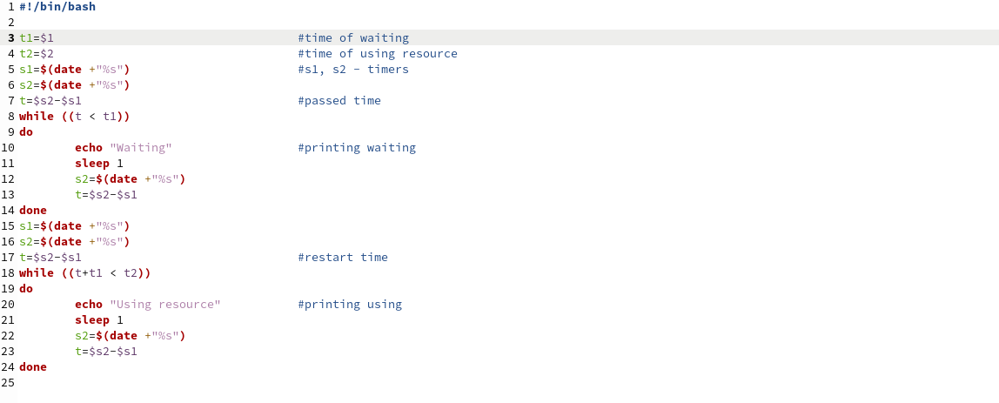
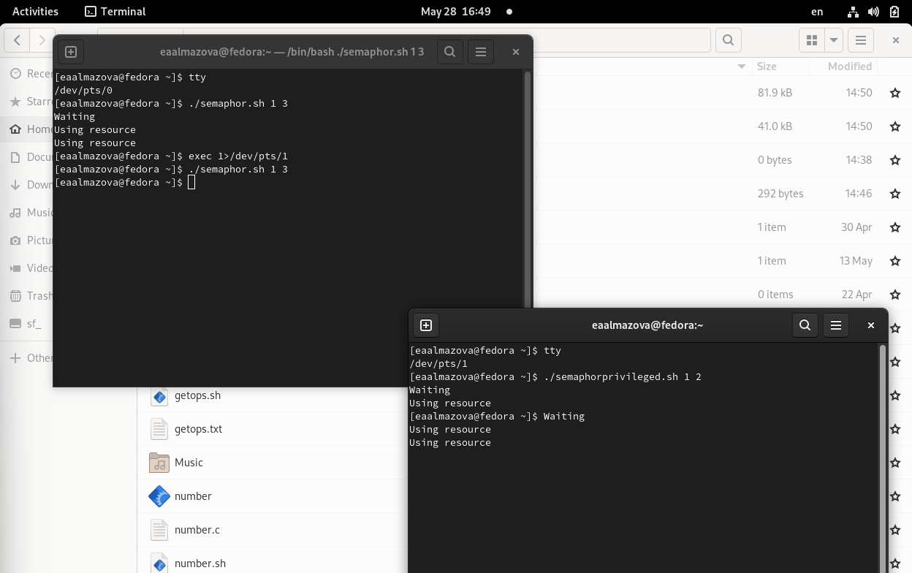
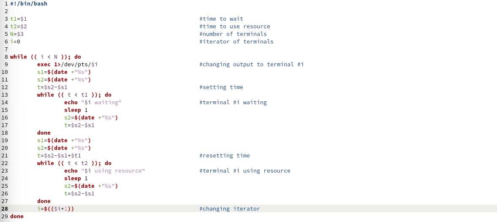
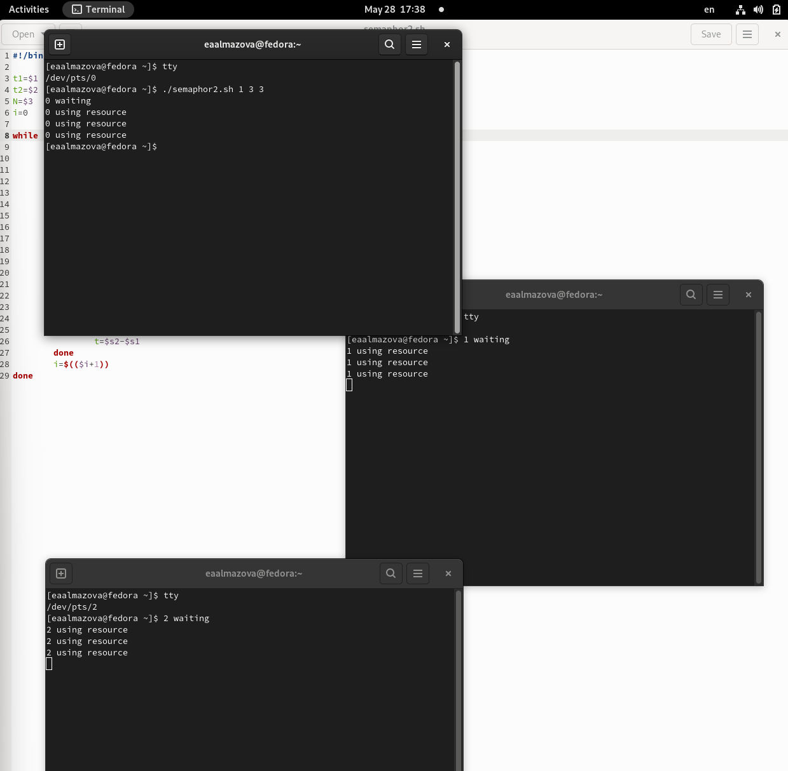
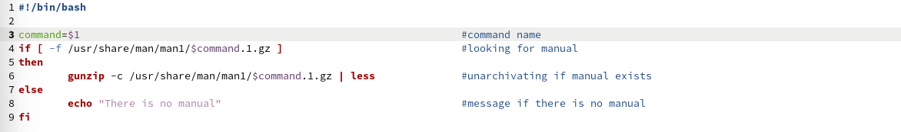
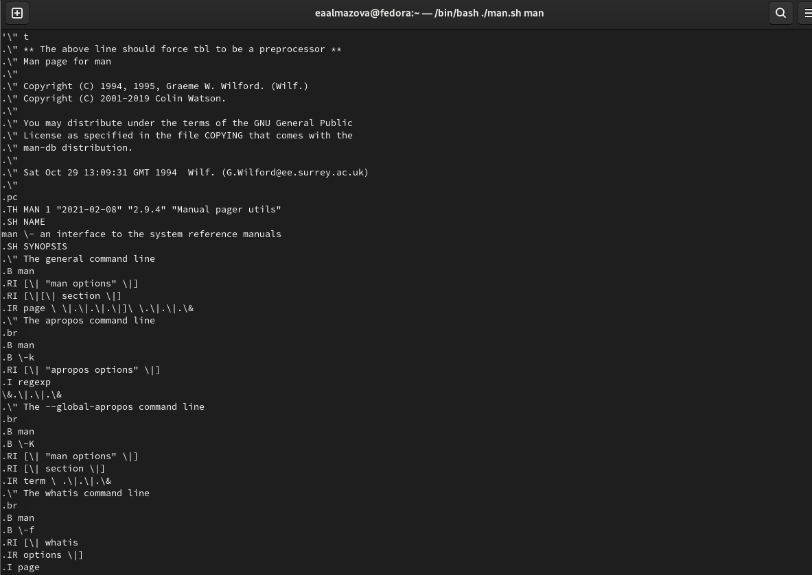
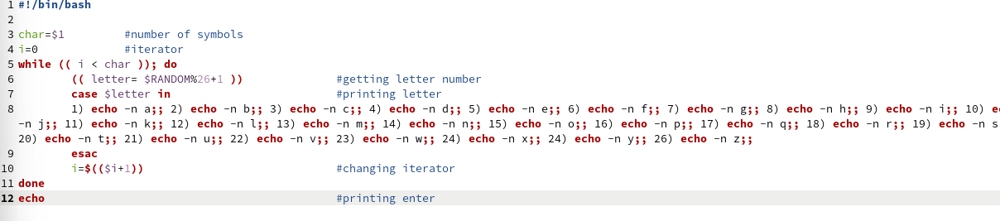
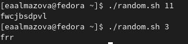

---
# Front matter
title: "Отчёт по лабораторной работе №12"
subtitle: "Дисциплина: Операционные системы"
author: "Елизавета Андреевна Алмазова"

## Generic options
lang: ru-RU
toc-title: "Содержание"

## Bibliography
bibliography: bib/cite.bib
csl: pandoc/csl/gost-r-7-0-5-2008-numeric.csl

## Pdf output format
toc: true # Table of contents
toc-depth: 2
lof: true # List of figures
lot: true # List of tables
fontsize: 12pt
linestretch: 1.5
papersize: a4
documentclass: scrreprt
## I18n polyglossia
polyglossia-lang:
  name: russian
  options:
	- spelling=modern
	- babelshorthands=true
polyglossia-otherlangs:
  name: english
## I18n babel
babel-lang: russian
babel-otherlangs: english
## Fonts
mainfont: PT Serif
romanfont: PT Serif
sansfont: PT Sans
monofont: PT Mono
mainfontoptions: Ligatures=TeX
romanfontoptions: Ligatures=TeX
sansfontoptions: Ligatures=TeX,Scale=MatchLowercase
monofontoptions: Scale=MatchLowercase,Scale=0.9
## Biblatex
biblatex: true
biblio-style: "gost-numeric"
biblatexoptions:
  - parentracker=true
  - backend=biber
  - hyperref=auto
  - language=auto
  - autolang=other*
  - citestyle=gost-numeric
## Pandoc-crossref LaTeX customization
figureTitle: "Рис."
tableTitle: "Таблица"
listingTitle: "Листинг"
lofTitle: "Список иллюстраций"
lotTitle: "Список таблиц"
lolTitle: "Листинги"
## Misc options
indent: true
header-includes:
  - \usepackage{indentfirst}
  - \usepackage{float} # keep figures where there are in the text
  - \floatplacement{figure}{H} # keep figures where there are in the text
---

# Цель работы

Цель данной лабораторной работы - изучить основы программирования в оболочке ОС UNIX. Научиться писать более сложные командные файлы с использованием логических управляющих конструкций и циклов.

# Задание

1. Написать командный файл, реализующий упрощённый механизм семафоров. Командный файл должен в течение некоторого времени t1 дожидаться освобождения ресурса, выдавая об этом сообщение, а дождавшись его освобождения, использовать его в течение некоторого времени t2<>t1, также выдавая информацию о том, что ресурс используется соответствующим командным файлом (процессом). Запустить командный файл в одном виртуальном терминале в фоновом режиме, перенаправив его вывод в другой (> /dev/tty#, где # — номер терминала куда перенаправляется вывод), в котором также запущен этот файл, но не фоновом, а в привилегированном режиме. Доработать программу так, чтобы имелась возможность взаимодействия трёх и более процессов.
2. Реализовать команду man с помощью командного файла. Изучите содержимое каталога /usr/share/man/man1. В нем находятся архивы текстовых файлов, содержащих справку по большинству установленных в системе программ и команд. Каждый архив можно открыть командой less сразу же просмотрев содержимое справки. Командный файл должен получать в виде аргумента командной строки название команды и в виде результата выдавать справку об этой команде или сообщение об отсутствии справки, если соответствующего файла нет в каталоге man1.
3. Используя встроенную переменную $RANDOM, напишите командный файл, генерирующий случайную последовательность букв латинского алфавита.

# Теоретическое введение

## Командные оболочки

Командная оболочка - это программа, позволяющая пользователю взаимодействовать с операционной системой компьютера. В операционных системах типа UNIX/Linux наиболее часто используются следующие реализации командных оболочек:

- оболочка Борна (Bourne shell или sh) — стандартная командная оболочка UNIX/Linux, содержащая базовый, но при этом полный набор функций;
- С-оболочка (или csh) — надстройка на оболочкой Борна, использующая С-подобный синтаксис команд с возможностью сохранения истории выполнения команд;
- оболочка Корна (или ksh) — напоминает оболочку С, но операторы управления программой совместимы с операторами оболочки Борна;
- BASH — сокращение от Bourne Again Shell (опять оболочка Борна), в основе своей совмещает свойства оболочек С и Корна (разработка компании Free Software Foundation).

POSIX (Portable Operating System Interface for Computer Environments) — набор стандартов описания интерфейсов взаимодействия операционной системы и прикладных программ. Стандарты POSIX разработаны комитетом IEEE (Institute of Electrical and Electronics Engineers) для обеспечения совместимости различных UNIX/Linux-подобных операционных систем и переносимости прикладных программ на уровне исходного кода. POSIX-совместимые оболочки разработаны на базе оболочки Корна.

## Переменные и массивы в языке программирования bash

Имена переменных могут быть выбраны пользователем. Пользователь имеет возможность присвоить переменной значение некоторой строки символов. Например, команда mark=/usr/andy/bin присваивает значение строки символов /usr/andy/bin переменной mark типа строка символов. Оболочка bash позволяет работать с массивами. Для создания массива используется команда set с флагом -A. За флагом следует имя переменной, а затем список значений, разделённых пробелами. Например, 1 set -A states Delaware Michigan "New Jersey". Далее можно сделать добавление в массив, например,states[49]=Alaska. Индексация массивов начинается с нулевого элемента.

## Арифметические вычисления

Оболочка bash поддерживает встроенные арифметические функции. Команда let является показателем того, что последующие аргументы представляют собой выражение, подлежащее вычислению. Простейшее выражение — это единичный терм (term), обычно целочисленный.

Целые числа можно записывать как последовательность цифр или в любом базовом формате типа radix\#number, где radix (основание системы счисления) — любое число не более 26. Для большинства команд используются следующие основания систем исчисления: 2 (двоичная), 8 (восьмеричная) и 16 (шестнадцатеричная). Простейшими математическими выражениями являются сложение (+), вычитание (-), умножение (\*), целочисленное деление (/) и целочисленный остаток от деления (%).

Команда let берет два операнда и присваивает их переменной. Положительным моментом команды let можно считать то, что для идентификации переменной ей не нужен знак доллара; вы можете писать команды типа let sum=x+7, и let будет искать переменную x и добавлять к ней 7. Команда let также расширяет другие выражения let, если они заключены в двойные круглые скобки. Таким способом вы можете создавать довольно сложные выражения.
Команда let не ограничена простыми арифметическими выражениями.

Подобно С оболочка bash может присваивать переменной любое значение, а произвольное выражение само имеет значение, которое может использоваться. При этом «ноль» воспринимается как «ложь», а любое другое значение выражения — как «истина». Для сказанного является выполнение некоторого действия, одновременно декрементируя
некоторое значение.

Наиболее распространённым является сокращение, избавляющееся от слова let в программах оболочек. Если объявить переменные целыми значениями, то любое присвоение автоматически будет трактоваться как арифметическое действие. Если использовать typeset -i для объявления и присвоения переменной, то при последующем её применении она станет целой. Также можно использовать ключевое слово integer (псевдоним для typeset -i) и объявлять таким образом переменные целыми. Выражения типа х=y+z будет восприниматься в это случае как арифметические.

Команда read позволяет читать значения переменных со стандартного ввода

## Стандартные переменные

Переменные PS1 и PS2 предназначены для отображения промптера командного процессора. PS1 — это промптер командного процессора, по умолчанию его значение равно символу $ или #. Если какая-то интерактивная программа, запущенная командным процессором, требует ввода, то используется промптер PS2. Он по умолчанию имеет значение символа >. Другие стандартные переменные:

- HOME — имя домашнего каталога пользователя. Если команда cd вводится без аргументов, то происходит переход в каталог, указанный в этой переменной.
- IFS — последовательность символов, являющихся разделителями в командной строке, например, пробел, табуляция и перевод строки (new line).
- MAIL — командный процессор каждый раз перед выводом на экран промптера проверяет содержимое файла, имя которого указано в этой переменной, и если содержимое этого файла изменилось с момента последнего ввода из него, то перед тем как вывести на терминал промптер, командный процессор выводит на терминал сообщение You have mail (у Вас есть почта).
- TERM — тип используемого терминала.
- LOGNAME — содержит регистрационное имя пользователя, которое устанавливается автоматически при входе в систему.

В командном процессоре Си имеется ещё несколько стандартных переменных. Значение всех переменных можно просмотреть с помощью команды set.

## Метасимволы и экранирование

Такие символы, как ' < > * ? | \ " &, являются метасимволами и имеют для командного процессора специальный смысл. Экранирование может быть осуществлено с помощью предшествующего метасимволу символа \, который, в свою очередь, является метасимволом.

## Командные файлы и их параметры

Последовательность команд может быть помещена в текстовый файл. Такой файл называется командным. Далее этот файл можно выполнить по команде bash командный_файл [аргументы]. Чтобы не вводить каждый раз последовательности символов bash, необходимо изменить код защиты этого командного файла, обеспечив доступ к этому файлу по выполнению. Это может быть сделано с помощью команды chmod +x имя_файла. Теперь можно вызывать свой командный файл на выполнение, просто вводя его имя с терминала так, как-будто он является выполняемой программой. Командный процессор распознает, что в Вашем файле на самом деле хранится не выполняемая программа, а программа, написанная на языке программирования оболочки, и осуществит её интерпретацию.

При вызове командного файла на выполнение параметры ему могут быть переданы точно таким же образом, как и выполняемой программе. С точки зрения командного файла эти параметры являются позиционными. Символ $ является метасимволом командного процессора. Он используется, в частности, для ссылки на параметры, точнее, для получения их значений в командном файле. В командный файл можно передать до девяти параметров. При использовании где-либо в командном файле комбинации символов $i, где 0 < 𝑖 < 10, вместо неё будет осуществлена подстановка значения параметра с порядковым номером i, т.е. аргумента командного файла с порядковым номером i. Использование комбинации символов $0 приводит к подстановке вместо неё имени данного командного файла.

## Getopts и флаги

Весьма необходимой при программировании является команда getopts, которая осуществляет синтаксический анализ командной строки, выделяя флаги, и используется для объявления переменных. Флаги — это опции командной строки, обычно помеченные знаком минус; Например, для команды ls флагом может являться -F. Иногда флаги имеют аргументы, связанные с ними. Программы интерпретируют флаги, соответствующим образом изменяя своё поведение. Строка опций option-string — это список возможных букв и чисел соответствующего флага. Если ожидается, что некоторый флаг будет сопровождаться некоторым аргументом, то за символом, обозначающим этот флаг, должно следовать двоеточие. Соответствующей переменной присваивается буква данной опции. Если команда getopts может распознать аргумент, то она возвращает истину. Принято включать getopts в цикл while и анализировать введённые данные с помощью оператора case.

## Управление последовательностью действий

Часто бывает необходимо обеспечить проведение каких-либо действий циклически и управление дальнейшими действиями в зависимости от результатов проверки некоторого условия. Для решения подобных задач язык программирования bash предоставляет возможность использовать такие управляющие конструкции, как for, case, if и while.

При каждом следующем выполнении оператора цикла for переменная имя принимает следующее значение из списка значений, задаваемых списком список -значений. Вообще говоря, список-значений является необязательным. При его отсутствии оператор цикла for выполняется для всех позиционных параметров или, иначе говоря, аргументов.

Оператор выбора case реализует возможность ветвления на произвольное число ветвей.

Выполнение условного оператора if сводится к тому, что сначала выполняется последовательность команд (операторов), которую задаёт список-команд в строке, содержащей служебное слово if. Затем, если последняя выполненная команда из этой последовательности команд возвращает нулевой код завершения (истина), то будет выполнена последовательность команд (операторов), которую задаёт список-команд в строке, содержащей служебное слово then. Фраза elif проверяется в том случае, когда предыдущая проверка была ложной. Строка, содержащая служебное слово else, является необязательной. Если она присутствует, то последовательность команд (операторов), которую задаёт список-команд в строке, содержащей служебное слово else, будет выполнена только при условии, что последняя выполненная команда из последовательности команд (операторов), которую задаёт список-команд в строке, содержащей служебное слово if или elif, возвращает ненулевой код завершения (ложь).

# Выполнение лабораторной работы

1. Написала командный файл semaphor.sh, реализующий упрощённый механизм семафоров. Командный файл, получая в качестве аргумента t1 и t2, в течение некоторого времени t1 дожидается освобождения ресурса, выдавая об этом сообщение, а дождавшись его освобождения, использует его в течение некоторого времени t2, также выдавая информацию о том, что ресурс используется соответствующим командным файлом (процессом) (рис.1). 

{ #fig:001 width=70% }

2. Проверила работу файла. Запустила командный файл semaphor.sh в одном виртуальном терминале в фоновом режиме, перенаправив его вывод в другой (> /dev/tty1), в котором также запущен файл semaphorprivileged.sh в привилегированном режиме (рис.2). 

{ #fig:002 width=70% }

3. Доработала программу semaphor2.sh так, чтобы имелась возможность взаимодействия трёх и более процессов (рис.3). Проверила работу программы (рис.4).

{ #fig:003 width=70% }

{ #fig:004 width=70% }

4. Реализовала команду man с помощью командного файла man.sh. Изучила содержимое каталога /usr/share/man/man1. В нем находятся архивы текстовых файлов, содержащих справку по большинству установленных в системе программ и команд. Каждый архив можно открыть командой less сразу же просмотрев содержимое справки. Командный файл получает в виде аргумента командной строки название команды и в виде результата выдает справку об этой команде или сообщение об отсутствии справки, если соответствующего файла нет в каталоге man1 (рис.5). Проверила работу файла на команде man (рис.6).

{ #fig:005 width=70% }

{ #fig:005 width=70% }

5. Используя встроенную переменную $RANDOM, написала командный файл random.sh, генерирующий случайную последовательность букв латинского алфавита, получая в качестве аргумента ее длину (рис.7). Проверила работу файла (рис.8).

{ #fig:007 width=70% }

{ #fig:008 width=70% }

# Выводы

В ходе выполнения данной лабораторной работы я изучила основы программирования в оболочке ОС UNIX, научилась писать более сложные командные файлы с использованием логических управляющих конструкций и циклов.

# Ответы на контрольные вопросы

1. Найдите синтаксическую ошибку в следующей строке: while [$1 != "exit"]

После \[ и перед \] должны стоять пробелы, выражение $1 стоит взять в двойные кавычки на случай содержания в ней пробелов: \[ "$1" != "exit" \].

2. Как объединить (конкатенация) несколько строк в одну?

Самый простой способ объединить две или более строковые переменные - записать их одну за другой:

VAR1="Hello,"

VAR2=" World"

VAR3="$VAR1$VAR2"

Вы также можете объединить одну или несколько переменных с литеральными строками. Когда за переменной следует другой допустимый символ имени переменной, вы должны заключить его в фигурные скобки ${VAR1}:

VAR1="Hello, "

VAR2="${VAR1}World"

Чтобы избежать каких-либо проблем с разделением слов или глобализацией, всегда пытайтесь использовать двойные кавычки вокруг имени переменной. Если вы хотите подавить переменную интерполяцию и специальную обработку символа обратной косой черты вместо двойных, используйте одинарные кавычки.

Bash не разделяет переменные по «типу», переменные обрабатываются как целое число или строка в зависимости от контекста. Вы также можете объединить переменные, которые содержат только цифры.

Другим способом объединения строк в bash является добавление переменных или литеральных строк к переменной с помощью += оператора: 

VAR1="Hello, "

VAR1+=" World"

3. Найдите информацию об утилите seq. Какими иными способами можно реализовать её функционал при программировании на bash?

Если вы запускаете seq с одним числом в качестве параметра командной строки, он считается от единицы до этого числа. Затем он печатает числа в окне терминала, по одному числу в строке. Если вы введете два числа в командной строке, первое будет начальным числом, а второе будет конечным числом. Вы можете установить размер шага, включив третье число. Он находится между начальным и конечным числами.

Мы также можем попросить seq создать список чисел от самого высокого до самого низкого. Однако для этого мы должны предоставить отрицательный шаг.

Номера начала, конца и шага также могут быть десятичными. Если какое-либо из чисел является десятичным, остальные также рассматриваются как десятичные.

Для изменения разделителя можно использовать использовать параметр -s (разделитель).

Обычно seq используется для генерации списка аргументов цикла for: for a in ${seq 100}. Это можно заменить на цикл for другого синтаксиса: for a in 1 2 3 ... 80 - или синтаксиса, похожий на Си: for ((i=1;i<101;i++))

4. Какой результат даст вычисление выражения $((10/3))?

3 - целочисленное деление без остатка.

5. Укажите кратко основные отличия командной оболочки zsh от bash.

- zsh быстрее bash;
- bash читает файл .bashrc в интерактивной оболочке без входа в систему и .bash_profile в оболочках со входом. Zsh читает .zshrc в оболочке без входа и .zprofile в оболочке со входом;
- для bash глобальные значения устанавливаются в /etc/inputrc, а личные значения пользователей – в ~/.inputrc. Большинство ключей привязаны не к последовательностям символов, а к конкретным функциям, реализованным readline. У zsh нет файла конфигурации: используется скрипт, вызываемый bindkey. Zsh не использует readline для ввода команд пользователем. Вместо этого используется собственный редактор ZLE;
- для экранирования в bash применяют символ обратного слэша \, тогда как в zsh – процент %;
- zsh не рассматривает # как начало комментария в командной строке по умолчанию, только в скриптах;
- массивы Bash индексируются от 0 до <длина>-1. Массивы Zsh индексируются от 1 до <длина>;
- в bash правая часть конвейера выполняется в подоболочке. В zsh он запускается в родительской оболочке;
- zsh имеет улучшенное автодополнение;
- zsh имеет настройки cd для ускоренного перехода по каталогам;
- zsh поддерживает числа с плавающей запятой;
- в zsh существует калькулятор zcalc, способный выполнять вычисления внутри терминала.

6. Проверьте, верен ли синтаксис данной конструкции for ((a=1; a <= LIMIT; a++))

Синтаксис верен.

7. Сравните язык bash с какими-либо языками программирования. Какие преимущества у bash по сравнению с ними? Какие недостатки?

Сравним bash и Python. Преимущества bash:

- Минимальная грамматика
- Нативная поддержка процессов
- Несколько способов отображения графического интерфейса
- Простые встроенные функции вместо API

Недостатки bash:

- Маленькая скорость
- Нет встроенного API
- Необходимость создания процессов для обработки данных
- Командный язык
