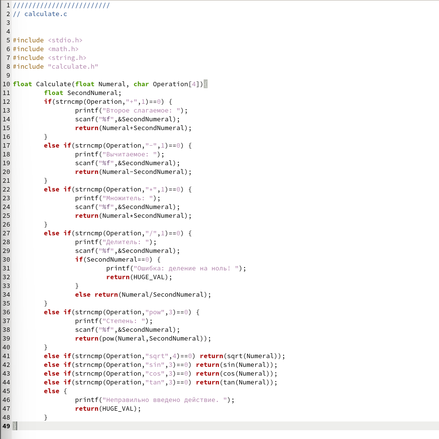
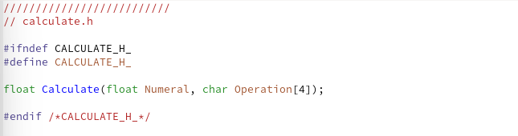
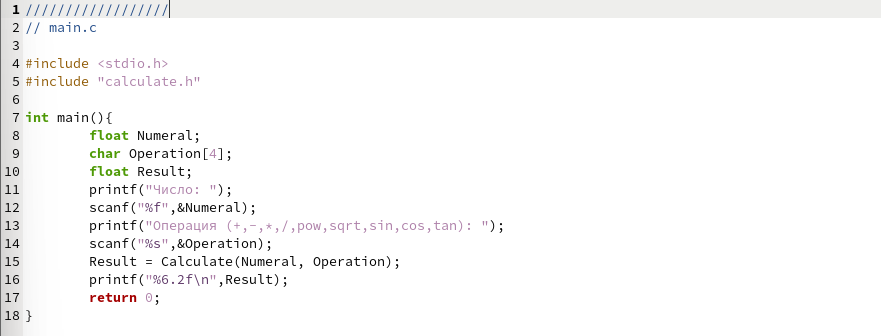
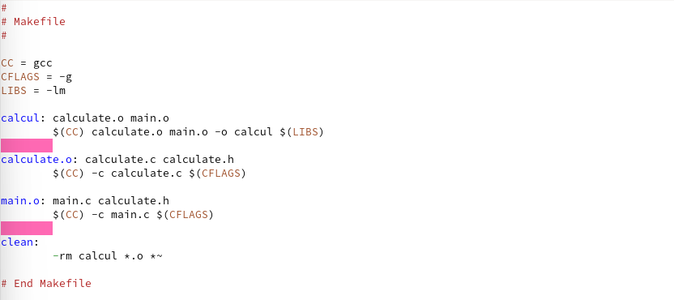
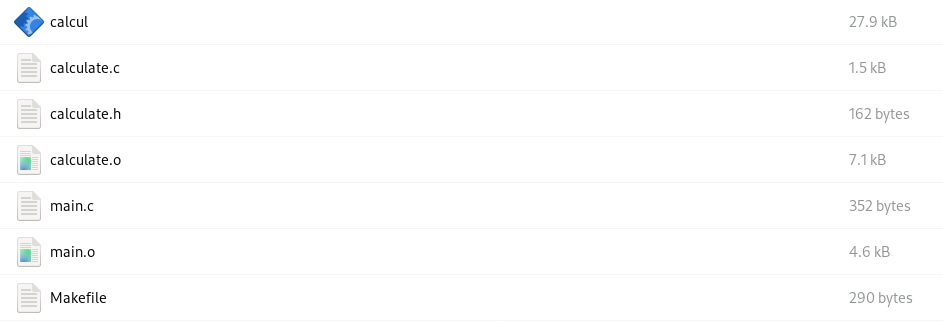
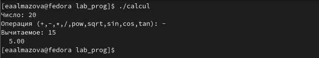
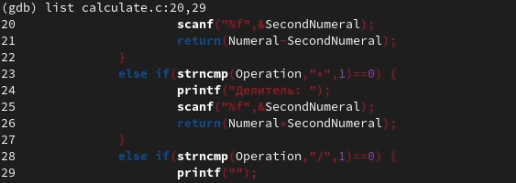
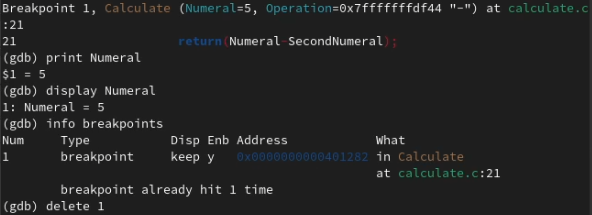

---
## Front matter
lang: ru-RU
title: Отчет по лабораторной работе №13
author: Алмазова Елизавета Андреевна
institute: РУДН, г. Москва, Россия
date: 04.06.2022

## Formatting
toc: false
slide_level: 2
theme: metropolis
header-includes: 
 - \metroset{progressbar=frametitle,sectionpage=progressbar,numbering=fraction}
 - '\makeatletter'
 - '\beamer@ignorenonframefalse'
 - '\makeatother'
aspectratio: 43
section-titles: true
---

# Отчет по лабораторной работе №13

## Цель работы и задание

Цель данной лабораторной работы - приобрести простейшие навыки разработки, анализа, тестирования и отладки приложений в ОС типа UNIX/Linux на примере создания на языке программирования С калькулятора с простейшими функциями.

Задание:

1. В домашнем каталоге создайте подкаталог ~/work/os/lab_prog.
2. Создайте в нём файлы: calculate.h, calculate.c, main.c. Это будет примитивнейший калькулятор, способный складывать, вычитать, умножать и делить, возводить число в степень, брать квадратный корень, вычислять sin, cos, tan. При запуске он будет запрашивать первое число, операцию, второе число. После этого программа выведет результат и остановится.
3. Выполните компиляцию программы посредством gcc.
4. При необходимости исправьте синтаксические ошибки.
5. Создайте Makefile. Поясните в отчете его содержание.
6. С помощью gdb выполните отладку программы calcul (перед использованием gdb исправьте Makefile):
	- Запустите отладчик GDB, загрузив в него программу для отладки
	- Для запуска программы внутри отладчика введите команду run
	- Для постраничного (по 9 строк) просмотра исходного код используйте команду list
	- Для просмотра строк с 12 по 15 основного файла используйте list с параметрами
	- Для просмотра определённых строк не основного файла используйте list с параметрами
	- Установите точку останова в файле calculate.c на строке номер 21
	- Выведите информацию об имеющихся в проекте точка останова:
	- Запустите программу внутри отладчика и убедитесь, что программа остановится в момент прохождения точки останова
	- Посмотрите, чему равно на этом этапе значение переменной Numeral
	- Сравните с результатом вывода на экран после использования команды: display Numeral
	- Уберите точки останова
7. С помощью утилиты splint попробуйте проанализировать коды файлов calculate.c и main.c.

## Ход работы

1. В домашнем каталоге создала подкаталог ~/work/os/lab_prog.
2. Создала в нём файлы: calculate.c (рис.1), calculate.h (рис.2), main.c (рис.3). Это будет примитивнейший калькулятор, способный складывать, вычитать, умножать и делить, возводить число в степень, брать квадратный корень, вычислять sin, cos, tan. При запуске он будет запрашивать первое число, операцию, второе число. После этого программа выведет результат и остановится.

{ #fig:001 width=70% }

{ #fig:002 width=70% }

{ #fig:003 width=70% }

4. Выполнила компиляцию программы посредством gcc (gcc -c calculate.c, gcc -c main.c, gcc calculate.o main.o -o calcul -lm). Добавила пропущенные точки с запятой после предупреждения компилятора.
5. Создала Makefile. Переменная CC содержит название утилиты gcc, CFLAGS содержит опции утилиты, LIBS - опции для объединения объектных файлов в исполняемый. Имеются 4 цели: clean для удаления созданных исполняемых и объектных файлов, calcul для компиляции исполняемого файла, calculate.o и main.o для создания соответствующих объектных файлов.
6. С помощью gdb выполнила отладку программы calcul (перед использованием gdb исправила Makefile, добавив опцию -g и заменив gcc на переменную, рис.4, рис.5, рис.6), например, постранично просмотрела код и поработала с точками останова (рис.7, рис.8):

{ #fig:004 width=70% }

{ #fig:005 width=70% }

{ #fig:006 width=70% }
	
{ #fig:007 width=70% }

{ #fig:008 width=70% }

7. С помощью утилиты splint проанализировала коды файлов calculate.c и main.c. Выяснились например такие факты, что в перечисленных файлах есть функция scanf, которая возвращает целое значение, но эти числа нигде не используются и не сохранятся. Также есть потеря данных при записи в переменную типа float и сравнение вещественного числа с нулем.

## Выводы

В ходе выполнения данной лабораторной работы я приобрела простейшие навыки разработки, анализа, тестирования и отладки приложений в ОС типа UNIX/Linux на примере создания на языке программирования С калькулятора с простейшими функциями.

## {.standout}

Спасибо за внимание!
