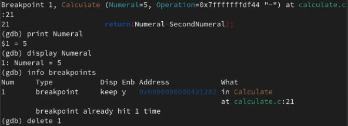

---
# Front matter
title: "Отчёт по лабораторной работе №13"
subtitle: "Дисциплина: Операционные системы"
author: "Елизавета Андреевна Алмазова"

## Generic options
lang: ru-RU
toc-title: "Содержание"

## Bibliography
bibliography: bib/cite.bib
csl: pandoc/csl/gost-r-7-0-5-2008-numeric.csl

## Pdf output format
toc: true # Table of contents
toc-depth: 2
lof: true # List of figures
lot: true # List of tables
fontsize: 12pt
linestretch: 1.5
papersize: a4
documentclass: scrreprt
## I18n polyglossia
polyglossia-lang:
  name: russian
  options:
	- spelling=modern
	- babelshorthands=true
polyglossia-otherlangs:
  name: english
## I18n babel
babel-lang: russian
babel-otherlangs: english
## Fonts
mainfont: PT Serif
romanfont: PT Serif
sansfont: PT Sans
monofont: PT Mono
mainfontoptions: Ligatures=TeX
romanfontoptions: Ligatures=TeX
sansfontoptions: Ligatures=TeX,Scale=MatchLowercase
monofontoptions: Scale=MatchLowercase,Scale=0.9
## Biblatex
biblatex: true
biblio-style: "gost-numeric"
biblatexoptions:
  - parentracker=true
  - backend=biber
  - hyperref=auto
  - language=auto
  - autolang=other*
  - citestyle=gost-numeric
## Pandoc-crossref LaTeX customization
figureTitle: "Рис."
tableTitle: "Таблица"
listingTitle: "Листинг"
lofTitle: "Список иллюстраций"
lotTitle: "Список таблиц"
lolTitle: "Листинги"
## Misc options
indent: true
header-includes:
  - \usepackage{indentfirst}
  - \usepackage{float} # keep figures where there are in the text
  - \floatplacement{figure}{H} # keep figures where there are in the text
---

# Цель работы

Цель данной лабораторной работы - приобрести простейшие навыки разработки, анализа, тестирования и отладки приложений в ОС типа UNIX/Linux на примере создания на языке программирования С калькулятора с простейшими функциями.

# Задание

1. В домашнем каталоге создайте подкаталог ~/work/os/lab_prog.
2. Создайте в нём файлы: calculate.h, calculate.c, main.c. Это будет примитивнейший калькулятор, способный складывать, вычитать, умножать и делить, возводить число в степень, брать квадратный корень, вычислять sin, cos, tan. При запуске он будет запрашивать первое число, операцию, второе число. После этого программа выведет результат и остановится.
3. Выполните компиляцию программы посредством gcc.
4. При необходимости исправьте синтаксические ошибки.
5. Создайте Makefile. Поясните в отчете его содержание.
6. С помощью gdb выполните отладку программы calcul (перед использованием gdb исправьте Makefile):
	- Запустите отладчик GDB, загрузив в него программу для отладки
	- Для запуска программы внутри отладчика введите команду run
	- Для постраничного (по 9 строк) просмотра исходного код используйте команду list
	- Для просмотра строк с 12 по 15 основного файла используйте list с параметрами
	- Для просмотра определённых строк не основного файла используйте list с параметрами
	- Установите точку останова в файле calculate.c на строке номер 21
	- Выведите информацию об имеющихся в проекте точка останова:
	- Запустите программу внутри отладчика и убедитесь, что программа остановится в момент прохождения точки останова
	- Посмотрите, чему равно на этом этапе значение переменной Numeral
	- Сравните с результатом вывода на экран после использования команды: display Numeral
	- Уберите точки останова
7. С помощью утилиты splint попробуйте проанализировать коды файлов calculate.c и main.c.
	
# Теоретическое введение

## Этапы разработки приложений

Процесс разработки программного обеспечения обычно разделяется на следующие этапы:

- планирование, включающее сбор и анализ требований к функционалу и другим характеристикам разрабатываемого приложения;
- проектирование, включающее в себя разработку базовых алгоритмов и спецификаций, определение языка программирования;
- непосредственная разработка приложения:
- кодирование — по сути создание исходного текста программы (возможно в нескольких вариантах);
- анализ разработанного кода;
- сборка, компиляция и разработка исполняемого модуля;
- тестирование и отладка, сохранение произведённых изменений;
- документирование.

Для создания исходного текста программы разработчик может воспользоваться любым удобным для него редактором текста: vi, vim, mceditor, emacs, geany и др. После завершения написания исходного кода программы (возможно состоящей из нескольких файлов), необходимо её скомпилировать и получить исполняемый модуль.

## Компиляция исходного текста и построение исполняемого файла

Compiler Collection). Это набор компиляторов для разного рода языков программирования (С, C++, Java, Фортран и др.). Работа с GCC производится при помощи одноимённой управляющей программы gcc, которая интерпретирует аргументы командной строки, определяет и осуществляет запуск нужного компилятора для входного файла. Файлы с расширением (суффиксом) .c воспринимаются gcc как программы на языке С, файлы с расширением .cc или .C — как файлы на языке C++, а файлы c расширением .o считаются объектными. gcc по расширению (суффиксу) .c распознает тип файла для компиляции и формирует объектный модуль — файл с расширением .o. Если требуется получить исполняемый файл с определённым именем (например, hello), то требуется воспользоваться опцией -o и в качестве параметра задать имя создаваемого файла.

Для сборки разрабатываемого приложения и собственно компиляции полезно воспользоваться утилитой make. В самом простом случае Makefile имеет следующий синтаксис:

<цель_1> <цель_2> ... : <зависимость_1> <зависимость_2> ...

<команда 1>

...

<команда n>

В качестве цели в Makefile может выступать имя файла или название какого-то действия. Зависимость задаёт исходные параметры (условия) для достижения указанной цели. Зависимость также может быть названием какого-то действия. Команды — собственно действия, которые необходимо выполнить для достижения цели. Рассмотрим пример Makefile для написанной выше простейшей программы, выводящей на экран приветствие ’Hello World!’:

hello: main.c

gcc -o hello main.c

Здесь в первой строке hello — цель, main.c — название файла, который мы хотим скомпилировать; во второй строке, начиная с табуляции, задана команда компиляции gcc с опциями.

Общий синтаксис Makefile имеет вид:

target1 [target2...]:[:] [dependment1...]

[(tab)commands] [#commentary]

[(tab)commands] [#commentary]

Здесь знак # определяет начало комментария (содержимое от знака # и до конца строки не будет обрабатываться. Одинарное двоеточие указывает на то, что последовательность команд должна содержаться в одной строке. Для переноса можно в длинной строке команд можно использовать обратный слэш (\). Двойное двоеточие указывает на то, что последовательность команд может содержаться в нескольких последовательных строках. Пример более сложного синтаксиса Makefile:

\#

\# Makefile for abcd.c

\#

CC = gcc

CFLAGS =

\# Compile abcd.c normaly

abcd: abcd.c

$(CC) -o abcd $(CFLAGS) abcd.c

clean:

-rm abcd *.o *~

\# End Makefile for abcd.c

В этом примере в начале файла заданы три переменные: CC и CFLAGS. Затем указаны цели, их зависимости и соответствующие команды. В командах происходит обращение к значениям переменных. Цель с именем clean производит очистку каталога от файлов, полученных в результате компиляции. Для её описания использованы регулярные выражения.

## Тестирование и отладка

Во время работы над кодом программы программист неизбежно сталкивается с появлением ошибок в ней. Использование отладчика для поиска и устранения ошибок в программе существенно облегчает жизнь программиста. В комплект программ GNU для ОС типа UNIX входит отладчик GDB (GNU Debugger).

Для использования GDB необходимо скомпилировать анализируемый код программы таким образом, чтобы отладочная информация содержалась в результирующем бинарном файле. Для этого следует воспользоваться опцией -g компилятора gcc: gcc -c file.c -g. После этого для начала работы с gdb необходимо в командной строке ввести одноимённую команду, указав в качестве аргумента анализируемый бинарный файл: gdb file.o

## Анализ исходного текста программы

Ещё одним средством проверки исходных кодов программ, написанных на языке C, является утилита splint. Эта утилита анализирует программный код, проверяет корректность задания аргументов использованных в программе функций и типов возвращаемых значений, обнаруживает синтаксические и семантические ошибки. В отличие от компилятора C анализатор splint генерирует комментарии с описанием разбора кода программы и осуществляет общий контроль, обнаруживая такие ошибки, как одинаковые объекты, определённые в разных файлах, или объекты, чьи значения не используются в работе программы, переменные с некорректно заданными значениями и типами и многое другое.

# Выполнение лабораторной работы

1. В домашнем каталоге создала подкаталог ~/work/os/lab_prog с помощью команд cd work (переход в существующую папку), mkdir os, mkdir os/lab_prog (создание подкаталога).
2. Создала в нём файлы: calculate.c (рис.1), calculate.h (рис.2), main.c (рис.3). Это будет примитивнейший калькулятор, способный складывать, вычитать, умножать и делить, возводить число в степень, брать квадратный корень, вычислять sin, cos, tan. При запуске он будет запрашивать первое число, операцию, второе число. После этого программа выведет результат и остановится.

{ #fig:001 width=70% }

{ #fig:002 width=70% }

{ #fig:003 width=70% }

4. Выполнила компиляцию программы посредством gcc (gcc -c calculate.c, gcc -c main.c, gcc calculate.o main.o -o calcul -lm). Добавила пропущенные точки с запятой после предупреждения компилятора.
5. Создала Makefile. Переменная CC содержит название утилиты gcc, CFLAGS содержит опции утилиты, LIBS - опции для объединения объектных файлов в исполняемый. Имеются 4 цели: clean для удаления созданных исполняемых и объектных файлов, calcul для компиляции исполняемого файла, calculate.o и main.o для создания соответствующих объектных файлов.
6. С помощью gdb выполнила отладку программы calcul (перед использованием gdb исправила Makefile, добавив опцию -g и заменив gcc на переменную, рис.4, рис.5, рис.6):
	- Запустила отладчик GDB, загрузив в него программу для отладки: gdb ./calcul
	- Для запуска программы внутри отладчика ввела команду run
	- Для постраничного (по 9 строк) просмотра исходного код использовала команду list
	- Для просмотра строк с 12 по 15 основного файла использовала list с параметрами: list 12,15
	- Для просмотра определённых строк не основного файла использовала list с параметрами: list calculate.c:20,29 (рис.7)
	- Установила точку останова в файле calculate.c на строке номер 21: list calculate.c:20,27, break 21
	- Вывела информацию об имеющихся в проекте точка останова: info breakpoints
	- Запустила программу внутри отладчика (run, 5, -, backtrace) и убедилась, что программа остановится в момент прохождения точки останова. 
	- Отладчик выдал следующую информацию: #0 Calculate (Numeral=5, Operation=0x7fffffffd280 "-") at calculate.c:21, #1 0x0000000000400b2b in main () at main.c:17, а команда backtrace показала весь стек вызываемых функций от начала программы до текущего места. Numeral на этом этапе равно 5: print Numeral и display Numeral показывают одинаковые значения. Затем убрала точки останова с помощью команды delete 1. (рис.8)

{ #fig:004 width=70% }

{ #fig:005 width=70% }

{ #fig:006 width=70% }
	
{ #fig:007 width=70% }

{ #fig:008 width=70% }

7. С помощью утилиты splint проанализировала коды файлов calculate.c и main.c. Выяснились например такие факты, что в перечисленных файлах есть функция scanf, которая возвращает целое значение, но эти числа нигде не используются и не сохранятся. Также есть потеря данных при записи в переменную типа float и сравнение вещественного числа с нулем.

# Выводы

В ходе выполнения данной лабораторной работы я приобрела простейшие навыки разработки, анализа, тестирования и отладки приложений в ОС типа UNIX/Linux на примере создания на языке программирования С калькулятора с простейшими функциями.

# Ответы на контрольные вопросы

1. Как получить информацию о возможностях программ gcc, make, gdb и др.?

С помощью команды man или опции -help для каждой команды.

2. Назовите и дайте краткую характеристику основным этапам разработки приложений в UNIX.

Процесс разработки программного обеспечения обычно разделяется на следующие этапы:

- планирование, включающее сбор и анализ требований к функционалу и другим характеристикам разрабатываемого приложения;
- проектирование, включающее в себя разработку базовых алгоритмов и спецификаций, определение языка программирования;
- непосредственная разработка приложения:
- кодирование — по сути создание исходного текста программы (возможно в нескольких вариантах);
- анализ разработанного кода;
- сборка, компиляция и разработка исполняемого модуля;
- тестирование и отладка, сохранение произведённых изменений;
- документирование.

Для создания исходного текста программы разработчик может воспользоваться любым удобным для него редактором текста: vi, vim, mceditor, emacs, geany и др. После завершения написания исходного кода программы (возможно состоящей из нескольких файлов), необходимо её скомпилировать и получить исполняемый модуль.

3. Что такое суффикс в контексте языка программирования? Приведите примеры использования.

Суффикс - расширение. Файлы с расширением (суффиксом) .c воспринимаются gcc как программы на языке С, файлы с расширением .cc или .C — как файлы на языке C++, а файлы c расширением .o считаются объектными. gcc по расширению (суффиксу) .c распознает тип файла для компиляции и формирует объектный модуль — файл с расширением .o. Если требуется получить исполняемый файл с определённым именем (например, hello), то требуется воспользоваться опцией -o и в качестве параметра задать имя создаваемого файла.

4. Каково основное назначение компилятора языка С в UNIX?э

Компиляция программы и получение исполняемого файла/модуля.

5. Для чего предназначена утилита make?

Для сборки разрабатываемого приложения и собственно компиляции полезно воспользоваться утилитой make. Она позволяет автоматизировать процесс преобразования файлов программы из одной формы в другую, отслеживает взаимосвязи между файлами

6. Приведите пример структуры Makefile. Дайте характеристику основным элементам этого файла.

В самом простом случае Makefile имеет следующий синтаксис:

<цель_1> <цель_2> ... : <зависимость_1> <зависимость_2> ...

<команда 1>

...

<команда n>

В качестве цели в Makefile может выступать имя файла или название какого-то действия. Зависимость задаёт исходные параметры (условия) для достижения указанной цели. Зависимость также может быть названием какого-то действия. Команды — собственно действия, которые необходимо выполнить для достижения цели. Рассмотрим пример Makefile для написанной выше простейшей программы, выводящей на экран приветствие ’Hello World!’:

hello: main.c

gcc -o hello main.c

Здесь в первой строке hello — цель, main.c — название файла, который мы хотим скомпилировать; во второй строке, начиная с табуляции, задана команда компиляции gcc с опциями.

Общий синтаксис Makefile имеет вид:

target1 [target2...]:[:] [dependment1...]

[(tab)commands] [#commentary]

[(tab)commands] [#commentary]

Здесь знак # определяет начало комментария (содержимое от знака # и до конца строки не будет обрабатываться. Одинарное двоеточие указывает на то, что последовательность команд должна содержаться в одной строке. Для переноса можно в длинной строке команд можно использовать обратный слэш (\). Двойное двоеточие указывает на то, что последовательность команд может содержаться в нескольких последовательных строках. Пример более сложного синтаксиса Makefile:

\#

\# Makefile for abcd.c

\#

CC = gcc

CFLAGS =

\# Compile abcd.c normaly

abcd: abcd.c

$(CC) -o abcd $(CFLAGS) abcd.c

clean:

-rm abcd *.o *~

\# End Makefile for abcd.c

В этом примере в начале файла заданы три переменные: CC и CFLAGS. Затем указаны цели, их зависимости и соответствующие команды. В командах происходит обращение к значениям переменных. Цель с именем clean производит очистку каталога от файлов, полученных в результате компиляции. Для её описания использованы регулярные выражения.

7. Назовите основное свойство, присущее всем программам отладки. Что необходимо сделать, чтобы его можно было использовать?

Во время работы над кодом программы программист неизбежно сталкивается с появлением ошибок в ней. Использование отладчика для поиска и устранения ошибок в программе существенно облегчает жизнь программиста. В комплект программ GNU для ОС типа UNIX входит отладчик GDB (GNU Debugger).

Для использования GDB необходимо скомпилировать анализируемый код программы таким образом, чтобы отладочная информация содержалась в результирующем бинарном файле. Для этого следует воспользоваться опцией -g компилятора gcc: gcc -c file.c -g. После этого для начала работы с gdb необходимо в командной строке ввести одноимённую команду, указав в качестве аргумента анализируемый бинарный файл: gdb file.o

8. Назовите и дайте основную характеристику основным командам отладчика gdb.

- backtrace вывод на экран пути к текущей точке останова (по сути вывод названий всех функций)
- break установить точку останова (в качестве параметра может быть указан номер строки или название функции)
- clear удалить все точки останова в функции continue продолжить выполнение программы
- delete удалить точку останова
- display добавить выражение в список выражений, значения которых отображаются при достижении точки останова программы
- finish выполнить программу до момента выхода из функции
- info breakpoints вывести на экран список используемых точек останова
- info watchpoints вывести на экран список используемых контрольных выражений
- list вывести на экран исходный код (в качестве параметра может быть указано название файла и через двоеточие номера начальной и конечной строк) next выполнить программу пошагово, но без выполнения вызываемых в программе функций
- print вывести значение указываемого в качестве параметра выражения
- run запуск программы на выполнение
- set установить новое значение переменной
- step пошаговое выполнение программы
- watch установить контрольное выражение, при изменении значения которого программа будет остановлена

9. Опишите по шагам схему отладки программы, которую Вы использовали при выполнении лабораторной работы.

- Запустите отладчик GDB, загрузив в него программу для отладки
- Для запуска программы внутри отладчика введите команду run
- Для постраничного (по 9 строк) просмотра исходного код используйте команду list
- Для просмотра строк с 12 по 15 основного файла используйте list с параметрами
- Для просмотра определённых строк не основного файла используйте list с параметрами
- Установите точку останова в файле calculate.c на строке номер 21
- Выведите информацию об имеющихся в проекте точка останова:
- Запустите программу внутри отладчика и убедитесь, что программа остановится в момент прохождения точки останова
- Посмотрите, чему равно на этом этапе значение переменной Numeral
- Сравните с результатом вывода на экран после использования команды: display Numeral
- Уберите точки останова

10. Прокомментируйте реакцию компилятора на синтаксические ошибки в программе при его первом запуске.

In function ... expected ... token - я пропустила точку с запятой, и компилятор мне об этом сообщил.

11. Назовите основные средства, повышающие понимание исходного кода программы.

escope для исследования функций в программе и lint для критической проверки программ, написанных на языке Си.

12. Каковы основные задачи, решаемые программой splint?

Эта утилита анализирует программный код, проверяет корректность задания аргументов использованных в программе функций и типов возвращаемых значений, обнаруживает синтаксические и семантические ошибки.

В отличие от компилятора C анализатор splint генерирует комментарии с описанием разбора кода программы и осуществляет общий контроль, обнаруживая такие ошибки, как одинаковые объекты, определённые в разных файлах, или объекты, чьи значения не используются в работе программы, переменные с некорректно заданными значениями и типами и многое другое.
