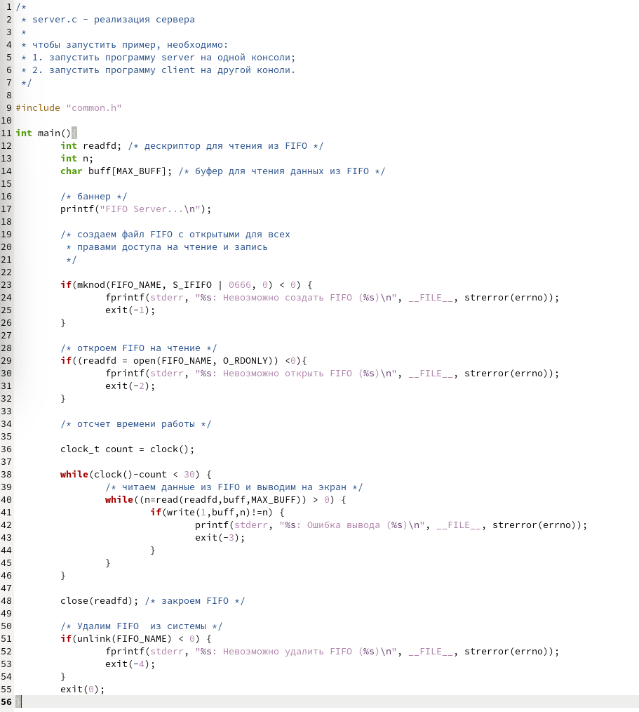

---
## Front matter
lang: ru-RU
title: Отчет по лабораторной работе №14
author: Алмазова Елизавета Андреевна
institute: РУДН, г. Москва, Россия
date: 04.06.2022

## Formatting
toc: false
slide_level: 2
theme: metropolis
header-includes: 
 - \metroset{progressbar=frametitle,sectionpage=progressbar,numbering=fraction}
 - '\makeatletter'
 - '\beamer@ignorenonframefalse'
 - '\makeatother'
aspectratio: 43
section-titles: true
---

# Отчет по лабораторной работе №14

## Цель работы и задание

Цель данной лабораторной работы - приобретение практических навыков работы с именованными каналами.

Задание:

Изучите приведённые в тексте программы server.c и client.c. Взяв примеры за образец, напишите аналогичные программы, внеся следующие изменения:

1. Работает не 1 клиент, а несколько (например, два).
2. Клиенты передают текущее время с некоторой периодичностью (например, раз в пять секунд). Используйте функцию sleep() для приостановки работы клиента.
3. Сервер работает не бесконечно, а прекращает работу через некоторое время (например, 30 сек). Используйте функцию clock() для определения времени работы сервера. Что будет в случае, если сервер завершит работу, не закрыв канал?

## Ход работы

1. Изучила приведённые в тексте программы server.c и client.c. Создала файлы common.h, server.c, client.c, Makefile и, взяв примеры за образец, написала аналогичные программы, внеся следующие изменения (рис.1, рис.2, рис.3, рис.4):
	1. Работает не 1 клиент, а несколько (например, два).
	2. Клиенты передают текущее время раз в пять секунд. Для получения текущего времени в файле client.c я использовала функции библиотеки time.h, добавленной в файле common.h, а для приостановки работы клиента функцию sleep(5). Это время передается три раза с помощью цикла.
	3. Я изменила файл server.c. Сервер работает не бесконечно, а прекращает работу через 30 сек. Использовала функцию clock() для определения времени работы сервера. Если сервер завершит работу, не закрыв канал, при новом включении сервера появится ошибка при создании канала, так как один уже существует.

{ #fig:001 width=70% }

{ #fig:002 width=70% }

{ #fig:003 width=70% }

{ #fig:004 width=70% }

2. Программы работают верно (рис.5, рис.6).

{ #fig:005 width=70% }

{ #fig:006 width=70% }

## Выводы

В ходе выполнения данной лабораторной работы я приобрела практические навыки работы с именованными каналами.

## {.standout}

Спасибо за внимание!
