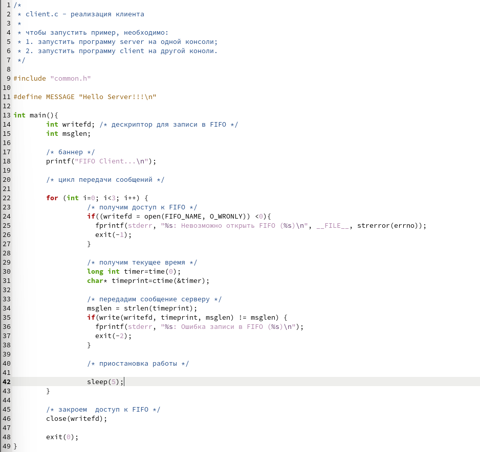
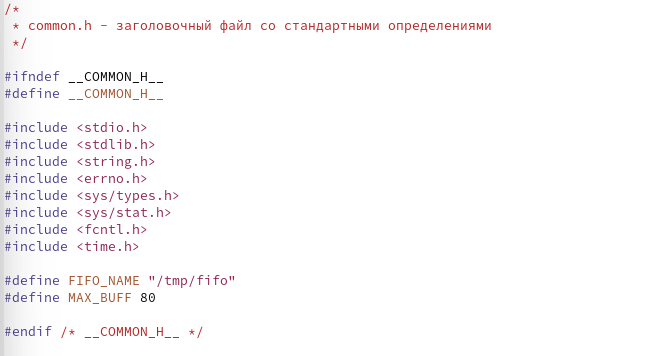
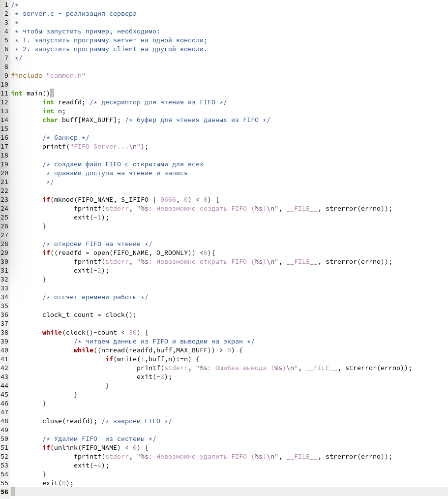
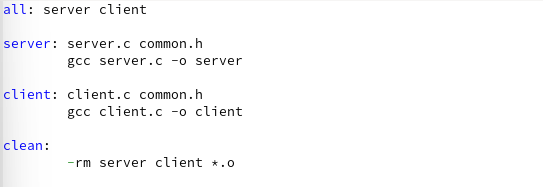
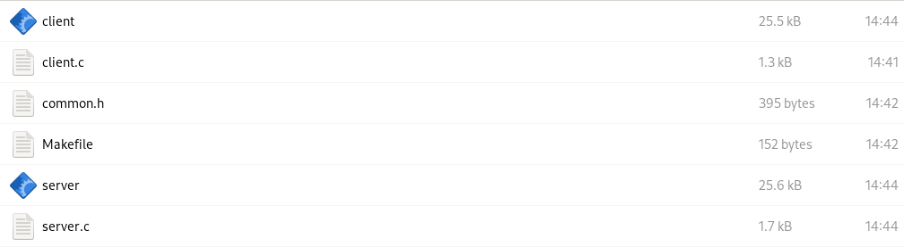
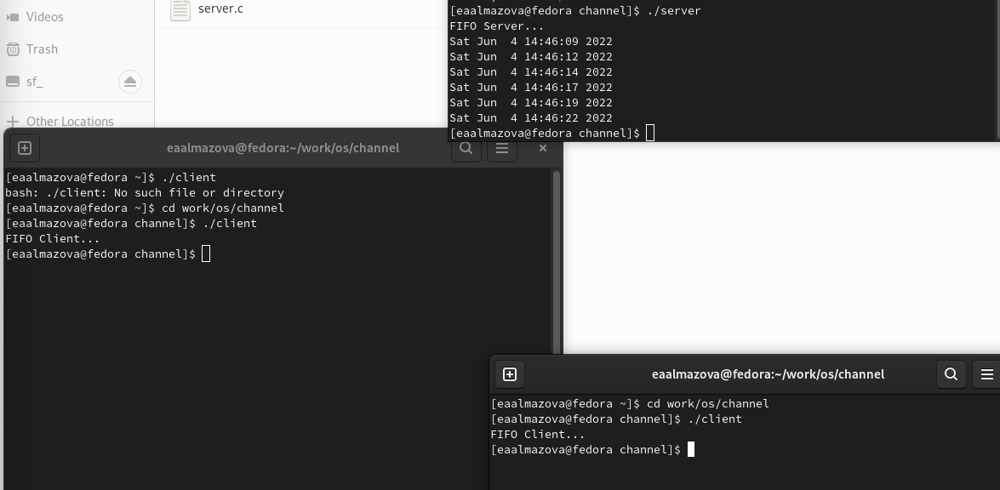

---
# Front matter
title: "Отчёт по лабораторной работе №14"
subtitle: "Дисциплина: Операционные системы"
author: "Елизавета Андреевна Алмазова"

## Generic options
lang: ru-RU
toc-title: "Содержание"

## Bibliography
bibliography: bib/cite.bib
csl: pandoc/csl/gost-r-7-0-5-2008-numeric.csl

## Pdf output format
toc: true # Table of contents
toc-depth: 2
lof: true # List of figures
lot: true # List of tables
fontsize: 12pt
linestretch: 1.5
papersize: a4
documentclass: scrreprt
## I18n polyglossia
polyglossia-lang:
  name: russian
  options:
	- spelling=modern
	- babelshorthands=true
polyglossia-otherlangs:
  name: english
## I18n babel
babel-lang: russian
babel-otherlangs: english
## Fonts
mainfont: PT Serif
romanfont: PT Serif
sansfont: PT Sans
monofont: PT Mono
mainfontoptions: Ligatures=TeX
romanfontoptions: Ligatures=TeX
sansfontoptions: Ligatures=TeX,Scale=MatchLowercase
monofontoptions: Scale=MatchLowercase,Scale=0.9
## Biblatex
biblatex: true
biblio-style: "gost-numeric"
biblatexoptions:
  - parentracker=true
  - backend=biber
  - hyperref=auto
  - language=auto
  - autolang=other*
  - citestyle=gost-numeric
## Pandoc-crossref LaTeX customization
figureTitle: "Рис."
tableTitle: "Таблица"
listingTitle: "Листинг"
lofTitle: "Список иллюстраций"
lotTitle: "Список таблиц"
lolTitle: "Листинги"
## Misc options
indent: true
header-includes:
  - \usepackage{indentfirst}
  - \usepackage{float} # keep figures where there are in the text
  - \floatplacement{figure}{H} # keep figures where there are in the text
---

# Цель работы

Цель данной лабораторной работы - приобретение практических навыков работы с именованными каналами.

# Задание

Изучите приведённые в тексте программы server.c и client.c. Взяв примеры за образец, напишите аналогичные программы, внеся следующие изменения:

1. Работает не 1 клиент, а несколько (например, два).
2. Клиенты передают текущее время с некоторой периодичностью (например, раз в пять секунд). Используйте функцию sleep() для приостановки работы клиента.
3. Сервер работает не бесконечно, а прекращает работу через некоторое время (например, 30 сек). Используйте функцию clock() для определения времени работы сервера. Что будет в случае, если сервер завершит работу, не закрыв канал?

# Теоретическое введение

Одним из видов взаимодействия между процессами в операционных системах является обмен сообщениями. Под сообщением понимается последовательность байтов, передаваемая от одного процесса другому.

В операционных системах типа UNIX есть 3 вида межпроцессорных взаимодействий: общеюниксные (именованные каналы, сигналы), System V Interface Definition (SVID — разделяемая память, очередь сообщений, семафоры) и BSD (сокеты). Для передачи данных между неродственными процессами можно использовать механизм именованных каналов (named pipes). Данные передаются по принципу FIFO (First In First Out) (первым записан — первым прочитан), поэтому они называются также FIFO pipes или просто FIFO. Именованные каналы отличаются от неименованных наличием идентификатора канала, который представлен как специальный файл (соответственно имя именованного канала — это имя файла). Поскольку файл находится на локальной файловой системе, данное IPC используется внутри одной системы. Файлы именованных каналов создаются функцией mkfifo.

Первый параметр — имя файла, идентифицирующего канал, второй параметр — маска прав доступа к файлу. После создания файла канала процессы, участвующие в обмене данными, должны открыть этот файл либо для записи, либо для чтения. При закрытии файла сам канал продолжает существовать. Для того чтобы закрыть сам канал, нужно удалить его файл, например с помощью вызова unlink(2). 

Рассмотрим работу именованного канала на примере системы клиент–сервер. Сервер создаёт канал, читает из него текст, посылаемый клиентом, и выводит его на терминал. Вызов функции mkfifo() создаёт файл канала (с именем, заданным макросом FIFO_NAME): mkfifo(FIFO_NAME, 0600).

В качестве маски доступа используется восьмеричное значение 0600, разрешающее процессу с аналогичными реквизитами пользователя чтение и запись. Можно также установить права доступа 0666. Открываем созданный файл для чтения: f = fopen(FIFO_NAME, O_RDONLY). Ждём сообщение от клиента. Сообщение читаем с помощью функции read() и печатаем на экран. После этого удаляется файл FIFO_NAME и сервер прекращает работу.

Клиент открывает FIFO для записи как обычный файл: f = fopen(FIFO_NAME, O_WRONLY). Посылаем сообщение серверу с помощью функции write(). Для создания файла FIFO можно использовать более общую функцию mknod(2), предназначенную для создания специальных файлов различных типов (FIFO, сокеты, файлы устройств и обычные файлы для хранения данных).

#include <sys/types.h>

#include <sys/stat.h>

#include <fcntl.h>

#include <unistd.h>

int mknod(const char \*pathname, mode_t mode, dev_t dev);

Тогда, вместо mkfifo(FIFO_NAME, 0600) пишем mknod(FIFO_NAME, S_IFIFO | 0600, 0).

Каналы представляют собой простое и удобное средство передачи данных, которое, однако, подходит не во всех ситуациях. Например, с помощью каналов довольно трудно организовать обмен асинхронными сообщениями между процессами.

# Выполнение лабораторной работы

1. Изучила приведённые в тексте программы server.c и client.c. Создала файлы common.h, server.c, client.c, Makefile и, взяв примеры за образец, написала аналогичные программы, внеся следующие изменения (рис.1, рис.2, рис.3, рис.4):
	1. Работает не 1 клиент, а несколько (например, два).
	2. Клиенты передают текущее время раз в пять секунд. Для получения текущего времени в файле client.c я использовала функции библиотеки time.h, добавленную в файле common.h, а для приостановки работы клиента функцию sleep(5). Это время передается три раза с помощью цикла.
	3. Я изменила файл server.c. Сервер работает не бесконечно, а прекращает работу через 30 сек. Использовала функцию clock() для определения времени работы сервера. Если сервер завершит работу, не закрыв канал, при новом включении сервера появится ошибка при создании канала, так как один уже существует.

{ #fig:001 width=70% }

{ #fig:002 width=70% }

{ #fig:003 width=70% }

{ #fig:004 width=70% }

2. Программы работают верно (рис.5, рис.6).

{ #fig:005 width=70% }

{ #fig:006 width=70% }

# Выводы

В ходе выполнения данной лабораторной работы я приобрела практические навыки работы с именованными каналами.

# Ответы на контрольные вопросы

1. В чем ключевое отличие именованных каналов от неименованных?

Именованные каналы отличаются от неименованных наличием
идентификатора канала, который представлен как специальный файл (соответственно
имя именованного канала — это имя файла). Поскольку файл находится на локальной
файловой системе, данное IPC используется внутри одной системы.

2. Возможно ли создание неименованного канала из командной строки?

Да, возможно с помощью символа |.

3. Возможно ли создание именованного канала из командной строки?

Да, возможно с помощью команды mknod/mkfifo.

4. Опишите функцию языка С, создающую неименованный канал.

Неименованный канал создается вызовом pipe, который заносит в массив int [2] два дескриптора открытых файлов. fd[0] – открыт на чтение, fd[1] – на запись (вспомните STDIN == 0, STDOUT == 1). Канал уничтожается, когда будут закрыты все файловые дескрипторы ссылающиеся на него.

В рамках одного процесса pipe смысла не имеет, передать информацию о нем в произвольный процесс нельзя (имени нет, а номера файловых дескрипторов в каждом процессе свои). Единственный способ использовать pipe – унаследовать дескрипторы при вызове fork (и последующем exec). После вызова fork канал окажется открытым на чтение и запись в родительском и дочернем процессе. Т.е. теперь на него будут ссылаться 4 дескриптора. Теперь надо определиться с направлением передачи данных – если надо передавать данные от родителя к потомку, то родитель закрывает дескриптор на чтение, а потомок - дескриптор на запись.

5. Опишите функцию языка С, создающую именованный канал.

Именованный канал FIFO доступен как объект в файловой системе. При этом, до открытия объекта FIFO на чтение, собственно коммуникационного объекта не создаётся. После открытия открытия объекта FIFO в одном процессе на чтение, а в другом на запись, возникает ситуация полностью эквивалентная использованию неименованного канала.

Объект FIFO в файловой системе создаётся вызовом функции int mkfifo(const char \*pathname, mode_t mode). Команда mkfifo позволяет задействовать одноименную утилиту, предназначенную для создания именованных программных каналов. Программные каналы предназначены для обмена данными между приложениями (или в рамках одного приложения) и представляют собой буферы в памяти, поддерживающие операции чтения и записи с блокировками.

Основное отличие между pipe и FIFO - то, что pipe могут совместно использовать только процессы находящиеся в отношении родительский-дочерний, а FIFO может использовать любая пара процессов.

6. Что будет в случае прочтения из fifo меньшего числа байтов, чем находится в канале?
Большего числа байтов?

В случае прочтение меньше числа байтов, остаток сохраняется для последующих чтений. ПРи прочтении большего числа, возвращается доступное число байтов, а читающий процесс должен обработать ситуацию, когда прочитано меньше, чем задано.

7. Аналогично, что будет в случае записи в fifo меньшего числа байтов, чем позволяет
буфер? Большего числа байтов?

Запись меньшего числа байтов атомарна - если несколько процессов записывают в канал, порции данных не перемешиваются. При записи больше числа байтов, вызов write(2) блокируются до освобождения, атомарность не гарантируется. Если процесс записывает данные в неоткрытый на чтение канал, то генерируется сигнал SIGPIPE, а вызов write(2) возвращает 0 с установкой ошибки. Если обработка сигнала SIGPIPE не установлена, то обрабатывается по умолчанию - процесс закрывается.

8. Могут ли два и более процессов читать или записывать в канал?

Могут, однако может случиться так, что будут прочитана или записана только часть данных.

9. Опишите функцию write (тип возвращаемого значения, аргументы и логику работы).
Что означает 1 (единица) в вызове этой функции в программе server.c (строка 42)?

Для записи данных в файл используется системный вызов write(): ssize_t write (int fd, const void * buffer, size_t count); В принципе write() выполняет процедуру, обратную read(): записывает count байтов из буфера buffer в файл с дескриптором fd, возвращая количество записанных байтов или -1 в случае ошибки. 1 - это идентификатор (дескриптор потока) стандартного потока вывода.

10. Опишите функцию strerror.

Функция strerror() возвращает строку, описывающую код ошибки, переданный в аргументе errnum, возможно с учетом категории LC_MESSAGES текущей локали для выбора соответсвующего языка. Приложение не должно изменять строку. Строка может измениться при последующем вызовом perror() или strerror(). В библиотеке нет функций изменяющих эту строку.

Функция strerror() возвращает соответствующее описание ошибки или сообщение о том, что ошибка неизвестна. Значение errno при удачном вызове не меняется, а при ошибке устанавливается в ненулевое значение. 
