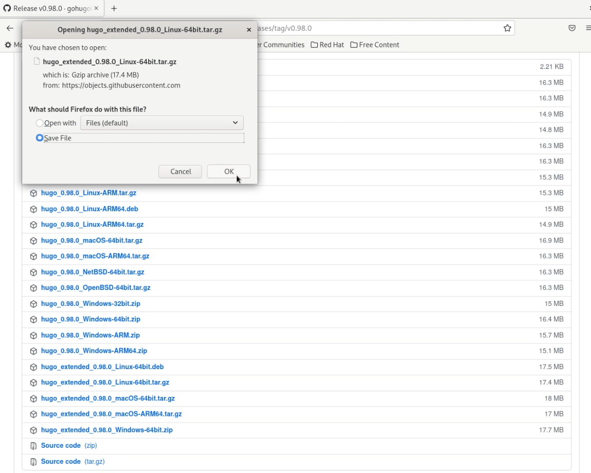
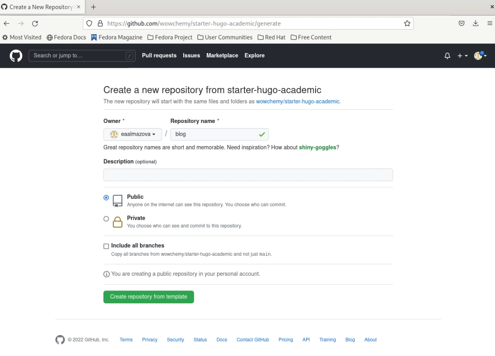
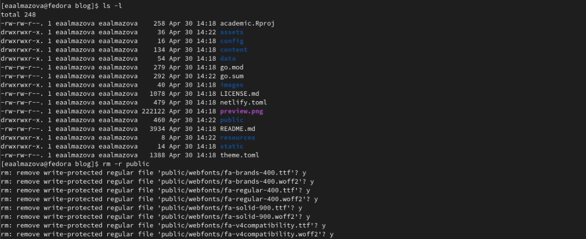
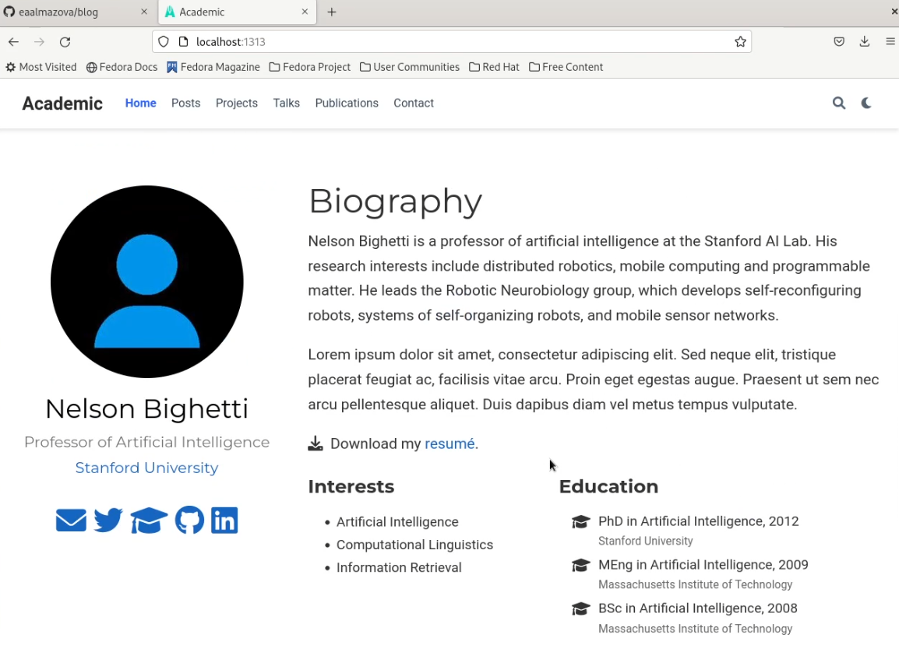
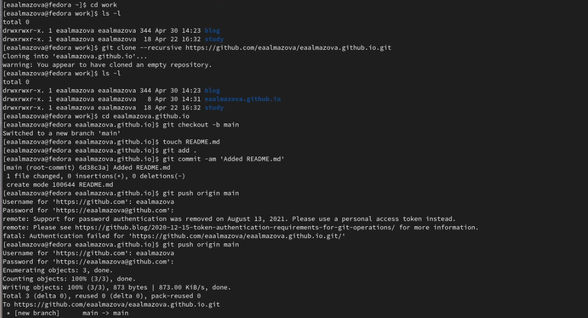
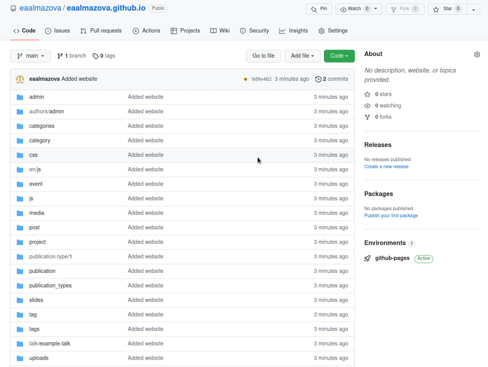
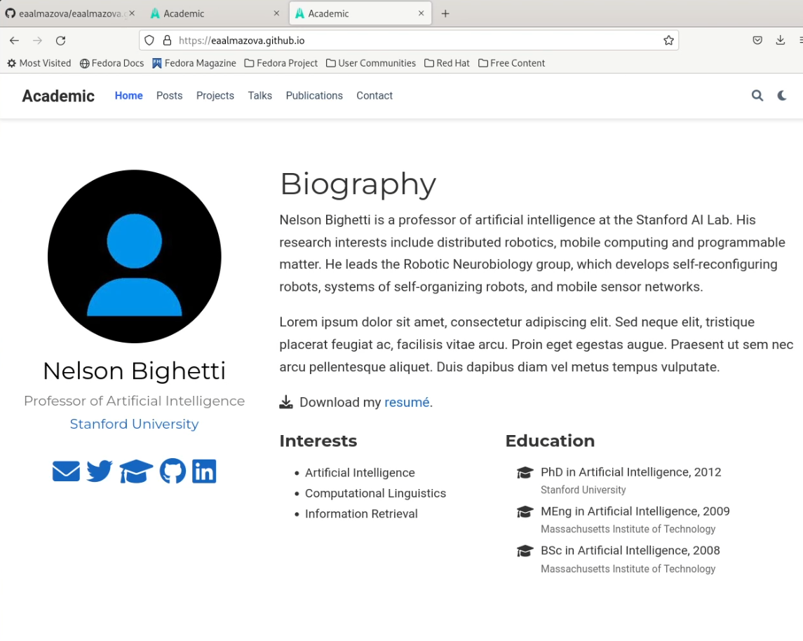

---
## Front matter
lang: ru-RU
title: Отчет по этапу №1 индивидуального проекта
author: Алмазова Елизавета Андреевна
institute: РУДН, г. Москва, Россия
date: 30.04.2022

## Formatting
toc: false
slide_level: 2
theme: metropolis
header-includes: 
 - \metroset{progressbar=frametitle,sectionpage=progressbar,numbering=fraction}
 - '\makeatletter'
 - '\beamer@ignorenonframefalse'
 - '\makeatother'
aspectratio: 43
section-titles: true
---

# Отчет по этапу №1 индивидуального проекта

## Цель работы и задание

Цель данного индивидуального проекта - поэтапное создание и заполнение сайта, представляющего меня как научного работника.
Задание - размещение на Github pages заготовки для персонального сайта:
- Установить необходимое программное обеспечение;
- Скачать шаблон темы сайта;
- Разместить его на хостинге git;
- Установить параметр для URLs сайта;
- Разместить заготовку сайта на Github pages.

## Ход работы

### Подготовка к работе с Hugo

Я скачала исполняемый файл Hugo (рис.1) и разархивировала скачанный архив. В домашнем каталоге я создала каталог bin и перенесла исполняемый файл туда.

{ #fig:001 width=70% }

### Работа с репозиторием blog

На основе шаблона Wowchemy Academic я создала репозиторий blog в своем github (рис.2) и скопировала содержимое папки на компьютер. Я запустила Hugo. и с помощью команды rm -r public удалила папку public (рис.3).

{ #fig:002 width=70% }

{ #fig:003 width=70% }

### Начальная работа с внешним видом сайта

Я выполнила команду ~/bin/hugo server и перешла по полученной ссылке на созданный сайт. С помощью удаления content/home/demo.md я удалила зеленый виджет с сайта (рис.4).

{ #fig:004 width=70% }

### Создание репозитория для сайта и настройка видимости

Я перешла в GitHub, создала репозиторий eaalmazova.github.io и клонировала его с помощью команды git clone --recursive рядом с папкой ~/work/blog. Перейдя в созданную папку, я переключилась на новую ветку main (git checkout -b main) и создала пустой файл README.md для активации репозитория. Затем добавила этот файл в GitHub (рис.5).
С помощью команды cd я перешла в blog и с помощью mc сделала строчку в .gitignore с public комментарием. Создание папки public (git submodule add -b main https://eaalmazova/eaalmazova.github.io.git public) прошло успешно. 

{ #fig:005 width=70% }

### Генерация файлов в public и синхронизация с GitHub

Я автоматически сгенерировала файлы в public (~/bin/hugo) и провела синхронизацию с GitHub (git add ., git commit -am 'Added README.md' и git push origin main). Теперь на сайте появились нужные файлы и сайт доступен по ссылке https://eaalmazova.github.io (рис.6,7).

{ #fig:006 width=70% }

{ #fig:007 width=70% }

## Выводы

В ходе реализации первого этапа проекта я разместила на GitHub pages заготовки для будущего сайта, в т.ч. установила необходимое программное обеспечение, скачала шаблон темы сайта, разместила его на хостинге git, установила параметр для URLs сайта, разместила заготовку сайта на Github pages.

## {.standout}

Спасибо за внимание!
