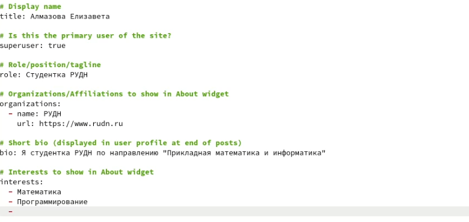
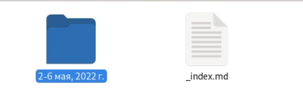
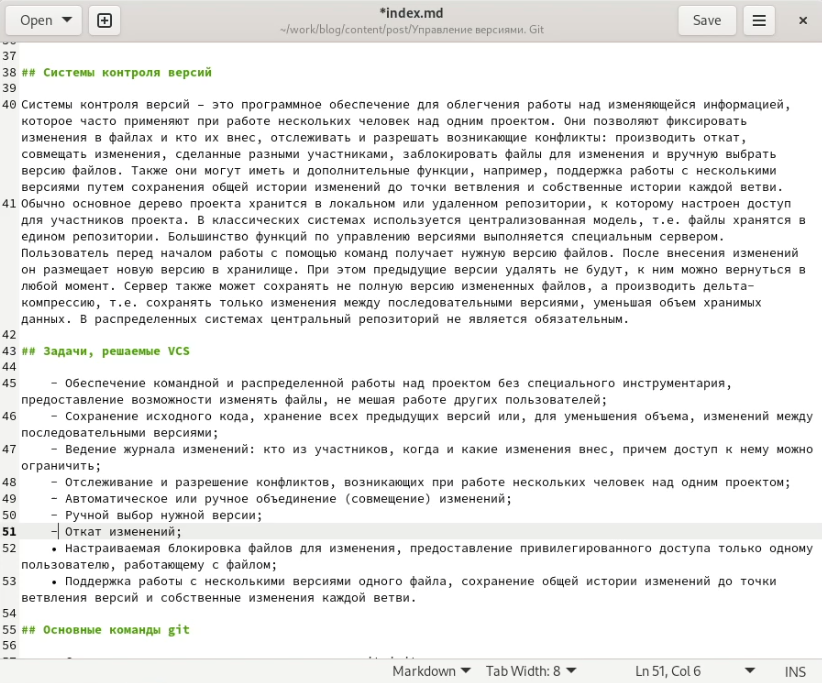

---
## Front matter
lang: ru-RU
title: Отчет по этапу №2 индивидуального проекта
author: Алмазова Елизавета Андреевна
institute: РУДН, г. Москва, Россия
date: 07.05.2022

## Formatting
toc: false
slide_level: 2
theme: metropolis
header-includes: 
 - \metroset{progressbar=frametitle,sectionpage=progressbar,numbering=fraction}
 - '\makeatletter'
 - '\beamer@ignorenonframefalse'
 - '\makeatother'
aspectratio: 43
section-titles: true
---

# Отчет по этапу №2 индивидуального проекта

## Цель работы и задание

Цель данного индивидуального проекта - поэтапное создание и заполнение сайта, представляющего меня как научного работника.
Задание - добавить к сайту данные о себе:
- Разместить фотографию владельца сайта.
- Разместить краткое описание владельца сайта (Biography).
- Добавить информацию об интересах (Interests).
- Добавить информацию от образовании (Education).
- Сделать пост по прошедшей неделе.
- Добавить пост на тему по выбору:
	- Управление версиями. Git.
	- Непрерывная интеграция и непрерывное развертывание (CI/CD).

## Ход работы

1. Разместила фотографию владельца сайта, заменив файл avatar.jpg в папке ~/work/blog/content/authors/admin на нужную картинку.
2. Изменила в этой же папке файл "index.md", разместив краткое описание владельца сайта (Biography), добавила информацию об интересах (Interests), добавила информацию об образовании (Education) (рис. 1).

{ #fig:001 width=70% }

3. Сделала пост по прошедшей неделе (2-6 мая, 2022 г.), создав соответствующую папку в ~/work/blog/content/post и в ней файл index.md, заполнила его (рис. 2).

{ #fig:002 width=70% }

4. Сделала пост на тему "Управление версиями. Git.", создав соответствующую папку в ~/work/blog/content/post и в ней файл index.md, заполнила его (рис. 3).

{ #fig:003 width=70% }

## Выводы

В ходе реализации первого этапа проекта я добавила к сайту данные о себе, в т.ч. числе фотографию, биографию, интересы и образование, а также добавила два поста: по прошедшей неделе и теме "Управление версиями. Git".

## {.standout}

Спасибо за внимание!
