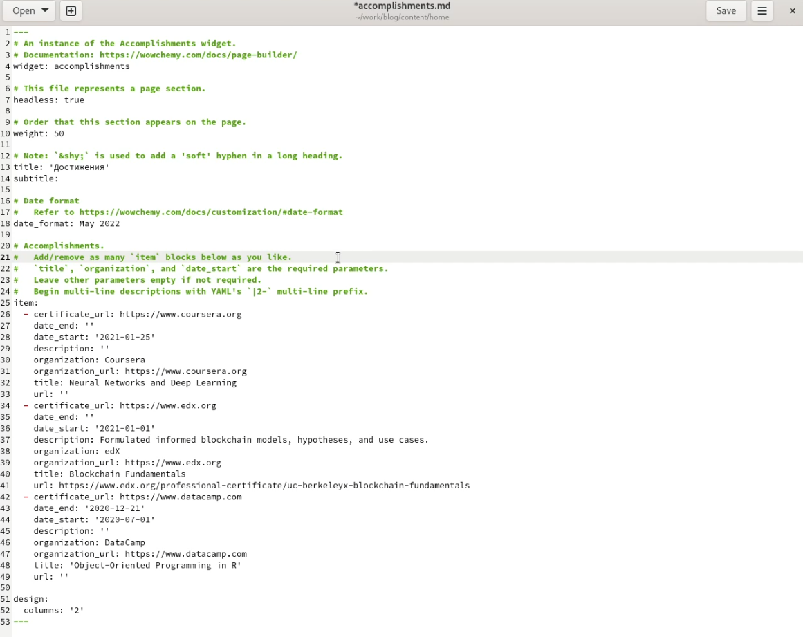
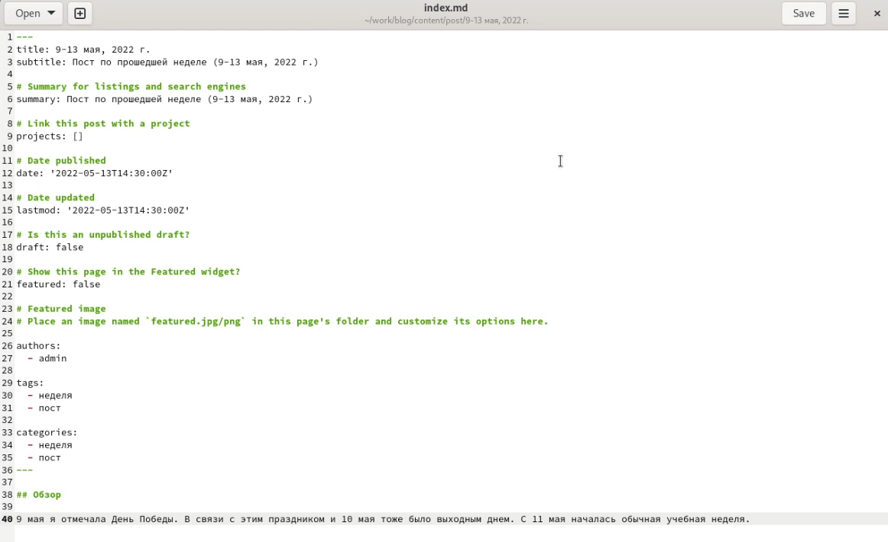
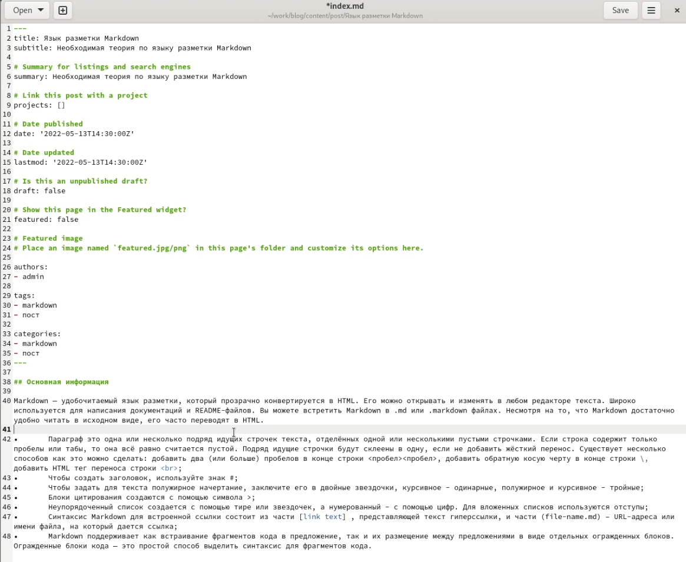

---
## Front matter
lang: ru-RU
title: Отчет по этапу №3 индивидуального проекта
author: Алмазова Елизавета Андреевна
institute: РУДН, г. Москва, Россия
date: 14.05.2022

## Formatting
toc: false
slide_level: 2
theme: metropolis
header-includes: 
 - \metroset{progressbar=frametitle,sectionpage=progressbar,numbering=fraction}
 - '\makeatletter'
 - '\beamer@ignorenonframefalse'
 - '\makeatother'
aspectratio: 43
section-titles: true
---

# Отчет по этапу №3 индивидуального проекта

## Цель работы и задание

Цель данного индивидуального проекта - поэтапное создание и заполнение сайта, представляющего меня как научного работника.

Задание - добавить к сайту достижения:

- Список достижений:
	- Добавить информацию о навыках (Skills).
	- Добавить информацию об опыте (Experience).
	- Добавить информацию о достижениях (Accomplishments).
- Сделать пост по прошедшей неделе.
- Добавить пост на тему по выбору:
	- Легковесные языки разметки.
	- Языки разметки. LaTeX.
	- Язык разметки Markdown.

## Ход работы

1. Я добавила на сайт список достижений, навыков и опыта, отректировав файлы accomplishments.md (достижения), skills.md (навыки) и experience.md (опыт) (рис.1).

{ #fig:001 width=70% }

2. Я сделала пост по прошедшей неделе 9-13 мая, 2022 г., создав в каталоге content/post соответствующий каталог и в нем создав и отредактировав файл index.md (рис.2).

{ #fig:002 width=70% }

3. Я добавила пост на тему "Язык разметки Markdown", создав в каталоге content/post соответствующий каталог и в нем создав и отредактировав файл index.md (рис.3).

{ #fig:003 width=70% }

## Выводы

В ходе реализации третьего этапа проекта я добавила на сайт информацию о навыках, достижениях и опыте, сделала пост по прошедшей неделе и на тему "Язык разметки Markdown".

## {.standout}

Спасибо за внимание!
