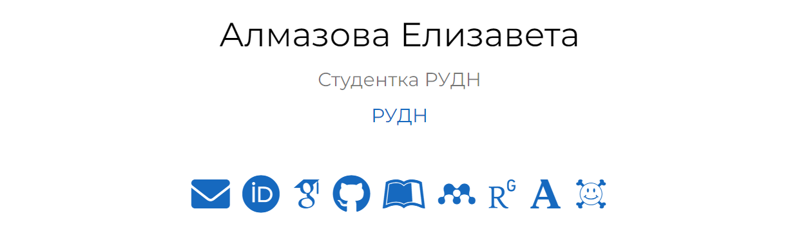
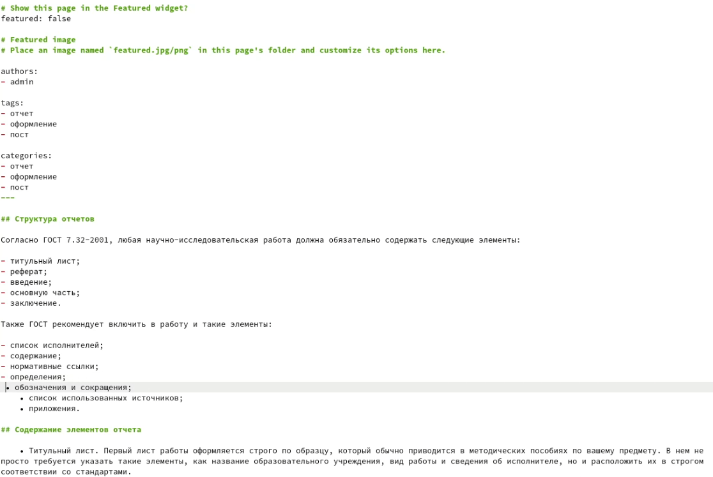

---
## Front matter
lang: ru-RU
title: Отчет по этапу №4 индивидуального проекта
author: Алмазова Елизавета Андреевна
institute: РУДН, г. Москва, Россия
date: 21.05.2022

## Formatting
toc: false
slide_level: 2
theme: metropolis
header-includes: 
 - \metroset{progressbar=frametitle,sectionpage=progressbar,numbering=fraction}
 - '\makeatletter'
 - '\beamer@ignorenonframefalse'
 - '\makeatother'
aspectratio: 43
section-titles: true
---

# Отчет по этапу №4 индивидуального проекта

## Цель работы и задание

Цель данного индивидуального проекта - поэтапное создание и заполнение сайта, представляющего меня как научного работника.

Задание - добавить к сайту ссылки на научные и библиометрические ресурсы:

- Зарегистрироваться на соответствующих ресурсах и разместить на них ссылки на сайте:
	- eLibrary : https://elibrary.ru/;
	- Google Scholar : https://scholar.google.com/;
	- ORCID : https://orcid.org/;
	- Mendeley : https://www.mendeley.com/;
	- ResearchGate : https://www.researchgate.net/;
	- Academia.edu : https://www.academia.edu/;
	- arXiv : https://arxiv.org/;
	- github : https://github.com/.
- Сделать пост по прошедшей неделе.
- Добавить пост на тему по выбору: оформление отчёта, создание презентаций, работа с библиографией.

## Ход работы

1. Я зарегистрировалась на соответствующих ресурсах и разместила на них ссылки на сайте (рис.1):
	- eLibrary : https://elibrary.ru/;
	- Google Scholar : https://scholar.google.com/;
	- ORCID : https://orcid.org/;
	- Mendeley : https://www.mendeley.com/;
	- ResearchGate : https://www.researchgate.net/;
	- Academia.edu : https://www.academia.edu/;
	- arXiv : https://arxiv.org/;
	- github : https://github.com/.

{ #fig:001 width=70% }

2. Я сделала пост по прошедшей неделе 16-20 мая, 2022 г, создав соответствующую папку в каталоге content/post и изменив в нем файл index.md.
3. Я сделала пост по теме оформления отчета, создав соответствующую папку в каталоге content/post и изменив в нем файл index.md (рис.2).

{ #fig:002 width=70% }

## Выводы

В ходе реализации четвертого этапа проекта я добавила к сайту ссылки на научные и библиометрические ресурсы, сделала пост по прошедшей неделе и добавила пост на тему оформления отчета.

## {.standout}

Спасибо за внимание!
