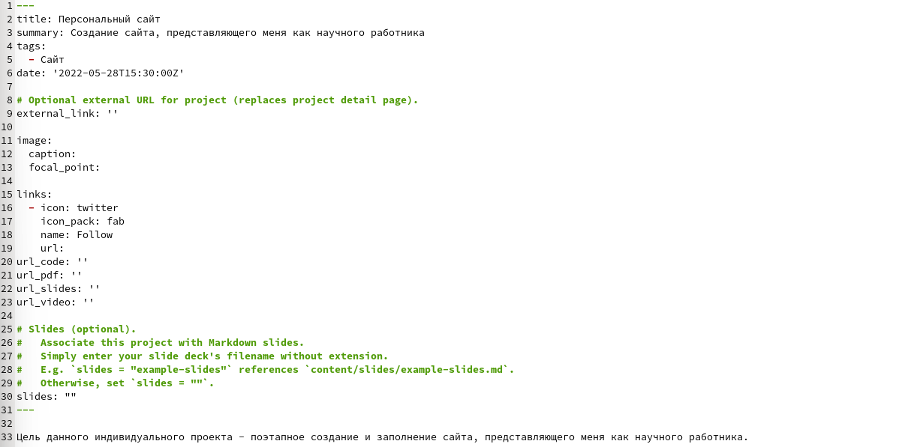
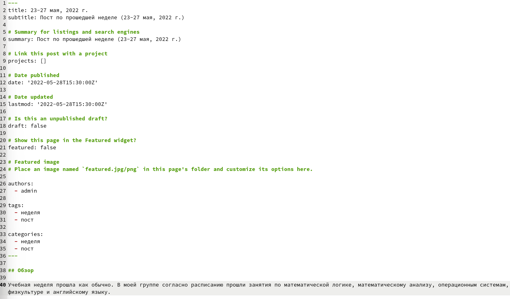

---
## Front matter
lang: ru-RU
title: Отчет по этапу №5 индивидуального проекта
author: Алмазова Елизавета Андреевна
institute: РУДН, г. Москва, Россия
date: 28.05.2022

## Formatting
toc: false
slide_level: 2
theme: metropolis
header-includes: 
 - \metroset{progressbar=frametitle,sectionpage=progressbar,numbering=fraction}
 - '\makeatletter'
 - '\beamer@ignorenonframefalse'
 - '\makeatother'
aspectratio: 43
section-titles: true
---

# Отчет по этапу №5 индивидуального проекта

## Цель работы и задание

Цель данного индивидуального проекта - поэтапное создание и заполнение сайта, представляющего меня как научного работника.

Задание - добавить к сайту все остальные элементы:

- Сделать записи для персональных проектов.
- Сделать пост по прошедшей неделе.
- Добавить пост на тему по выбору:
	- Языки научного программирования.

## Ход работы

1. Я зашла в папку content/project и создала проект, который назвала "Персональный сайт", заполнила информацию о нем в файле index.md (рис.1).

{ #fig:001 width=70% }

2. Я сделала пост по прошедшей неделе 23-27 мая, 2022 г, создав соответствующую папку в каталоге content/post и изменив в нем файл index.md (рис.2).

{ #fig:002 width=70% }

3. Я сделала пост по языкам научного программирования, создав соответствующую папку в каталоге content/post и изменив в нем файл index.md (рис.3).

{ #fig:003 width=70% }

## Выводы

В ходе реализации 5 этапа проекта я добавила к сайту все остальные элементы, в том числе сделала записи для персональных проектов, добавила посты по прошедшей неделе и языкам научного программирования.

## {.standout}

Спасибо за внимание!
