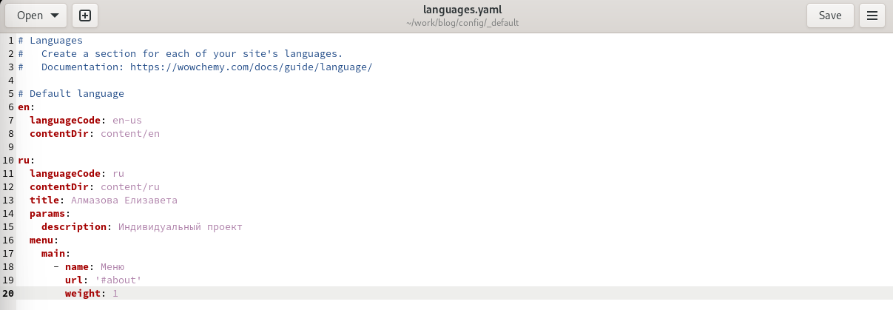
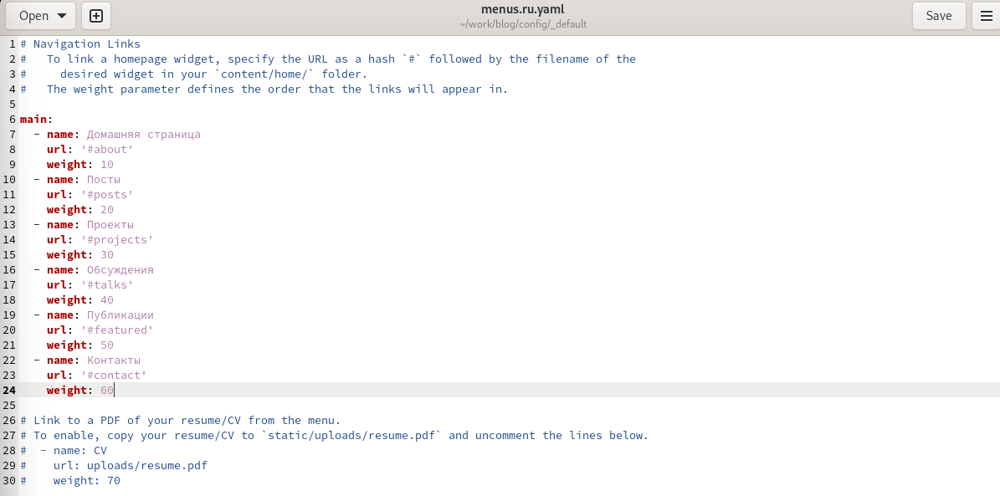
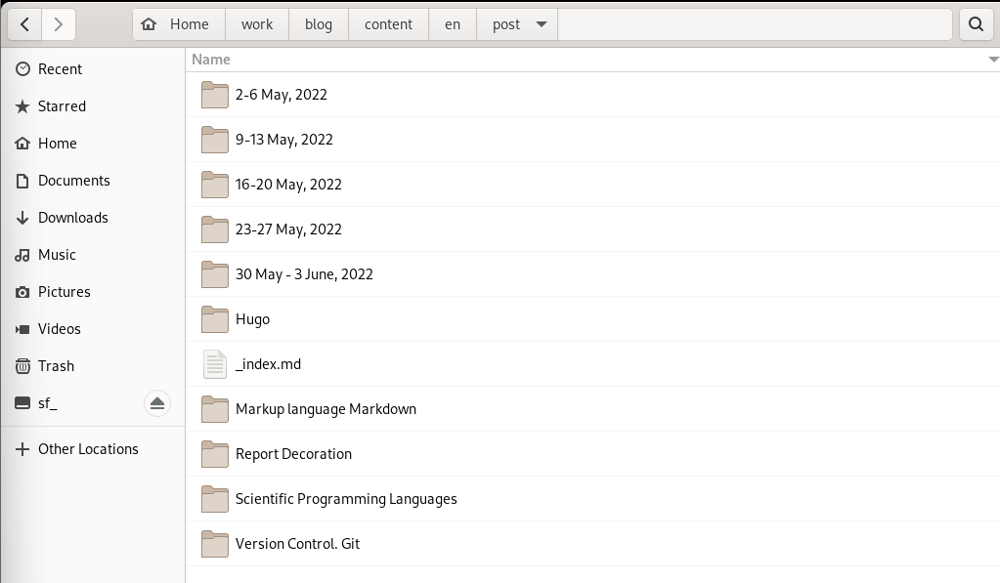
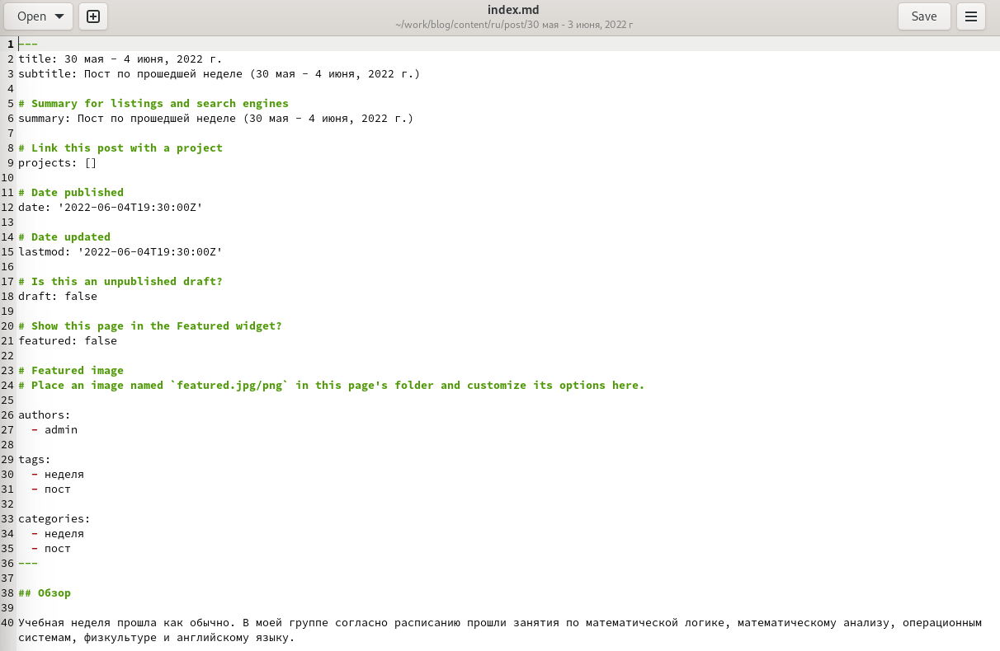
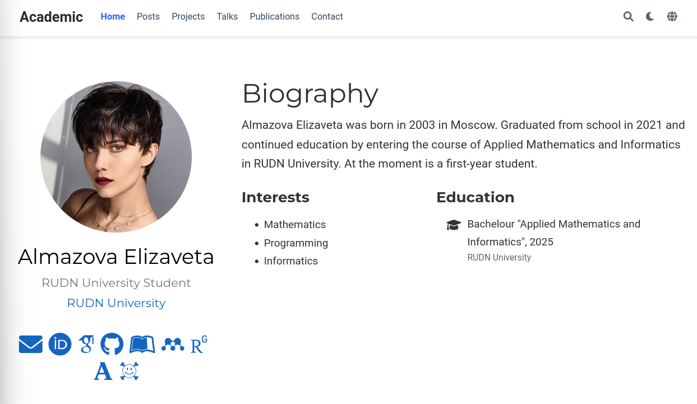
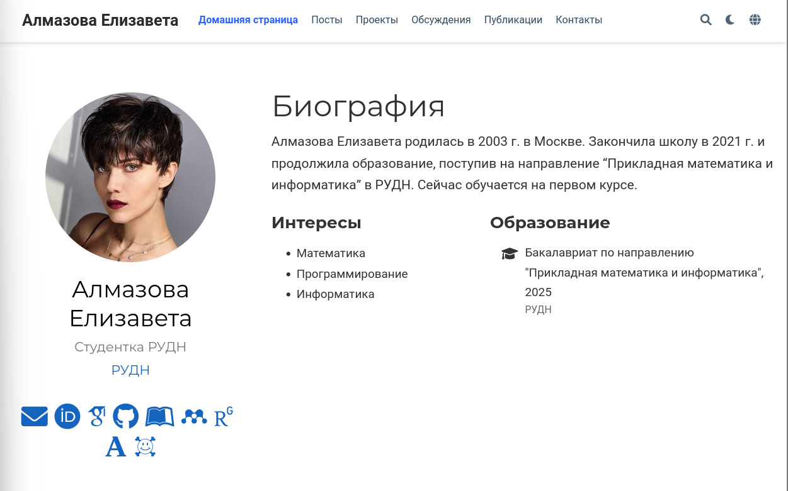

---
## Front matter
lang: ru-RU
title: Отчет по этапу №6 индивидуального проекта
author: Алмазова Елизавета Андреевна
institute: РУДН, г. Москва, Россия
date: 04.06.2022

## Formatting
toc: false
slide_level: 2
theme: metropolis
header-includes: 
 - \metroset{progressbar=frametitle,sectionpage=progressbar,numbering=fraction}
 - '\makeatletter'
 - '\beamer@ignorenonframefalse'
 - '\makeatother'
aspectratio: 43
section-titles: true
---

# Отчет по этапу №6 индивидуального проекта

## Цель работы и задание

Цель данного индивидуального проекта - поэтапное создание и заполнение сайта, представляющего меня как научного работника.

Задание - размещение двуязычного сайта на Github.

- Сделать поддержку английского и русского языков.
- Разместить элементы сайта на обоих языках.
- Разместить контент на обоих языках.
- Сделать пост по прошедшей неделе.
- Добавить пост на тему по выбору (на двух языках).

## Ход работы

1. Я сделала поддержку английского и русского языков, изменив файл languages.yaml, где поставила английский как язык по умолчанию и настроила второй, русский, язык. Также в каталоге blog я создала подкаталог i18n, в который скачала с github Wowchemy файлы en.yaml и ru.yaml (рис.1, рис.2).

{ #fig:001 width=70% }

{ #fig:002 width=70% }

2. Я создала дублирующий menus.yaml файл под названием menus.ru.yaml и изменила названия элементов сайта в заголовке (рис.3). Также я убрала ненужные элементы из меню.

{ #fig:003 width=70% }

3. В папке content я создала две папки en и ru и разместила в них контент на соответствующем языке (рис.4).

{ #fig:004 width=70% }

4. Я создала пост по прошедшей неделе (30 мая - 4 июня, 2022 г.), создав соответствующие папки и в них файлы index.md с текстом на соответствующих языках в папках en/post и ru/post (рис.5).

{ #fig:005 width=70% }

5. Я создала пост на тему по выбору: генератор статических сайтов Hugo, создав соответствующие папки и в них файлы index.md с текстом на соответствующих языках в папках en/post и ru/post.
6. Домашняя страница сайта на двух языках представлена на рисунках 6 и 7.

{ #fig:006 width=70% }

{ #fig:007 width=70% }

## Выводы

В ходе реализации шестого этапа проекта я разместила двуязычный сайт на GitHub, сделала поддержку русского и английского языков, разместила контент и элементы сайта на двух языках, а также сделала посты по прошедшей неделе и на тему генератора сайтов Hugo.

## {.standout}

Спасибо за внимание!
