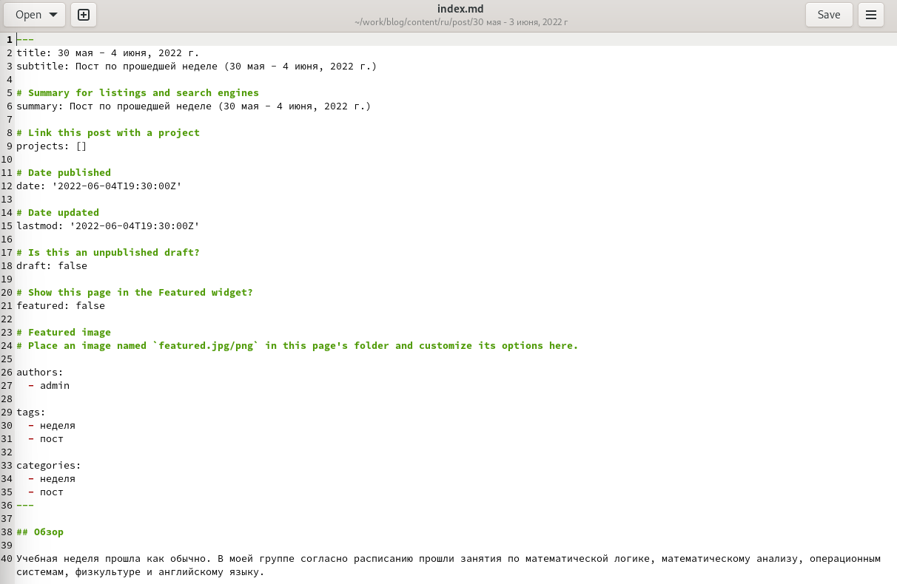

---
# Front matter
title: "Отчёт по этапу №6 индивидуального проекта"
subtitle: "Дисциплина: Операционные системы"
author: "Елизавета Андреевна Алмазова"

## Generic options
lang: ru-RU
toc-title: "Содержание"

## Bibliography
bibliography: bib/cite.bib
csl: pandoc/csl/gost-r-7-0-5-2008-numeric.csl

## Pdf output format
toc: true # Table of contents
toc-depth: 2
lof: true # List of figures
lot: true # List of tables
fontsize: 12pt
linestretch: 1.5
papersize: a4
documentclass: scrreprt
## I18n polyglossia
polyglossia-lang:
  name: russian
  options:
	- spelling=modern
	- babelshorthands=true
polyglossia-otherlangs:
  name: english
## I18n babel
babel-lang: russian
babel-otherlangs: english
## Fonts
mainfont: PT Serif
romanfont: PT Serif
sansfont: PT Sans
monofont: PT Mono
mainfontoptions: Ligatures=TeX
romanfontoptions: Ligatures=TeX
sansfontoptions: Ligatures=TeX,Scale=MatchLowercase
monofontoptions: Scale=MatchLowercase,Scale=0.9
## Biblatex
biblatex: true
biblio-style: "gost-numeric"
biblatexoptions:
  - parentracker=true
  - backend=biber
  - hyperref=auto
  - language=auto
  - autolang=other*
  - citestyle=gost-numeric
## Pandoc-crossref LaTeX customization
figureTitle: "Рис."
tableTitle: "Таблица"
listingTitle: "Листинг"
lofTitle: "Список иллюстраций"
lotTitle: "Список таблиц"
lolTitle: "Листинги"
## Misc options
indent: true
header-includes:
  - \usepackage{indentfirst}
  - \usepackage{float} # keep figures where there are in the text
  - \floatplacement{figure}{H} # keep figures where there are in the text
---

# Цель работы

Цель данного индивидуального проекта - поэтапное создание и заполнение сайта, представляющего меня как научного работника. 

# Задание

Размещение двуязычного сайта на Github.

- Сделать поддержку английского и русского языков.
- Разместить элементы сайта на обоих языках.
- Разместить контент на обоих языках.
- Сделать пост по прошедшей неделе.
- Добавить пост на тему по выбору (на двух языках).

# Теоретическое введение

Статический генератор сайта — программа, которая из различных исходных файлов (картинок, шаблонов в разных форматах, текстовых файлов и т.п) генерирует статический HTML-сайт. Один из ярких представителей — Hugo. Hugo — один из самых популярных генераторов статических сайтов с открытым исходным кодом, написан на языке Go. Благодаря своей удивительной скорости и гибкости, Hugo делает создание веб-сайтов увлекательным. Он подойдет как для создания лендингов, «многостраничников» — так и для создания более сложных продуктов: блог, новостной портал и даже интернет-магазин. Установить фреймворк можно практически на любую современную платформу в несколько команд.

Фреймворк имеет очень хорошую документацию. Она доступна только на английском языке. Информация очень хорошо структурирована, что позволяет освоить данную технологию, за несколько дней. Для лучшего восприятия, практически в каждой главе есть обучающее видео от разработчиков. Все это позволяет очень быстро приступить к созданию собственных сайтов.

Основной контент или содержимое сайта хранится в формате .md в папке content. В роли контента могут выступать статьи, новости, продукты интернет магазина и прочее. Каталог «data» используется для хранения файлов конфигурации, которые Hugo может использовать при создании веб-сайта. Можно записать эти файлы в формате YAML, JSON или TOML.

Hugo имеет около 200 готовых тем, которые можно легко установить и использовать. Это значительно ускоряет процесс разработки. Темы включают в себя не только отличные дизайнерские, но и хорошие программные решения. Wowchemy предлагает удобный шаблон для создания сайта научного работника и не только, узнать больше можно на их официальном сайте.

# Реализация этапа проекта

1. Я сделала поддержку английского и русского языков, изменив файл languages.yaml, где поставила английский как язык по умолчанию и настроила второй, русский, язык. Также в каталоге blog я создала подкаталог i18n, в который скачала с github Wowchemy файлы en.yaml и ru.yaml (рис.1, рис.2).

{ #fig:001 width=70% }

{ #fig:002 width=70% }

2. Я создала дублирующий menus.yaml файл под названием menus.ru.yaml и изменила названия элементов сайта в заголовке (рис.3). Также я убрала ненужные элементы из меню.

{ #fig:003 width=70% }

3. В папке content я создала две папки en и ru и разместила в них контент на соответствующем языке (рис.4).

{ #fig:004 width=70% }

4. Я создала пост по прошедшей неделе (30 мая - 4 июня, 2022 г.), создав соответствующие папки и в них файлы index.md с текстом на соответствующих языках в папках en/post и ru/post (рис.5).

{ #fig:005 width=70% }

5. Я создала пост на тему по выбору: генератор статических сайтов Hugo, создав соответствующие папки и в них файлы index.md с текстом на соответствующих языках в папках en/post и ru/post.
6. Домашняя страница сайта на двух языках представлена на рисунках 6 и 7.

{ #fig:006 width=70% }

{ #fig:007 width=70% }

# Выводы

В ходе реализации шестого этапа проекта я разместила двуязычный сайт на GitHub, сделала поддержку русского и английского языков, разместила контент и элементы сайта на двух языках, а также сделала посты по прошедшей неделе и на тему генератора сайтов Hugo.
